:PROPERTIES:
:GPTEL_MODEL: gwen3.5:9b
:GPTEL_BACKEND: Jetson
:GPTEL_SYSTEM: You are a large language model and a careful programmer. Provide code and only code as output without any additional text, prompt or note.
:GPTEL_TOOLS:
:GPTEL_BOUNDS: ((response (452 1281) (1283 2825) (3032 4369)))
:ID: spiega_readme
:END:
#+title: spiega documentation project
#+STARTUP: showall
#+TODO: active done crit milestone todo review knwoledge task
#+PROPERTY: HEADER-ARGS+ :eval no-export
#+TAGS: executive(e) present(p) hide(h) devops(o) dev(d) science(s) business(b) architecture(a) management(m)
#+DATE: <2026-07-22>
#+property: header-args:bash :result output replace :export none 

* spiega documentation

This project enables the documentation of complex projects and technical articles by using lightweight text files and support from local agents.
Local models are less capable and we need to boost their productivity by limiting the access and the capabilities to a focused selection. We improve the context and the overall speed.

*** motivation

Agents are helpful assistants but they are not reliable nor responsible for the success of the project. We need to set up a system that produces not only running code but reliable products.

- safe :: agents it the containers won't access critical information and will stay focused
- reproducible :: those text file should contain all the information to replicate a project which usually gets in vibe coding
- local :: your knowledge and information stays in your system
- minimal :: you produce and store few MB of data

*** outcome

The user writes down the ideas while agents and tools produce the rest:

- mind maps :: how concepts are related together
- monitoring :: factual information from the system
- diagrams :: how things are connected together
- slides :: sections into presentable items
- database :: creates a graph connecting all the relevant nodes
- project management :: kanban e gantt
- animations :: footage for presentations
  
*** stack

The purpose of this project is to be as simple as possible to version control and replicate. Size should be minimal and text is the only source of truth: images, video, slides, animations... are reproducible from the source text file.

- org files :: the dynamic file format that allow the background work [[id:knwoledge_graph-org_mode][.org files]] [[id:knwoledge_graph-org_file_example][.org file examples]] [[id:org_files][org files features]] 
- emacs :: as favorite text editor configured in [[./emacs/]]
- docker :: for serving language models and MCP [[./deploy/]]
- coding agents :: to bind LLMs with tools [[id:agent_context][agentic context]] [[id:agent_call-coding][coding assistant]] 

*** tools

We add few tools for boosting productivity 

- animation :: blender and manim
- diagrams :: mermaid
- dictation :: tested few utils
- coding :: unit tests, lint
- REPL :: directly execute and test code

*** architecture

We have really few components and we want to keep the host application minimal. Plus we want to deploy the assistants on multiple hardware so we can easily scale.

Write a mermaid diagram of the following architecture: 

We need to create a container with a LLM and a coding agent which access gpu capabilities.
We have tested multiple combinations for the *guest* containers: 

- LLM serving :: ollama, llama.cpp, vllm, unsloth
- coding agents :: aider, opencode, pi-coding
- MCP server :: custom
- MCP middleware :: port forwarding between host and guest

On the host we have:

- emacs :: text editor [[id:agent_interview-emacs][emacs]]
- blender :: [[id:plan-MCP][MCP blender]]
  

#+name: spiega_arch
#+BEGIN_SRC mermaid :file ./img/spiega_arch.svg :export none
graph LR

subgraph Host
  E[emacs] --> B[blender]
end

subgraph Guest
   LLM1[ollama] --> LLM2[llama.cpp] --> LLM3[vllm]
   LLM4[unsloth] --> CA1[aider] --> CA2[opencode] --> CA3[pi-coding] --> MCP[MCP server] 
end
subgraph Middleware
  MCP --> Port
end
Guest --> PF[Port forwarding between] --> Middleware --> Host

#+end_src

#+RESULTS: spiega_arch

    

*** knowledge base

As you proceed in creating a project you create and update the knowledge base which is used as reference for the project so no information should be assumed. For example if I want to run an IoT project I create a folder with the spec of every IoT device so I don't need to re-run any web search. [[id:IoT_controller][IoT Controller]]

*** storage

The repo should be really minimal, all the transient information is mounted on the host [[~/Downloads]] folder.

*** hardware

I currently run this project on a gaming [[id:main_laptop][laptop]] and an IoT device [[id:jetson use-cases][jetson]].

*** sync

Currently I use a simple webdav server to sync the local files to my server which I can access with my cell phone. 

* features

Despite interacting with a single text editor the output of the project is reach in features

*** mind maps

Made by org-roam which creates a searchable database where we creates the link necessary for the agents to navigate the context

*** MCP

We add as well an MCP server for physical AI and 3d modeling [[id:blender_animation-mcp][mcp]].

*** monitoring

Org files allow to run commands and parse the output so we can monitor and admin the system while working at a project
[[id:sysadmin][sysadmin]]

*** diagrams

We create the graphics for the documentation out of simple text files. [[id:project_stack-dia][Diagrams]] 

*** slides and blog

We can export the org files into blog post and slides [[id:knwoledge_graph-present][project presentation]] [[id:manim_animations][presentation-video]] [[id:documentation_present][present documentation]]

*** project management

The documentation is tightly bound to its execution and org files manage the status of the project and create the representation we need to understand the project planning and status. 

**** TODO dedicated org file

*** animations

To further document the project we can create multiple footage type to explain the ideas. [[id:2d_animation][animation]] [[id:2d_animation][2d animations]] [[id:blender_animation][blender animation]] [[id:manim_animations][animation-creation,]][[id:manim_animations][2d animations - manim]] [[id:blender_animation-2d][blender 2d animations]]

*** reproducible

The project stems out of few text files and independent of the code the basic information is contained in the sources so by changing any background information agents can replicate the building of the project.
Vibe coding is chat based so you lose the knowledge and the critical steps to build a project. Skills and rules files often don't work as expected

