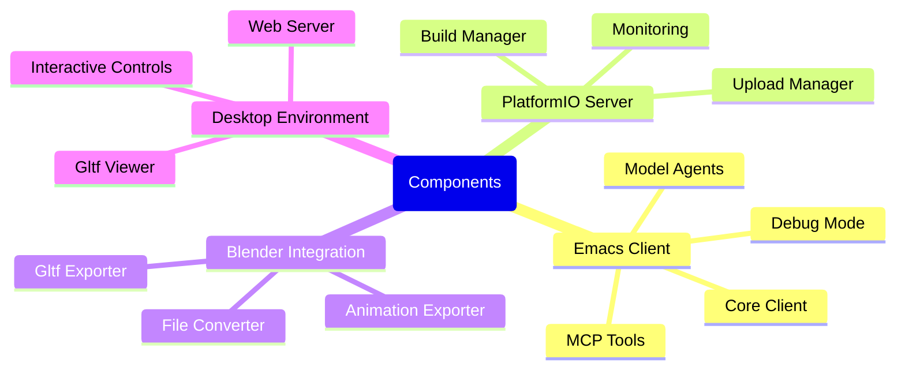
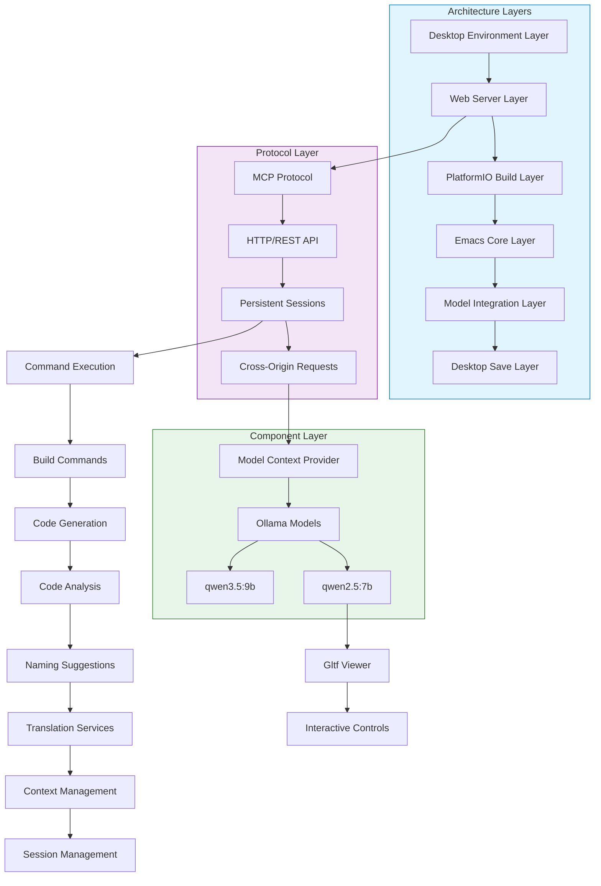

# System Architecture Overview

:::info {name="System Architecture"}
High-level architecture of the Emacs PlatformIO Blender system
:::

## System Overview

```mermaid
flowchart TB
    subgraph system [System Overview]
        A[Desktop Environment] --> B[Emacs Client]
        B --> C[PlatformIO Server]
        C --> D[Build Outputs]
        
        D --> E[Blender Integration]
        E --> F[Gltf/obj Files]
        F --> G[WebGL Viewer]
        
        subgraph components [Components]
        G --> H[Gltf Model Viewer]
        H --> I[Interactive Controls]
        I --> J[Animation Support]
        end
        
        J --> K[Blinking Eyes]
        L[Debug Mode] --> M[Interactive Controls]
        end
        
        B --> M
        C --> L
    end
    
    style system fill:#e8f5e9,stroke:#2e7d32
    style components fill:#c8e6c9,stroke:#388e3c
```

## Component Architecture



## Architecture Layers



## Data Flow Architecture

```mermaid
flowchart TD
    subgraph dataflow [Data Flow]
        A[User Input] --> B{Input Type}
        
        B -->|Source Code| C[Code Parsing]
        B -->|Natural Language| D[NLP Processing]
        B -->|Build Command| E[Build Execution]
        
        C --> F[Code Analysis]
        D --> G[Intent Recognition]
        E --> H[Build Management]
        
        subgraph processing [Processing]
        F --> I[Tokenization]
        G --> J[Intent Classification]
        H --> K[Task Planning]
        
        I --> L[Model Inference]
        J --> L
        K --> L
        
        subgraph model [Model Inference]
        L --> M[Context Management]
        M --> N[Optimized Context]
        N --> O[vLLM Backend]
        O --> P[Token Generation]
        
        subgraph output [Output Generation]
        P --> Q[Response Generation]
        Q --> R[Response Formatting]
        R --> S[Output Display]
        S --> T[Code Updates]
        end
        
        S --> U[Desktop Save]
        T --> U
    end
    
    subgraph display [Display Layer]
        U --> V[Output Buffer]
        V --> W[Code Display]
        W --> X[Syntax Highlight]
        X --> Y[Error Messages]
        Y --> Z[Interactive Controls]
        end


    style dataflow fill:#c8e6c9,stroke:#388e3c
    style display fill:#fff3e0,stroke:#e65100
    style processing fill:#e3f2fd,stroke:#1565c0
    style model fill:#fce4ec,stroke:#c2185b
```

## Message Flow

```mermaid
flowchart TD
    subgraph messages [Message Flow]
        A[User Message] --> B[MCP Client]
        B --> C{Protocol Type}
        
        C -->|System Prompt| D[System Prompt]
        C -->|Tool Call| E[Tool Call]
        C -->|Error| F[Error Message]
        
        D --> G[Prompt Processing]
        G --> H[Context Window]
        H --> I[Model Inference]
        
        E --> J[Tool Execution]
        J --> K[Response Generation]
        
        F --> L[Error Handling]
        L --> M[Error Display]
        
        subgraph response [Response]
        I --> N[Response Generation]
        K --> N
        N --> O[Response Formatting]
        O --> P[Response Display]
        P --> Q[Update Buffer]
        end
        
        suborg:org-inlin-images-display --> R[Image Display]
        R --> S[Desktop Save]
        suborg:org-inlin-images-display fill:#e8f5e9,stroke:#2e7d32
        end
    
    P --> S
    K --> L
    F --> L
    Q --> R
    S --> T[Session End]
    T --> X[Cleanup]
    X --> Y[Exit Debug]
    Y --> N
    
    style messages fill:#e1f5fe,stroke:#0277bd
    style response fill:#e8f5e9,stroke:#2e7d32
    suborg fill:#c8e6c9,stroke:#388e3c
```

## Security Architecture

```mermaid
flowchart LR
    subgraph security [Security Architecture]
        A[CORS Configuration] --> B[CorsHeaders]
        B --> C[CORS_ALLOW]
        
        subgraph models [Model Management]
        C --> D[Model Registry]
        D --> E[Model Authorization]
        E --> F[Session Management]
        end
        
        subgraph desktop [Desktop Save]
        F --> G[Desktop Save]
        G --> H[Encrypted Storage]
        H --> I[Backup Management]
        I --> J[Version Control]
        end
        
        J --> K[Security Audit]
        K --> L[Audit Logs]
        L --> M[Security Alerts]
        
        subgraph debug [Debug Mode]
        M --> N[Debug Controls]
        N --> O[Pause/Resume]
        O --> P[Interactive Debug]
        
        subgraph validation [Validation]
        P --> Q[Validation Check]
        Q --> R[Encoding Check]
        R --> S[File Integrity]
        end
        
        style security fill:#e8f5e9,stroke:#2e7d32
        style models fill:#f3e5f5,stroke:#7b1fa2
        style desktop fill:#e1f5fe,stroke:#0277bd
        style debug fill:#c8e6c9,stroke:#388e3c
        style validation fill:#fff3e0,stroke:#e65100
```

## Performance Architecture

```mermaid
flowchart TD
    subgraph perf [Performance Architecture]
        A[Performance Monitoring] --> B[Load Path Cache]
        B --> C[Package Cache]
        C --> D[Model Inference Cache]
        D --> E[Session Management]
        
        subgraph optimization [Optimization]
        E --> F[Context Caching]
        F --> G[Token Optimization]
        G --> H[Query Optimization]
        
        subgrid[Rendering]
        H --> I[GPU Acceleration]
        I --> J[Context Window Management]
        J --> K[Memory Optimization]
        K --> L[Fast Startup]
        end
        
        L --> M[Memory Management]
        M --> N[GC Optimization]
        N --> O[Efficient Allocation]
        
        subgrid[Display]
        O --> P[Render Buffer]
        P --> Q[Display Updates]
        Q --> R[Smooth Rendering]
        R --> S[Frame Rate Maintenance]
        
        style perf fill:#fff3e0,stroke:#e65100
        style optimization fill:#e3f2fd,stroke:#1565c0
        subgrid fill:#fce4ec,stroke:#c2185b
    end
    
    S --> T[Performance Metrics]
    T --> U[Monitor Dashboard]
    U --> V[Performance Analysis]
    V --> W[Optimization Suggestions]
    
    W --> Z[Benchmark Tests]
    Z --> AA[Benchmark Results]
    AA --> AB[Performance Report]
    
    style W fill:#e8f5e9,stroke:#2e7d32
    style Z fill:#fff3e0,stroke:#e65100
    style AA fill:#e3f2fd,stroke:#1565c0
    style AB fill:#fce4ec,stroke:#c2185b
```

## Best Practices

:::info {name="Architecture Best Practices"}
1. Keep components modular
2. Use appropriate caching layers
3. Monitor performance metrics regularly
4. Use context window efficiently
5. Optimize token usage
6. Keep security measures active
7. Document architecture decisions
:::
