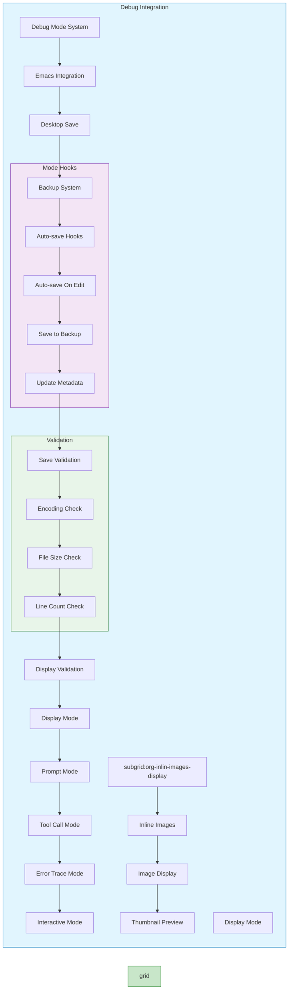

# Debug Mode System

:::info {name="Debug Mode"}
Interactive debugging with Emacs
:::

## Debug Mode Commands

```mermaid
flowchart TD
    subgraph debug [Debug Mode]
        A[C-c k k] --> B{Debug Type}
        
        subgraph types [Debug Types]
            B -->|System Prompt| C[Show Prompt in Buffer]
            B -->|Tool Call| D[Log Tool Calls]
            B -->|Error Trace| E[Stack Trace Display]
            B -->|Interactive| F[Interactive Debug]
        end
        
        subgraph modes [Debug Modes]
            C --> G[Debug Mode]
            G --> H[Analysis Mode]
            
            D --> G
            E --> I[Error Console]
            
            subgraph kill [Kill System]
                F --> J[C-c k k]
                J --> K[Kill Process]
            end
            
            subgraph load [Load System]
                N[C-c k k] --> O[Load Debug]
                O --> P[Interactive Debug]
            end
        end
        
        subgraph analysis [Analysis Mode]
        G --> Q[Debug Analysis]
        Q --> R[Error Detection]
        R --> S[Performance Trace]
        H --> T[Analysis Results]
    end
    
    subgraph results [Results]
        T --> U[Debug Report]
        I --> U
        U --> V[Fix Suggestion]
        V --> W[Exit Debug]
    end
    
    K --> C
    K --> D
    K --> E
    
    C --> W
    I --> W
    S --> W
    
    style debug fill:#ef9a9a,stroke:#c62828
    style types fill:#ffcdd2,stroke:#c62828
    styles.fill fill:#f8d7da
```

## System Prompt Debug

```mermaid
flowchart TD
    subgraph sprompt [System Prompt Debug]
        A[C-c k k] --> B{Show Prompt?}
        
        subgraph display [Display Options]
            B -->|Yes| C[Buffer Display]
            C --> D[Markdown Format]
            C --> E[Plain Display]
            
            B -->|No| F[Hide Prompt]
        end
        
        subgraph validation [Validation]
            D --> G[Prompt Validation]
            E --> G
            F --> G
            G --> H[Prompt Check]
            H --> I[Prompt Status]
        end
        
        subgraph edit [Edit Prompt]
            I --> J[Edit Prompt]
            J --> K[Save Changes]
            K --> L[Prompt Updated]
        end
        
        subgraph kill [Kill Display]
            A --> M{Continue Debug?}
            M -->|Yes| N[Continue Debug]
            M -->|No| O[Show Prompt]
            
            style display fill:#fff9c4,stroke:#f9a825
            style validation fill:#e8f5e9,stroke:#2e7d32
            style edit fill:#c8e6c9,stroke:#388e3c
            style kill fill:#f3e5f5,stroke:#7b1fa2
        end
    
    O --> G & N
    G --> L
    N --> M
    L --> P[Update Buffer]
    P --> Q[Prompt Ready]
    Q --> N
```

## Tool Call Logging

```mermaid
flowchart LR
    subgraph log [Tool Call Logging]
        A{Tool Call Made?}
        
        A -->|Yes| B[Log Call Details]
        B --> C[Call Name]
        B --> D[Arguments]
        B --> E[Response]
        
        subgraph details [Call Details]
        C --> F[Parse Arguments]
        D --> F
        E --> F
        
        subgraph storage [Storage]
        F --> G[Save to Log]
        G --> H[~/emacsd/debug/]
        
        subgraph analysis [Analysis]
        H --> I[Log Analysis]
        I --> J[Pattern Detection]
        J --> K[Optimization Suggestion]
        end
        
        E --> I
        F --> K
        
        style log fill:#e3f2fd,stroke:#1565c0
        style details fill:#fff3e0,stroke:#e65100
        style storage fill:#e8f5e9,stroke:#2e7d32
        style analysis fill:#c8e6c9,stroke:#388e3c
```

## Interactive Debug Mode

```mermaid
flowchart TB
    subgraph interactive [Interactive Debug]
        A[C-c k k] --> B{Debug Enabled?}
        
        B -->|Yes| C{Debug Action}
        B -->|No| D[Enable Debug]
        
        subgraph actions [Debug Actions]
            C -->|Start| E[Enable Debug]
            E --> F[Show Controls]
            F --> G[Pause Execution]
            
            C -->|Stop| H[Stop Debug]
            H --> I[Cleanup Buffer]
            
            C -->|Next| J[Next Step]
            J --> K[Update Display]
            
            C -->|Previous| L[Previous Step]
            L --> M[Update Display]
        end
        
        subgraph state [State Management]
            G --> N[Debug State]
            N --> O[Pause/Resume]
            O --> P[State Check]
            
            suborg:org-inlin-images-display --> R[Display Images]
            R --> S[Inline Display]
            S --> T[Thumbnail Preview]
            
            style actions fill:#e3f2fd,stroke:#1565c0
            style state fill:#e8f5e9,stroke:#2e7d32
            suborg:org-inlin-images-display fill:#c8e6c9,stroke:#388e3c
            R fill:#fce4ec,stroke:#c2185b
            end
    
    D --> N
    N --> P
    P --> Q[Debug Active]
    Q --> R
    R --> S
    S --> T
    T --> Q
    Q --> R
```

## Error Trace Display

```mermaid
flowchart TD
    subgraph errors [Error Trace]
        A{Error Occurred?}
        
        A -->|Yes| B[Show Error Stack]
        B --> C{Trace Depth?}
        
        subgraph stack [Stack Display]
            C -->|Shallow| D[Current Frame]
            C -->|Full| E[Full Stack]
            C -->|All| F[All Calls]
        end
        
        subgraph analysis [Analysis]
        D --> G[Parse Frame]
        E --> G
        F --> G
        G --> H[Error Analysis]
        H --> I[Suggestions]
        
        subgraph storage [Storage]
        I --> J[Save Trace]
        J --> K[~/emacsd/errors/]
        
        subgraph cleanup [Cleanup]
        K --> L{Timeout?}
        L -->|Yes| M[Cleanup Old]
        L -->|No| N[Keep Trace]
        end
        
        style errors fill:#e3f2fd,stroke:#1565c0
        style stack fill:#f3e5f5,stroke:#7b1fa2
        style analysis fill:#fff3e0,stroke:#e65100
        style storage fill:#e8f5e9,stroke:#2e7d32
        style cleanup fill:#c8e6c9,stroke:#388e3c
```

## Debug Panel Layout

```mermaid
flowchart TB
    subgraph panel [Debug Panel]
        A{Panel Type}
        
        A -->|System Prompt| B[Prompt Display]
        A -->|Tool Calls| C[Call Log]
        A -->|Error Trace| D[Error Stack]
        A -->|Interactive| E[Interactive Controls]
        
        subgraph controls [Panel Controls]
        B --> F[Debug Controls]
        C --> F
        D --> F
        E --> F
        
        F --> G[Pause Button]
        F --> H[Step Button]
        F --> I[Resume Button]
        F --> J[Clear Button]
        F --> K[Close Button]
        end
        
        subgraph layout [Layout Configuration]
        G --> L[Svelte Layout]
        H --> L
        I --> L
        J --> L
        K --> L
        
        L --> M[Svelte Components]
        M --> N[Panel Frame]
        M --> O[Content Area]
        M --> P[Control Buttons]
        end
        
        B --> G
        C --> M
        D --> M
        E --> M
        
        style panel fill:#fff3e0,stroke:#e65100
        style controls fill:#e3f2fd,stroke:#1565c0
        style layout fill:#f3e5f5,stroke:#7b1fa2
```

## Debug Buffer Management

```mermaid
flowchart TD
    subgraph buffers [Buffer Management]
        A[Debug Buffer Created] --> B[Create Buffer]
        
        subgraph display [Display Options]
        B --> C{Display Type?}
        
        C -->|System Prompt| D[Show Prompt]
        C -->|Tool Calls| E[Show Calls]
        C -->|Error Trace| F[Show Errors]
        C -->|Interactive| G[Show Interactive]
        
        subgraph controls [Buffer Controls]
        D --> H[Debug Controls]
        E --> H
        F --> H
        G --> H
        H --> I[Pause Button]
        H --> J[Resume Button]
        I --> K[Step Button]
        J --> K
        end
        
        subgraph storage [Buffer Storage]
        I --> L[Save State]
        J --> L
        K --> L
        L --> M[~/emacsd/debug/]
        M --> N[Restore on Exit]
        end
        
        subgraph kill [Buffer Kill]
        N --> O{Kill Buffer?}
        
        subgraph kill [Kill Buffer]
        O -->|Confirm| P[Confirm Kill]
        O -->|No| Q[Keep Buffer]
        end
        
        I --> A
        O --> R[Restore]
        Q --> L
        P --> C
        R --> L
        C --> N
        
        style buffers fill:#e8f5e9,stroke:#2e7d32
        style display fill:#fff3e0,stroke:#e65100
        style storage fill:#c8e6c9,stroke:#388e3c
        style kill fill:#fce4ec,stroke:#c2185b
```

## Debug Mode Integration



## Best Practices

:::info {name="Debug Mode Best Practices"}
1. Enable debug mode for specific tasks
2. Use prompt display to check messages
3. Monitor tool call logs regularly
4. Review error traces for quick fixes
5. Keep interactive mode enabled for development
6. Use pause/stop controls for safety
7. Clean up debug buffers on exit
:::
