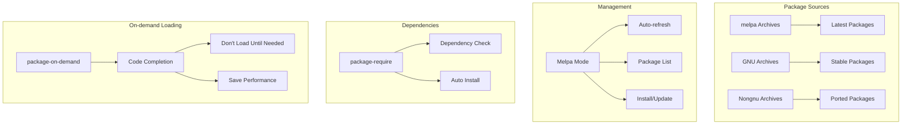
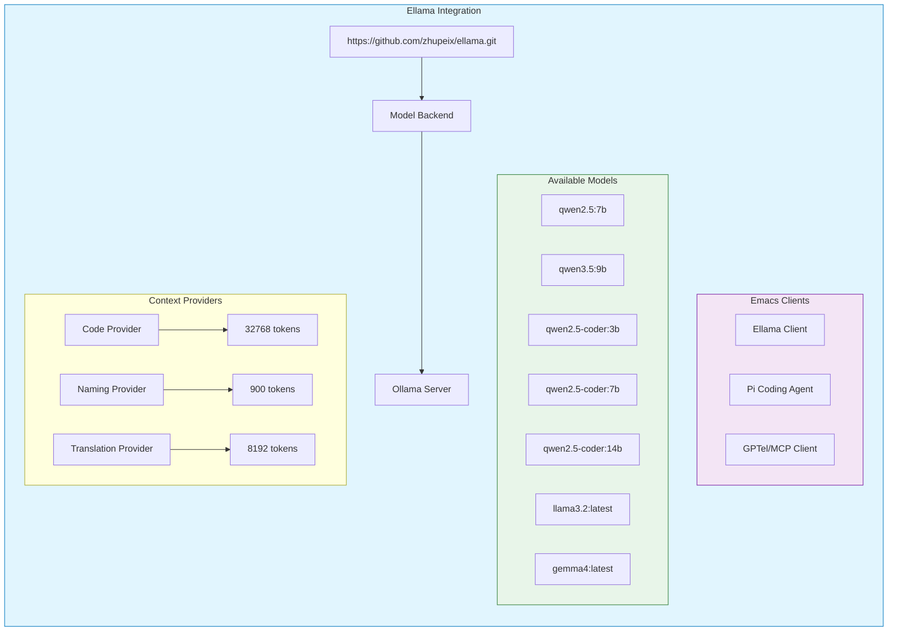
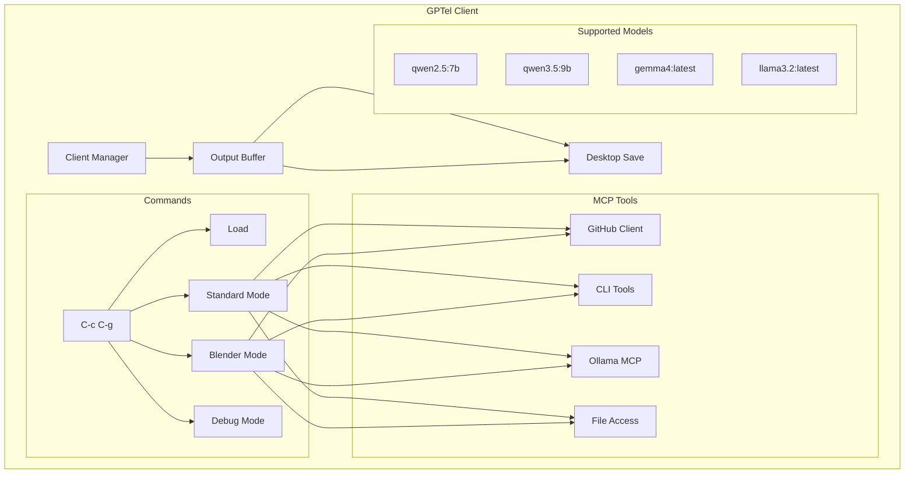
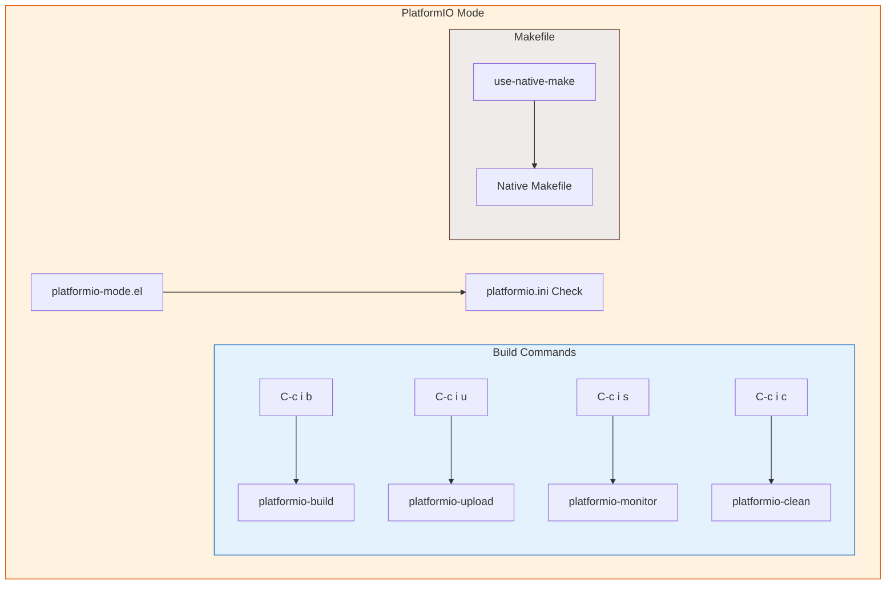
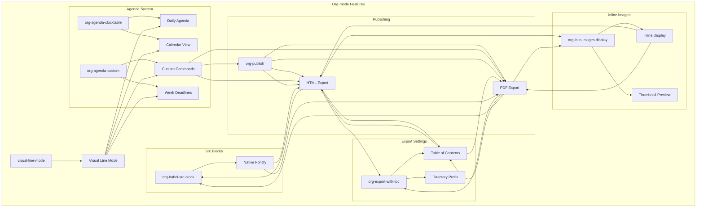
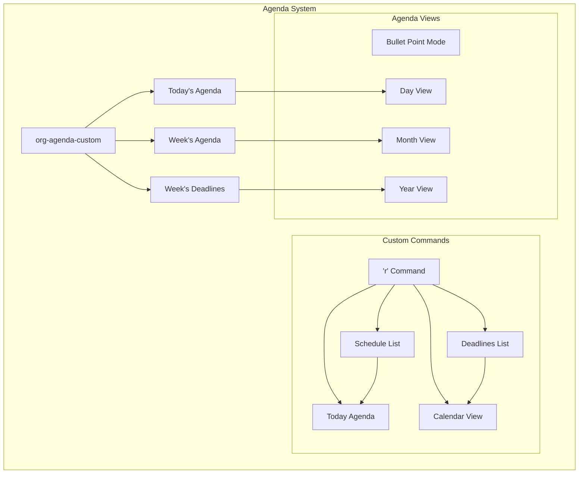
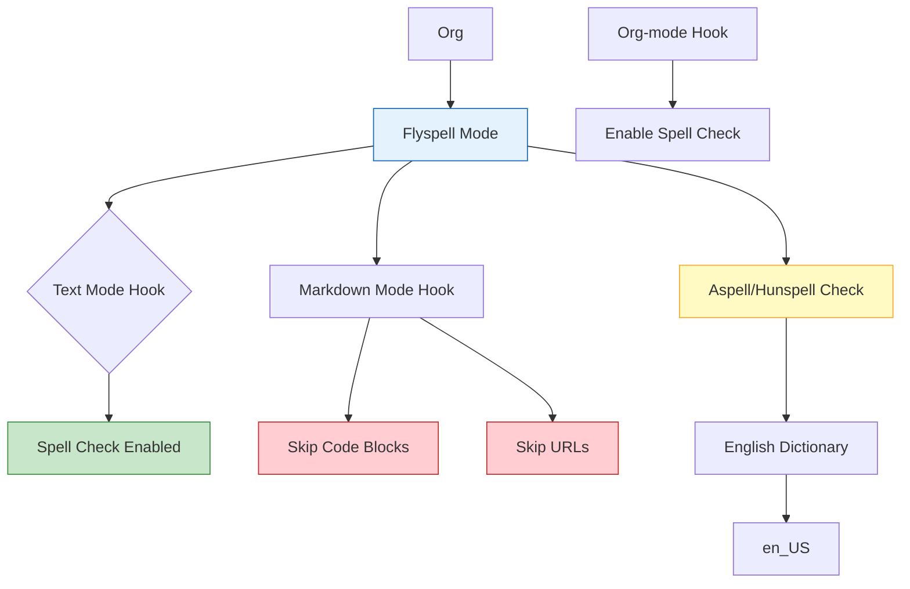
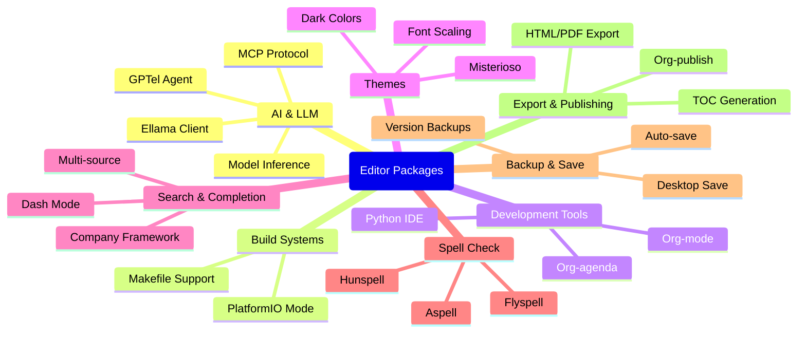
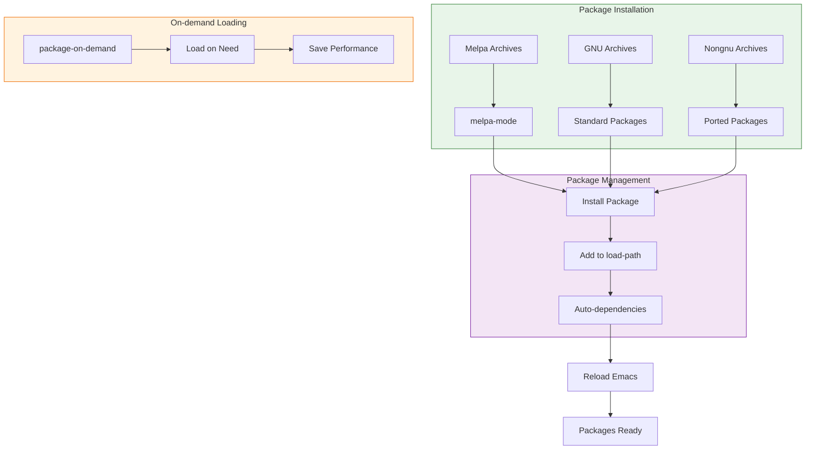
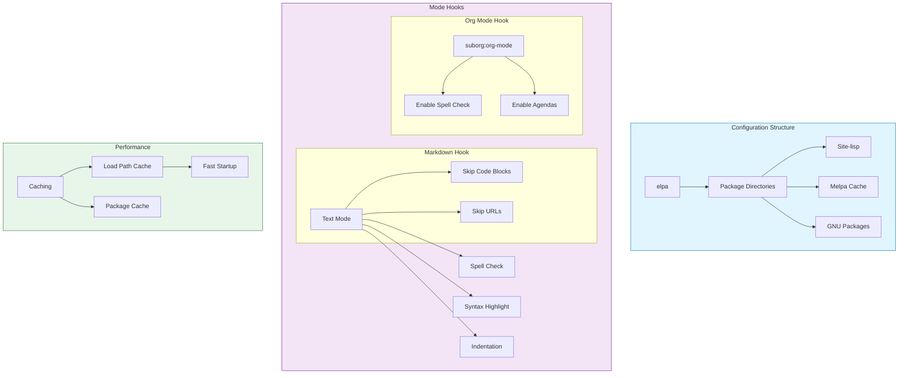

# Editor Plugins & Packages

:::info {name="Package Management"}
Emacs Package Management System (ELPA)
:::

## Package Sources



## Available Packages

| Package | Purpose | Description |
|---------|---------|-------|
| `ellama` | AI Assistant | Model integration with Ollama |
| `gptel` | GPT Client | LLM client interface |
| `mcp-ebmc` | MCP Client | Model Context Protocol support |
| `platformio-mode` | PlatformIO | Embedded build system |
| `elpy` | Python IDE | Python development |
| `org-mode` | Org-mode | Org files support |
| `misterioso` | Theme | Dark theme |
| `org-agenda` | Agenda | Custom agenda views |
| `flyspell` | Spell Check | In-line spell checking |
| `dash` | Search | File search |
| `company` | Completion | Completion framework |

## Ellama Integration



## GPTel Agent



## PlatformIO Mode



## Org-mode Plugins



## Custom Commands

| Command | Bind Key | Function |
|---------|----------|----------|
| `econky-start` | `M-x` | Start Econky |
| `econky-stop` | `M-x` | Stop Econky |
| `platformio-build` | `C-c i b` | Build project |
| `platformio-upload` | `C-c i u` | Upload firmware |
| `platformio-monitor` | `C-c i s` | Open serial |
| `platformio-clean` | `C-c i c` | Clean build |

## Completion Frameworks

```mermaid
flowchart TD
    subgraph completion [Completion System]
        A[Company Mode] --> B[Multi-source]
        
        subgraph packages [Packages]
            C[Dash] --> D[File Search]
            C --> E[Command Search]
            C --> F[Git Search]
        end
        
        subgraph company [Company Client] --> G[Prompt]
        G --> H[Completions]
        H --> I[Selection]
    end
    
    B --> D & E & F
    D --> G
    E --> G
    F --> G
    I --> J[Suggestions]
    J --> G
```

## Theme Integration

```mermaid
flowchart LR
    subgraph theme [Theme System]
        A[Misterioso] --> B[Dark Colors]
        B --> C[#110428 Background]
        B --> D[95% Alpha]
        
        subgraph functions [Font Functions]
        E[Custom Font] --> F[Scaling Font]
        E --> G[Prompt Font]
    end
    
    subgraph styles [Styling]
        H[Visual Line Mode] --> I[Line Height]
    end
    
    C --> E & H
    D --> E & H
    
    F --> K[Text Display]
    G --> K
    K --> L[Font Rendering]
    I --> L
```

## Org-mode Agenda



## Spell Checking



## Package List



## Package Installation



## Plugin Configuration



## Best Practices

:::info {name="Editor Plugin Best Practices"}
1. Keep packages updated using `M-x package-refresh-contents`
2. Use on-demand loading for large packages
3. Enable backup before installing new packages
4. Check dependencies before installation
5. Use melpa mode for latest packages
6. Keep package versions compatible
7. Test packages in personal config first
:::
