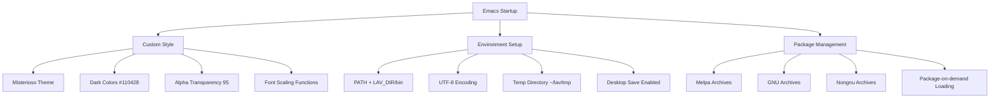
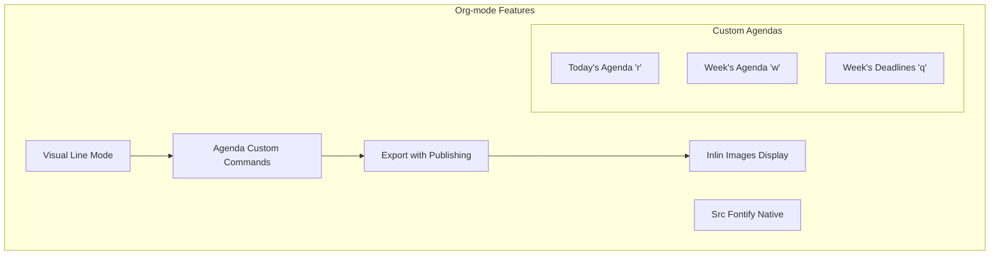
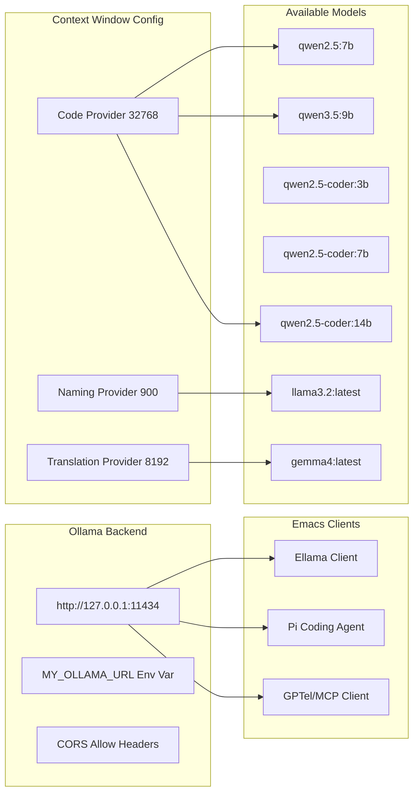
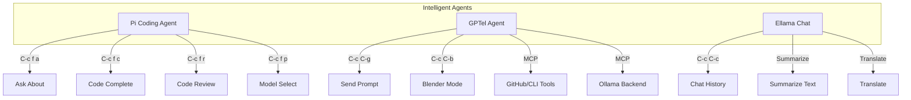
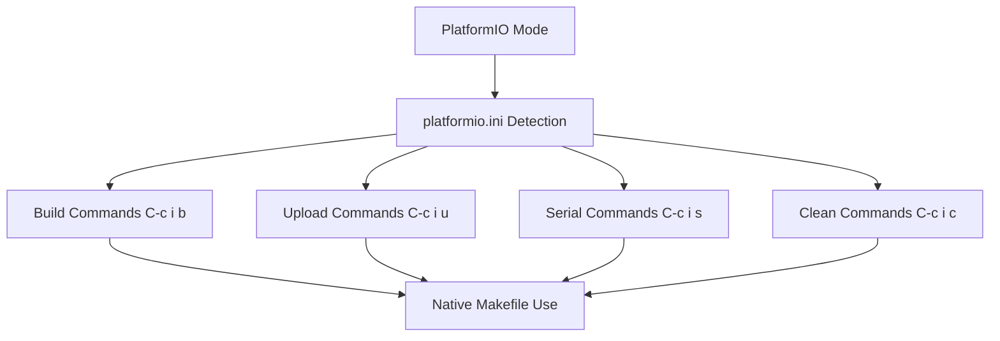
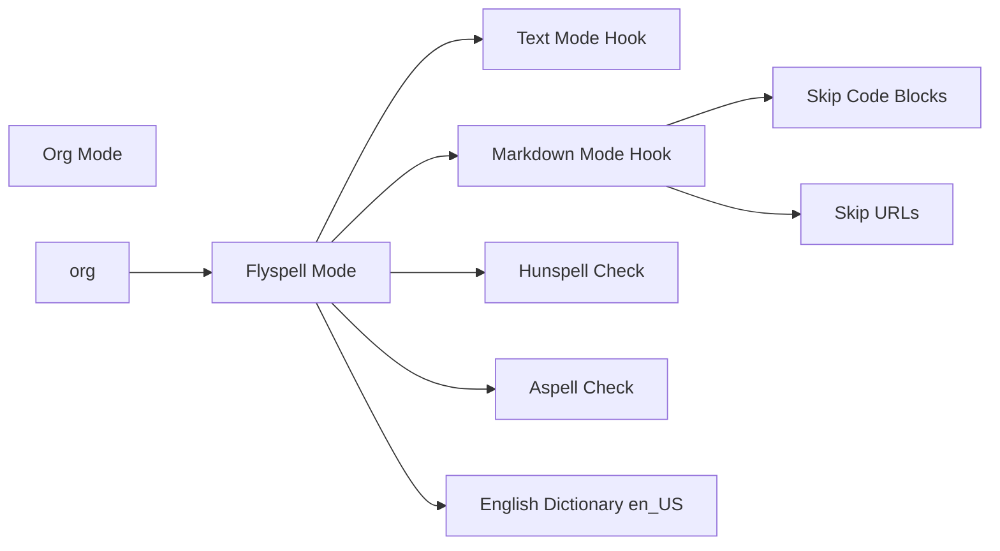
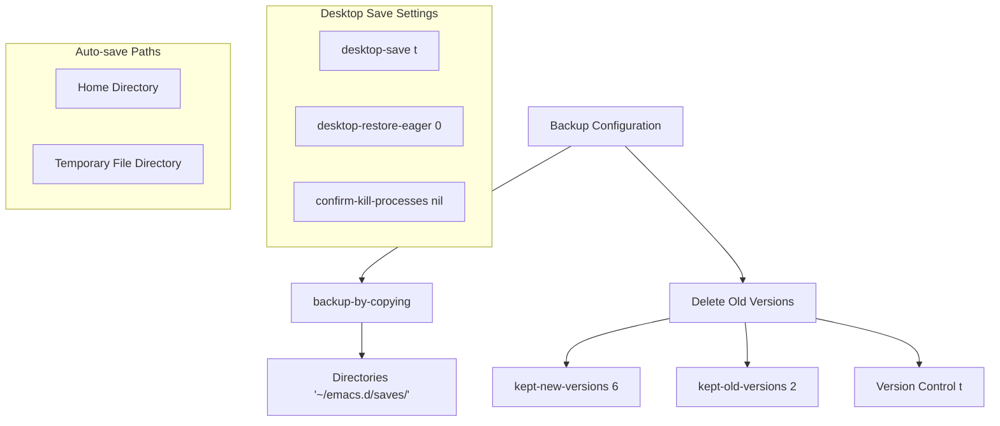

# Emacs Configuration Overview

:::info {name="Configuration Location"}
File: `~/.emacs.d/init.el` (or `mcp_server/emacs/emacs.el`)
:::

## System Configuration



## Org-mode Configuration



## LLM Integration (Ollama)



## Interactive Agents



## Keybindings Structure

```mermaid
mindmap
  root(Emacs Keybindings)
    C-c f[a] ellama-ask-about
    C-c f[c] ellama-code-complete
    C-c f[r] ellama-code-review
    C-c f[g] ellama-improve-grammar
    C-c f[w] ellama-improve-wording
    C-c f[i] ellama-chat
    C-c f[p] ellama-provider-select
    C-c f[s] ellama-summarize
    C-c f[t] ellama-translate
    C-c C-g gptel-load-and-call
    C-c C-b gptel-blender-prompt
    C-c C-c gptel-send
    M-x econky-start
    M-x econky-stop
```

## PlatformIO Integration



## Spell Checking



## Backup & Version Control



:::info {name="Note"}
This configuration enables AI-assisted coding with multiple LLM backends, platform-specific tools (Blender, PlatformIO), and sophisticated file organization.
:::
