# File Operations Overview

:::info {name="File System Integration"}
Integrates Emacs with Blender, PlatformIO, and file management utilities
:::

## Core File Operations

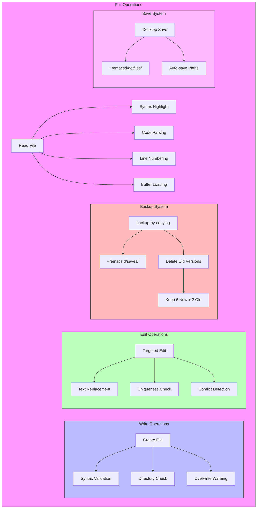

## PlatformIO File Operations

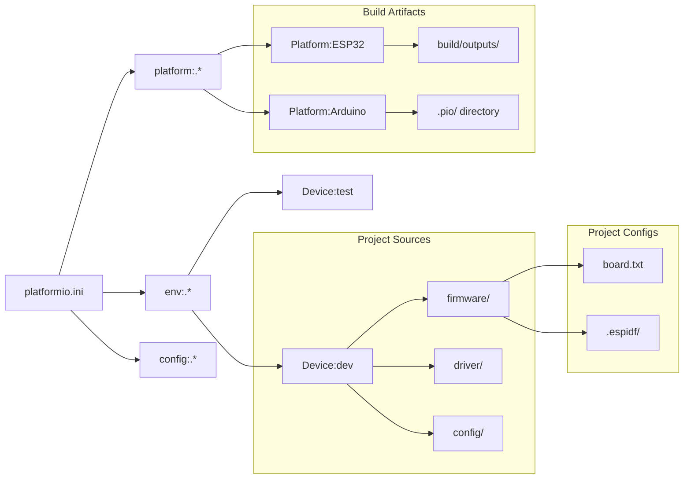

## PlatformIO Commands

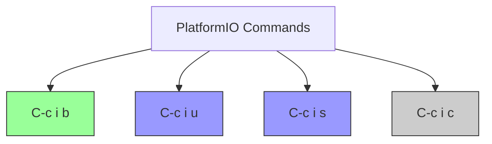

## Blender File Operations

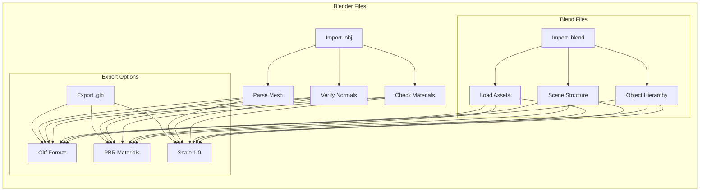

## Read Operations

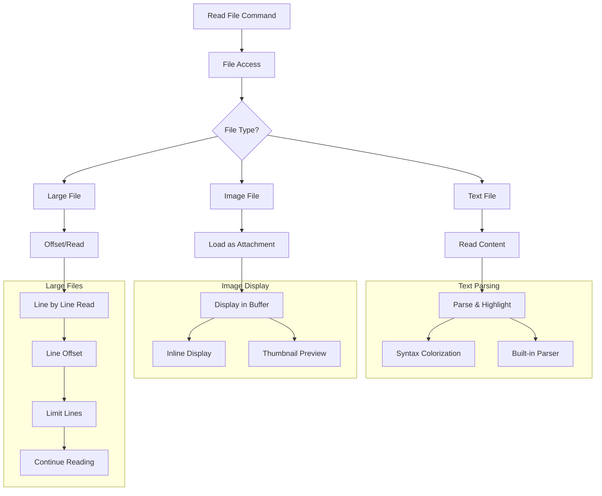

## Write Operations

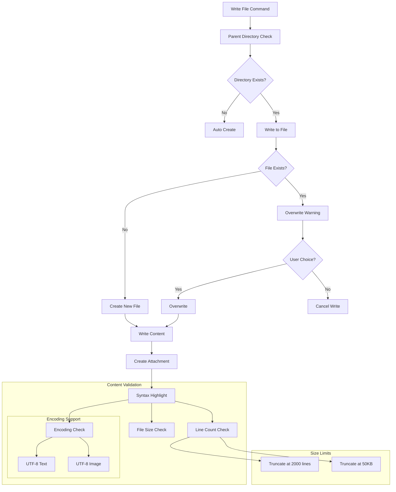

## Edit Operations

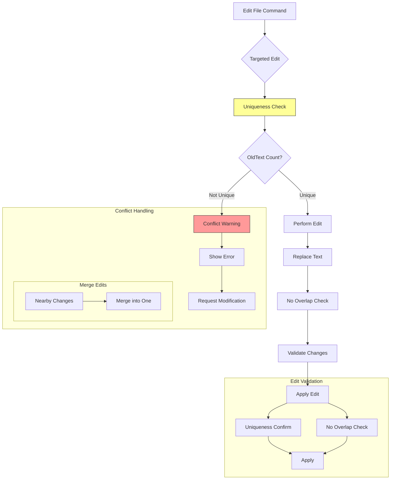

## Backup System

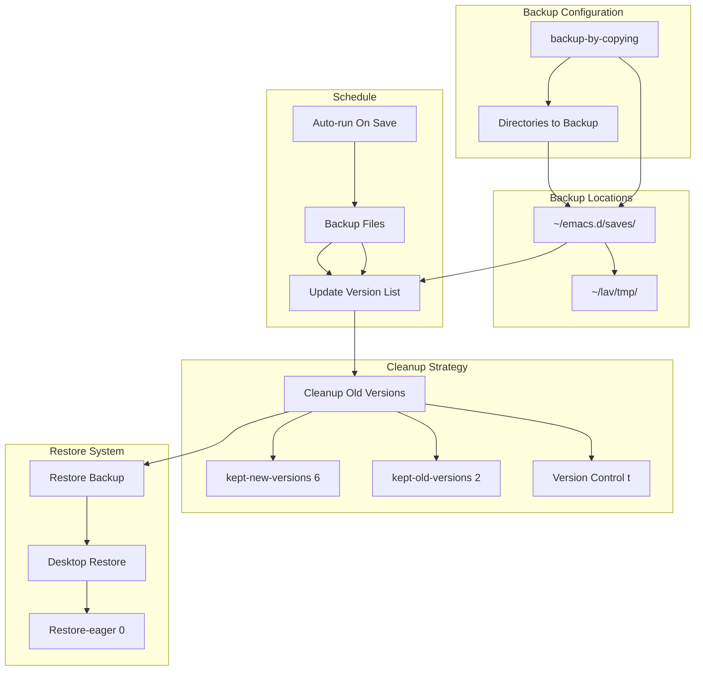

## Auto-save System

```mermaid
flowchart TD
    subgraph autosave [Auto-save Configuration]
        A[desktop-save t] --> B[Auto-save Enabled]
    end
    
    subgraph savepaths [Save Paths]
        C[Save Directory] --> D[~/emacsd/dotfiles/]
        C --> E[Temporary File Directory]
    end
    
    subgraph restore [Restore Settings]
        F[Confirm Kill Processes nil]
        F --> G[Graceful Shutdown]
        
        subgraph eager [Eager Restore]
        H[desktop-restore-eager 0]
        H --> I[Restore on Exit]
    end
    
    A --> D & E
    D --> J{Save Event}
    E --> J
    
    subgraph events [Trigger Events]
        J --> K[File Modified]
        J --> L[Buffers Changed]
    end
    
    K --> M[Save to Backup]
    L --> M
    M --> N[Update Metadata]
```

## Desktop Save

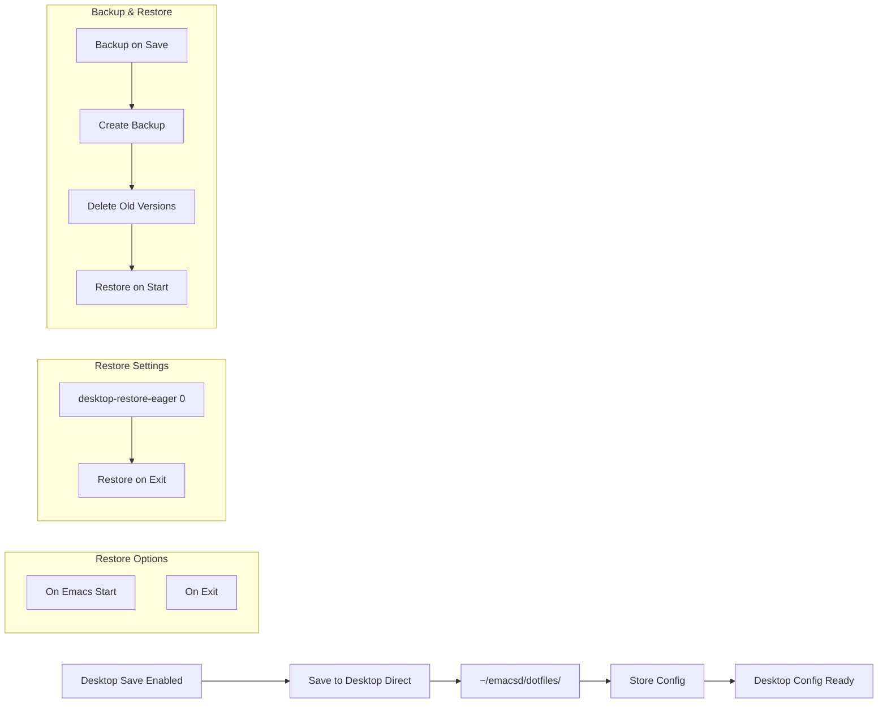

## Large File Handling

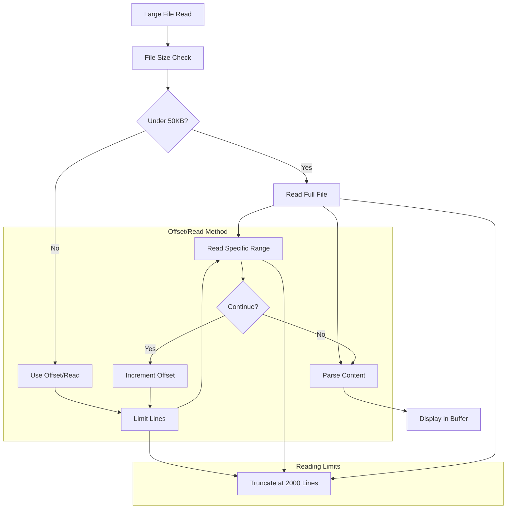

## File Type Handling

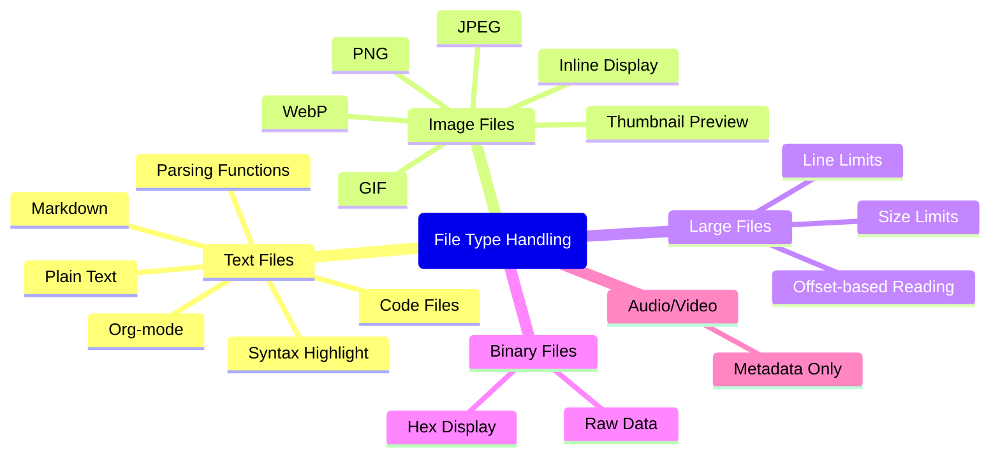

## File Operations Summary

| Operation | Command | Function |
|-----------|---------|----------|
| Read File | Read path | Load file into buffer |
| Read with offset | Read path offset limit | Read specific lines |
| Write File | Write path content | Create/write file |
| Edit File | Edit path edits | Targeted text replacement |
| Delete File | bash rm path | Remove file |
| List Files | bash ls | List directory |
| Search Files | bash rg term | Recursive grep |
| Backup | backup-by-copying | Create backup |
| Restore | desktop-restore | Restore config |
| Save | C-x C-s | Save buffer |
| Auto-save | desktop-save | Auto-save enabled |

:::info {name="File Operations Best Practices"}
1. Always check file type before reading
2. Use offset/limit for large files
3. Enable backup on important files
4. Use parent directory creation for writes
5. Validate file encoding
6. Check limits (2000 lines, 50KB)
:::
