# GPTel Agent Integration with Blender

:::info {name="Integration Point"}
File: `mcp_server/elmcp/el_mcp_server.py` (lines 5366-5444)
:::

## GPTel Agent Overview

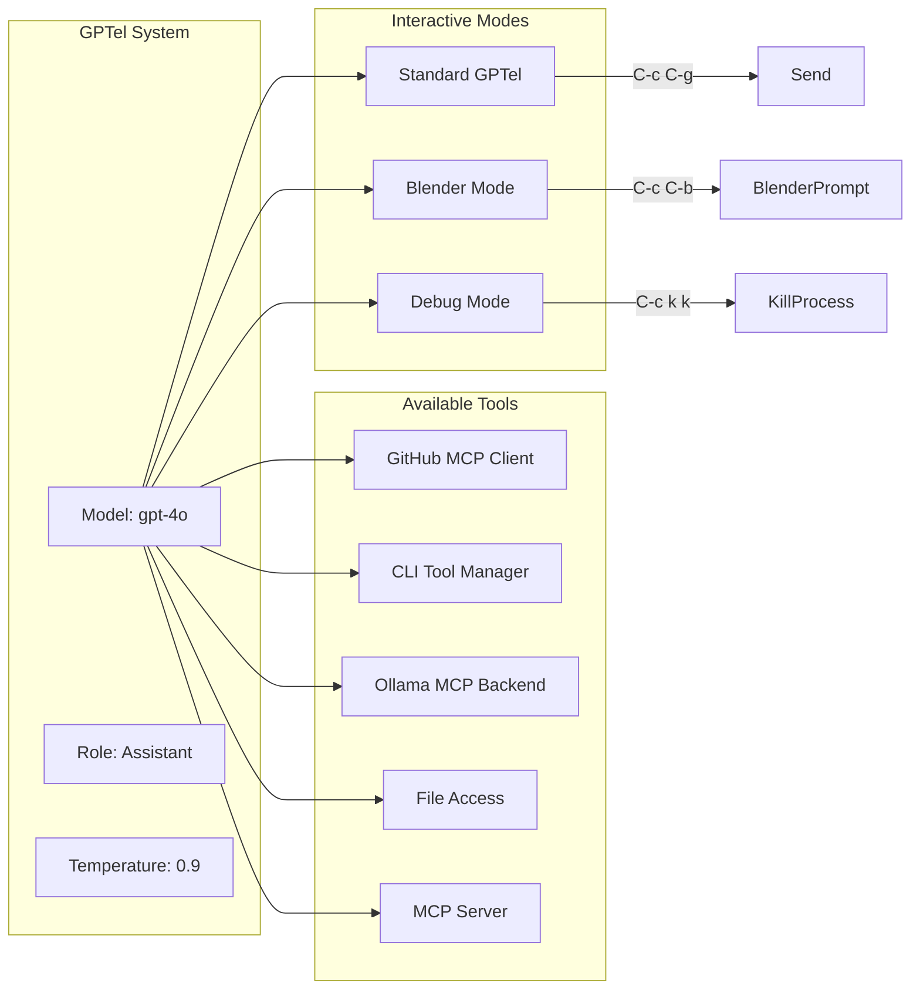

## Blender Mode Workflow

```mermaid
sequenceDiagram
    participant User as User
    participant Emacs as Emacs
    participant GPTel as GPTel
    participant MCP as MCP Server
    
    Note over User,GPTel: C-c C-b to enter Blender mode
    User->>Emacs: C-c C-b (gptel-blender-prompt)
    activate Emacs
    Emacs->>Emacs: Enter Blender Mode
    deactivate Emacs
    
    Note over User,BlenderMode: Describe/Ask about Blender state
    User->>GPTel: C-c C-c (Send Command)
    activate GPTel
    
    Note over GPTel,MCP: Send prompt to Ollama with system prompt
    GPTel->>MCP: Generate Blender-specific prompt
    MCP->>MCP: Access Blender environment
    deactivate GPTel
    
    Note over GPTel,User: Receive response
    MCP->>User: Display in current buffer
    deactivate MCP
```

## Mode Activation

```mermaid
flowchart TB
    start((Start)) --> A[C-c C-g]
    A --> B{Mode Selected?}
    B -->|Standard| C[GPTel Standard]
    B -->|Blender| D[Blender Mode]
    B -->|Debug| E[Debug Mode]
    
    C --> F[Normal conversation]
    D --> G[Blender-specific prompts]
    E --> H[System prompt debugging]
    
    G --> I[C-c C-c Send]
    H --> I
    F --> I
    
    I --> J{Response?}
    J -->|Yes| K[Display Result]
    J -->|No| L[Error/Timeout]
    
    K --> M{Continue?}
    L --> M
    M -->|Yes| G
    M -->|No| end((End))
```

## System Prompt Structure

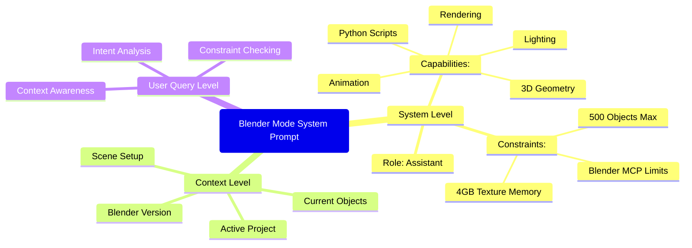

## Command Structure

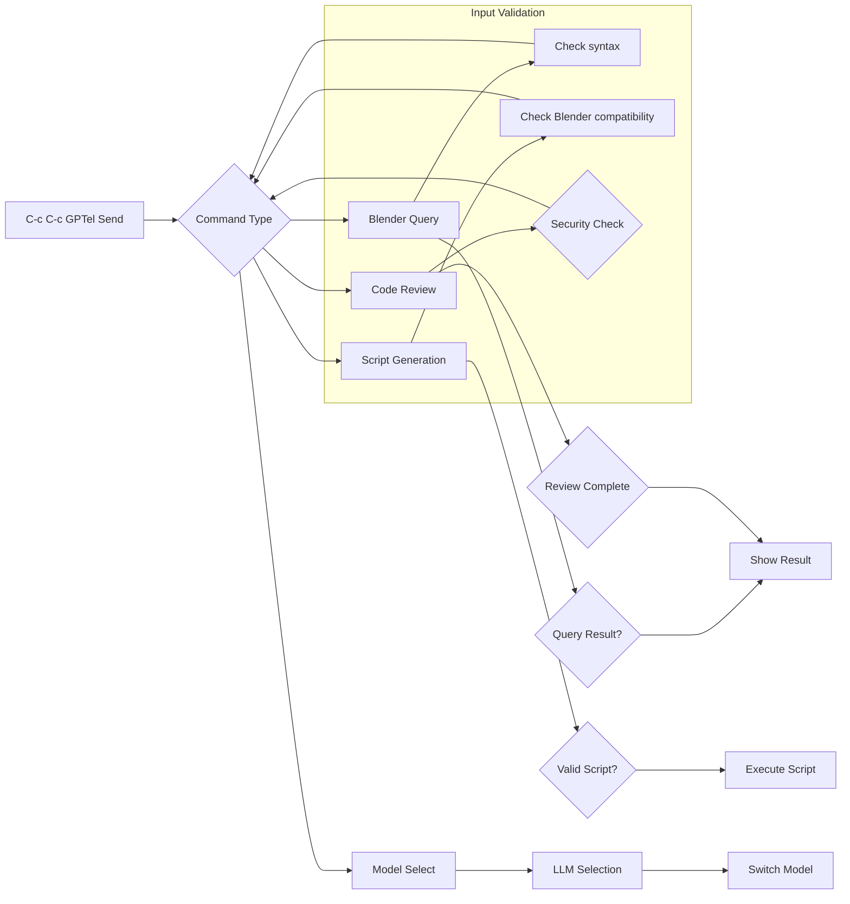

## Response Format

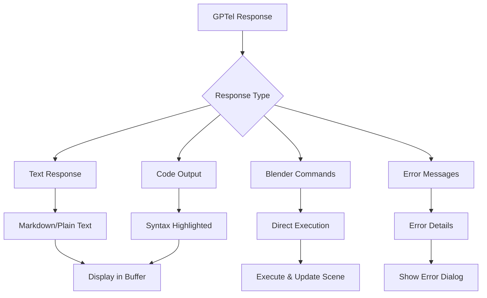

## Tool Chain

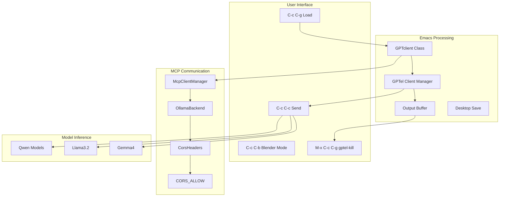

## Debug Mode

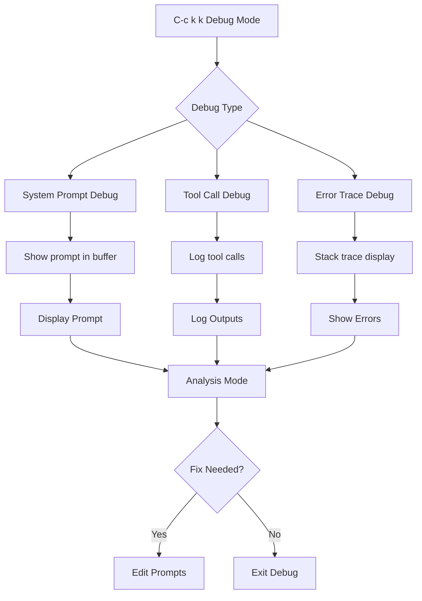

## MCP Clients

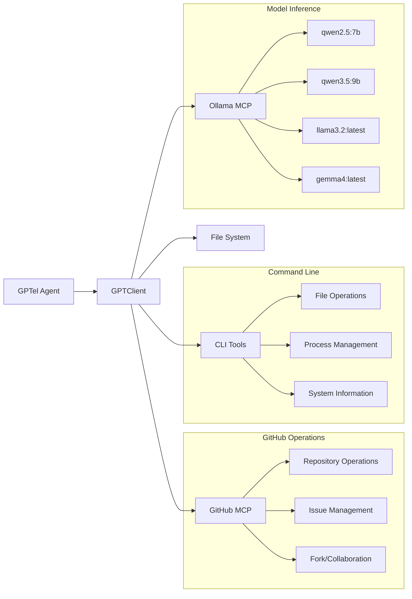

## Context Management

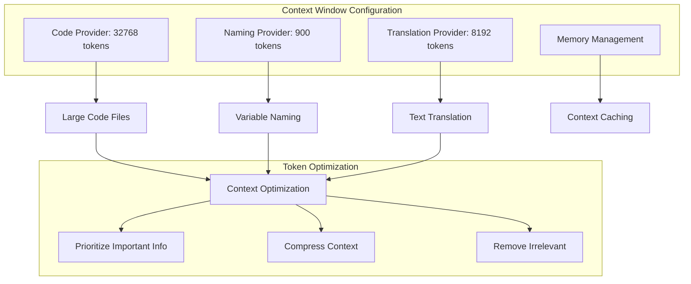

## Session Management

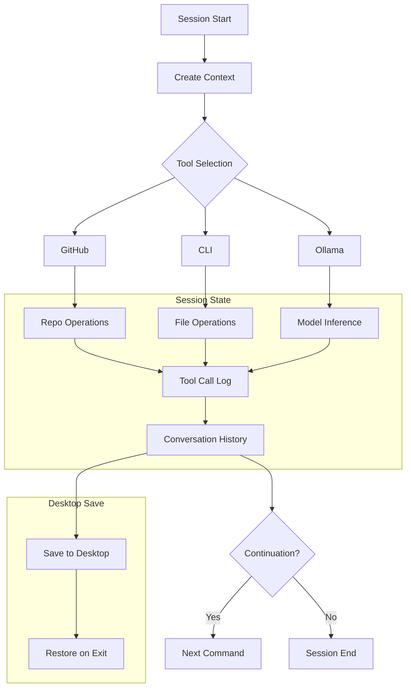

## Security & Validation

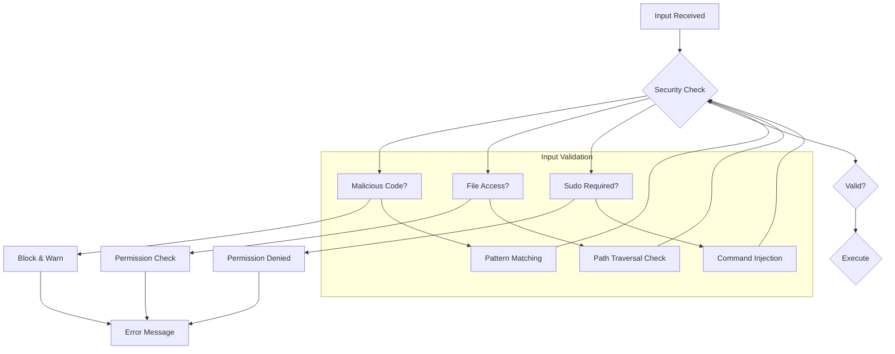

## Interactive Mode

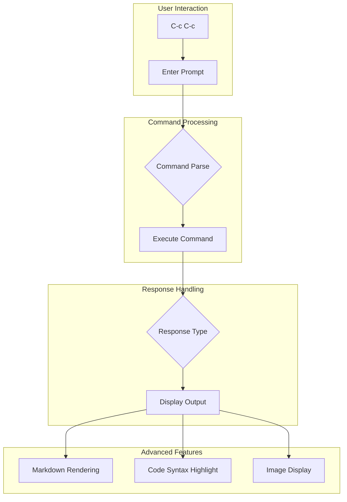

:::info {name="Best Practices"}
1. Always start with `C-c C-g` to load GPTel
2. Use `C-c C-b` for Blender-specific tasks
3. Keep context windows within limits
4. Use debug mode (`C-c k k`) for troubleshooting
5. Check MCP tools availability before use
:::
