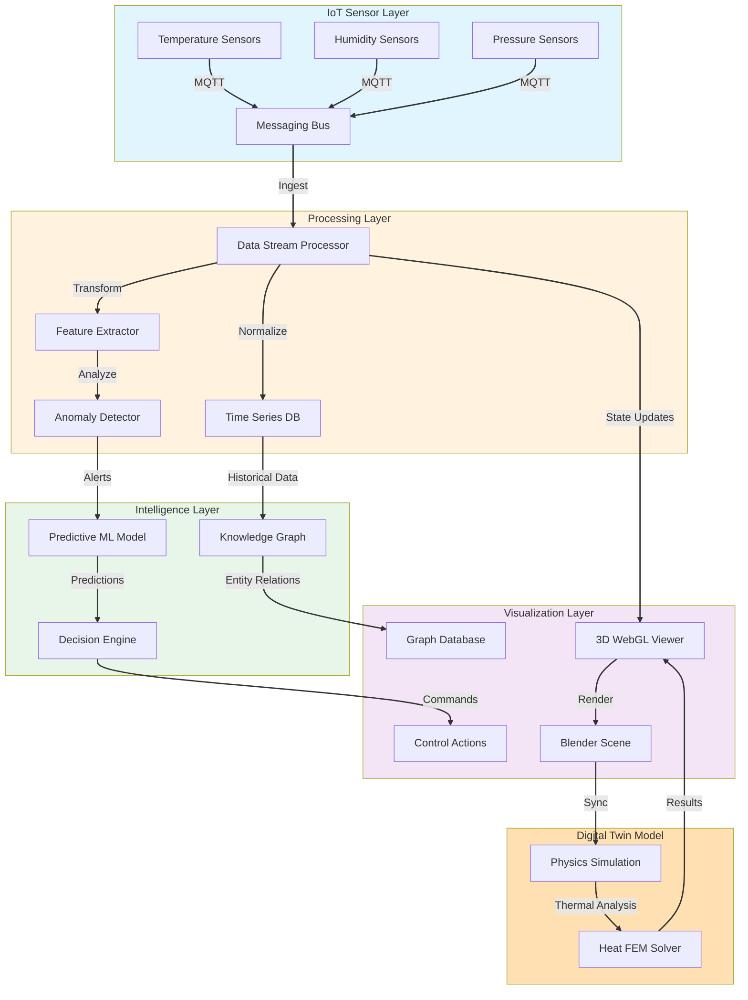
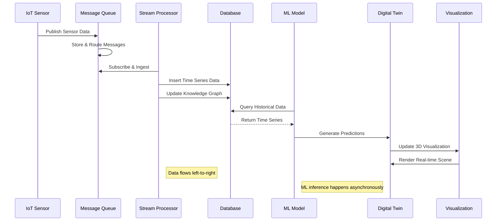
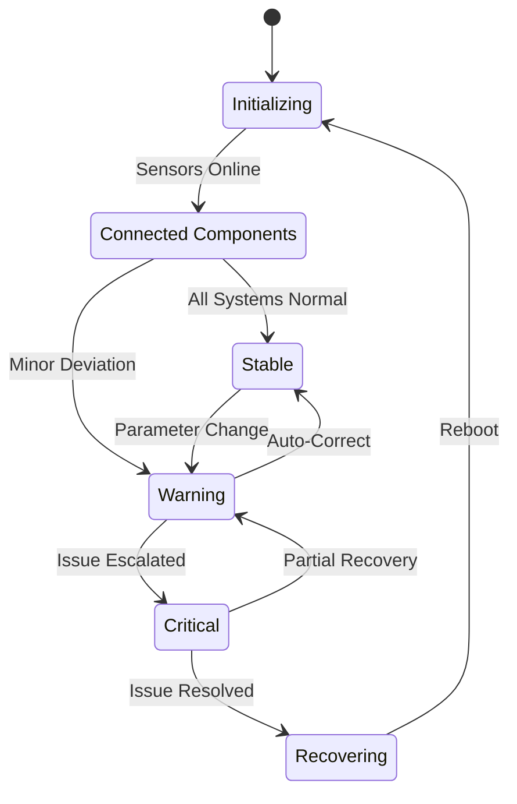
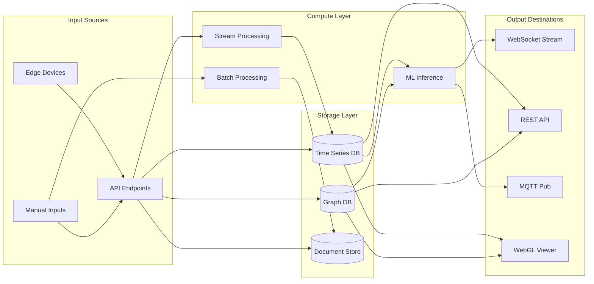
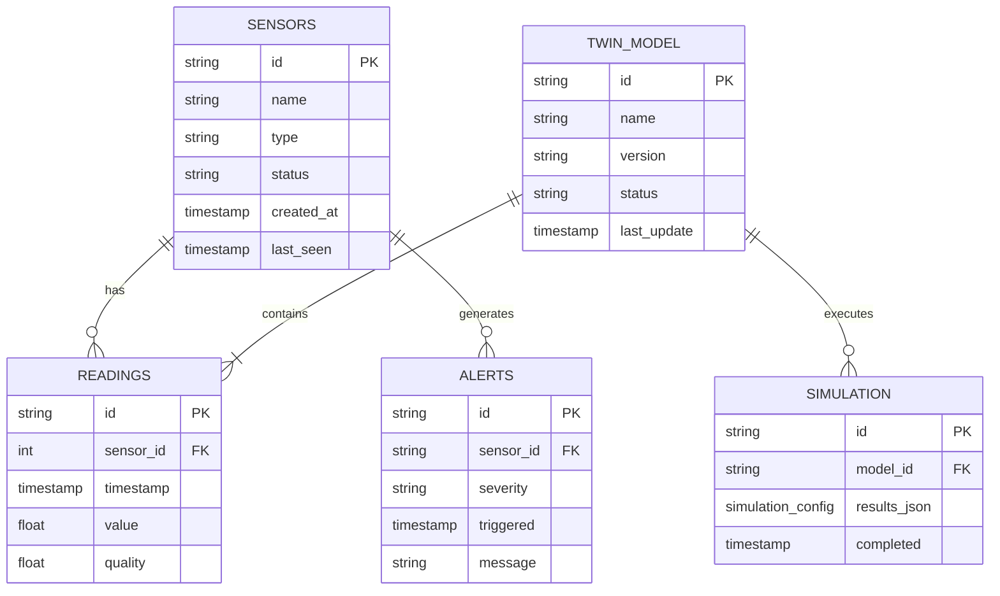
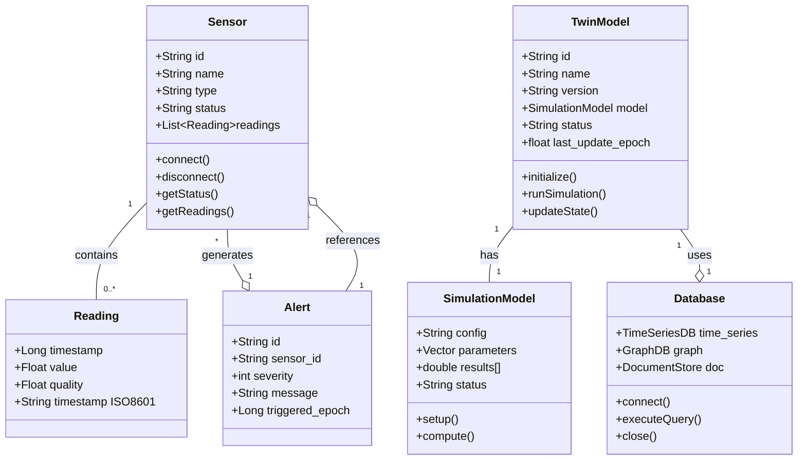
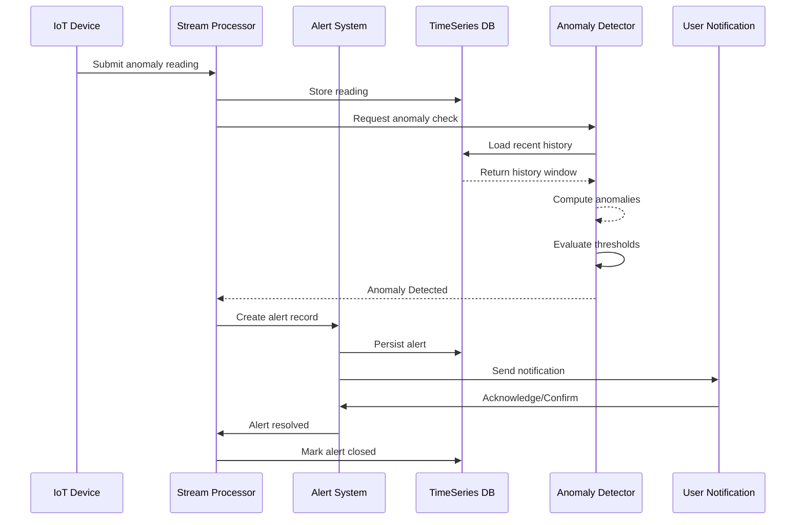

# Digital Twin Architecture Overview

This document demonstrates how to embed and render [Mermaid](https://mermaid.js/) diagrams in markdown files for the Blender Digital Twin project.

## System Architecture Flow

## Component Interaction Diagram

## State Machine for Twin Status

## Data Flow Architecture

## Entity Relationship Map

## Deployment Pipeline

```mermaid
flowchart LR
    A[Requirements] --> B[Development]
    B --> C[Code Review]
    C --> D[Tests]
    D --> E[Build Docker Image]
    E --> F[Push to Registry]
    F --> G[CI/CD Pipeline]
    G --> H[Deploy Stage]
    H --> I[Smoke Tests]
    I --> J[Deploy Production]
    J --> K[Health Checks]
    K --> L[Monitor Alerts]

    style A fill:#fce4ec
    style B fill:#f3e5f5
    style C fill:#e1f5fe
    style D fill:#e8f5e9
    style E fill:#fff3e0
    style F fill:#fffde7
    style G fill:#f3e5f5
    style H fill:#e1f5fe
    style I fill:#e8f5e9
    style J fill:#f3e5f5
    style K fill:#e1f5fe
    style L fill:#f3e5f5
```

## Class Diagram for Core Classes

## Sequence Diagram - Alert Handling

## Notes

- Mermaid diagrams are rendered by compatible markdown viewers
- Common diagram types supported: flowchart, sequence, class, graph, state, er
- Use appropriate syntax for each diagram type
- Ensure your viewer has Mermaid.js loaded
- For custom styling, see [Mermaid documentation](https://mermaid.js/#/)

## License

This knowledge base content is available under Creative Commons BY-NC-SA 4.0.
