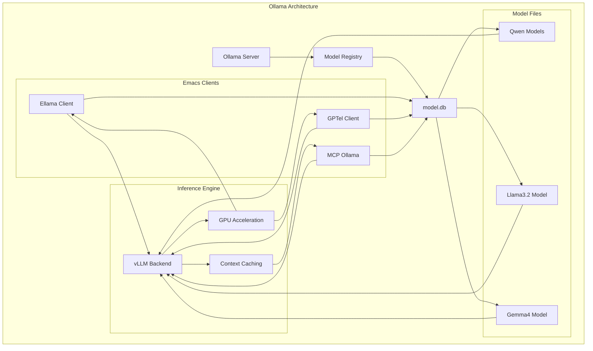
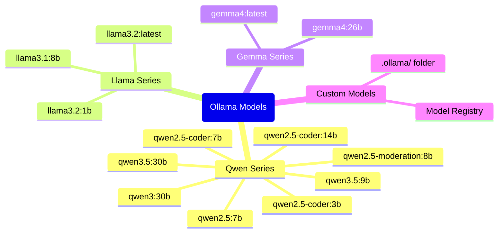
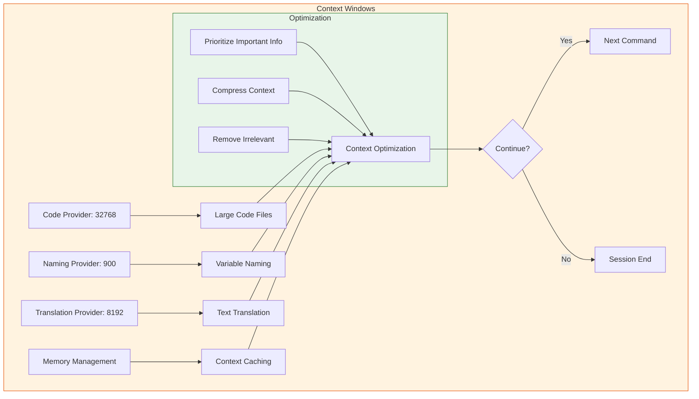

# Ollama Model Integration

:::info {name="Local LLM Server"}
Run Ollama locally for private AI model inference
:::

## Ollama Architecture



## Available Models



## Model Inference

```mermaid
flowchart TD
    subgraph inference [Inference Pipeline]
        A[User Prompt] --> B[Context Window]
        
        subgraph context [Context Window]
            C[Code Provider: 32768]
            D[Naming Provider: 900]
            E[Translation: 8192]
        end
        
        B --> F[Tokenization]
        F --> G[Model Processing]
        G --> H[GPU Acceleration]
        H --> I[Token Generation]
        I --> J[Token Generation]
        J --> K[Context Caching]
        
        subgraph response [Response Generation]
            K --> L[Decode Text]
            L --> M[Send to Client]
        end
        
        subgraph client [Client Output]
            M --> N[GPTel Response]
            M --> O[Ellama Output]
        end
        
        style context fill:#e3f2fd,stroke:#1565c0
        subgraph response fill:#c8e6c9,stroke:#388e3c
        subgraph client fill:#fce4ec,stroke:#c2185b
        end
```

## MCP Ollama Integration

```mermaid
flowchart LR
    subgraph ollama [MCP Ollama Client]
        A[Model Context Protocol] --> B[Ollama Server]
        
        subgraph tools [MCP Tools]
            C[Model Selection] --> D[qwen2.5:7b]
            C --> E[qwen3.5:9b]
            C --> F[llama3.2:latest]
            C --> G[gemma4:latest]
        end
        
        subgraph protocol [Protocol]
            H[Request] --> I[CorsHeaders]
            I --> J[CORS_ALLOW]
        end
        
        B --> C
    
    style ollama fill:#e1f5fe,stroke:#0277bd
    style tools fill:#f3e5f5,stroke:#7b1fa2
    style protocol fill:#e8f5e9,stroke:#2e7d32
```

## Model Context Management

```mermaid
flowchart TB
    subgraph context [Context Management]
        A[Token Optimization] --> B[Prioritize Important]
        B --> C[Compress Context]
        C --> D[Remove Irrelevant]
        
        subgraph providers [Context Providers]
            subgraph code [Code Provider]
            E[32768 tokens] --> F[Large Code Files]
            F --> G[Parse Code]
            G --> H[Highlight Syntax]
            end
            
            subgraph naming [Naming Provider]
            I[900 tokens] --> J[Variable Naming]
            J --> K[Check Names]
            K --> L[Generate Short Names]
            end
            
            subgraph translation [Translation Provider]
            subgraph translation [Translation Provider]
            M[8192 tokens] --> N[Text Translation]
            N --> O[Multi-language]
            O --> P[Context Aware]
            end
            
            G --> B & C
            K --> B & C
            O --> B & C
            B --> Q[Optimized Context]
            C --> Q
            Q --> R[Send to Model]
            R --> S[Model Inference]
            S --> T[Generate Response]
            T --> U[Optimized Response]
        end
        
        style code fill:#e3f2fd,stroke:#1565c0
        style naming fill:#c8e6c9,stroke:#388e3c
        style translation fill:#fce4ec,stroke:#c2185b
    end
    
    style S fill:#fff3e0,stroke:#e65100
    style T fill:#fff3e0,stroke:#e65100
```

## Model Selection

```mermaid
flowchart TD
    subgraph selection [Model Selection]
        A{Model Type?}
        
        A -->|Small Code| B[qwen-coder:3b]
        A -->|Medium Code| C[qwen-coder:7b]
        A -->|Large Code| D[qwen-coder:14b]
        A -->|General| E[qwen2.5:7b]
        A -->|Advanced| F[qwen3.5:9b]
        A -->|Lightweight| G[llama3.2:1b]
        A -->|Standard| H[llama3.2:latest]
        A -->|Multilingual| I[gemma4:latest]
        
        subgraph tasks [Model Tasks]
            B --> J[Code Generation]
            J --> K[Small Tasks]
            K --> L[Quick Responses]
            C --> M[Code Analysis]
            M --> N[Medium Complexity]
            N --> O[Better Accuracy]
            D --> P[Complex Code]
            P --> Q[High Accuracy]
            Q --> R[Advanced Analysis]
            E --> S[General Tasks]
            S --> T[Standard Mode]
            F --> U[Best Accuracy]
            U --> V[Advanced Analysis]
        end
        
        style selection fill:#e1f5fe,stroke:#0277bd
        style tasks fill:#c8e6c9,stroke:#388e3c
```

## Context Window Configuration



## Model Backend Setup

```mermaid
flowchart TD
    subgraph setup [Model Setup]
        A[Ollama Server] --> B[Localhost:11434]
        B --> C[Model Registry]
        C --> D[model.db]
        
        subgraph cache [Cache Management]
        E[Session Management] --> F[MCP Session]
        F --> G[Conversation History]
        G --> H[Desktop Save]
        H --> I[Restore on Exit]
        end
        
        subgraph cors [CORS Configuration]
        J[CorsHeaders] --> K[CORS_ALLOW]
        K --> L[Cross-Origin Requests]
        end
        
        B --> E & J
        E --> I
        J --> K
        
        style setup fill:#e8f5e9,stroke:#2e7d32
        style cache fill:#f3e5f5,stroke:#7b1fa2
        style cors fill:#fff3e0,stroke:#e65100
```

## Model Response Handling

```mermaid
flowchart LR
    subgraph response [Model Response]
        A[Model Output] --> B{Response Type}
        
        B -->|Text| C[Markdown/Plain]
        B -->|Code| D[Syntax Highlight]
        B -->|Commands| E[Direct Execution]
        B -->|Error| F[Error Details]
        
        C --> G[Display Buffer]
        D --> G
        E --> H[Execute Update]
        F --> I[Show Error]
        
        subgraph display [Display Options]
        G --> J[Output Buffer]
        H --> J
        
        subgraph validation [Validation]
        I --> K[Error Check]
        K --> L[Warn User]
        end
    
    style response fill:#e1f5fe,stroke:#0277bd
    style display fill:#c8e6c9,stroke:#388e3c
    style validation fill:#fce4ec,stroke:#c2185b
```

## Best Practices

:::info {name="Model Inference Best Practices"}
1. Start Ollama server with `ollama serve`
2. Pull models before use
3. Monitor context window usage
4. Use appropriate model for task size
5. Enable CORS for browser access
6. Keep responses in buffer
7. Use debug mode for troubleshooting
:::
