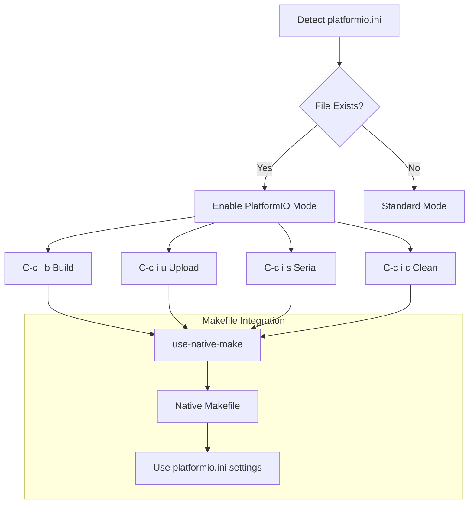
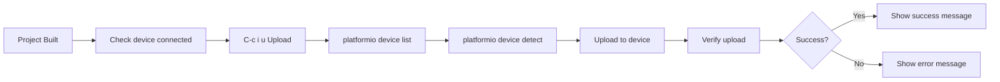
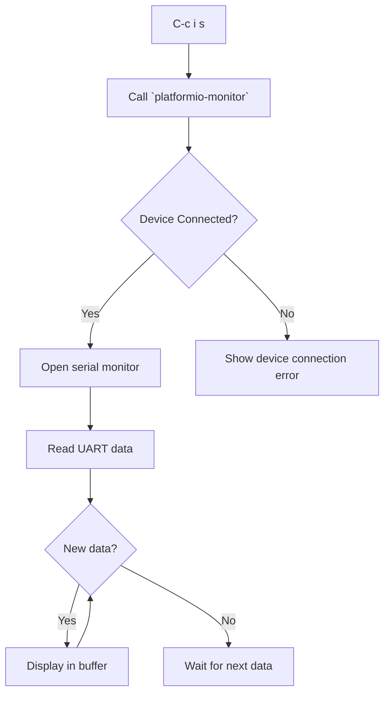
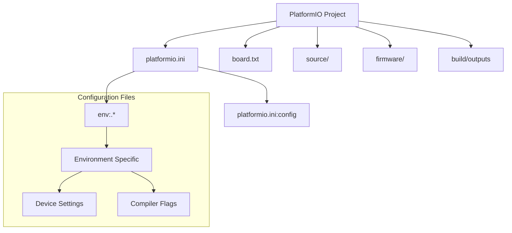
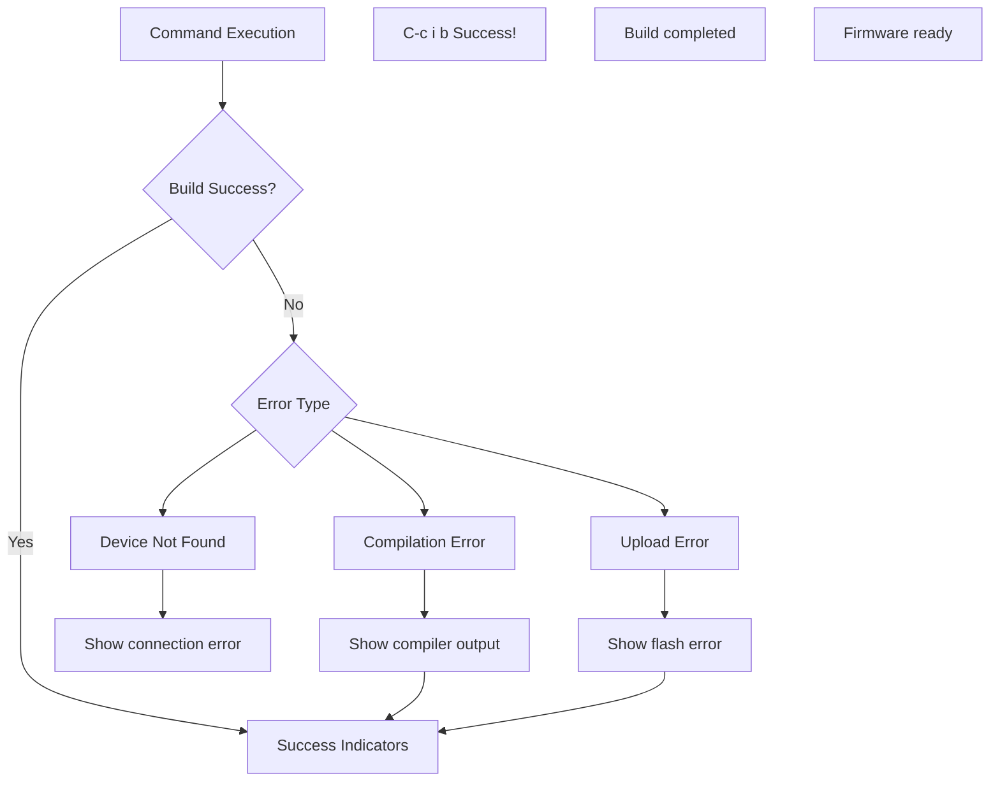
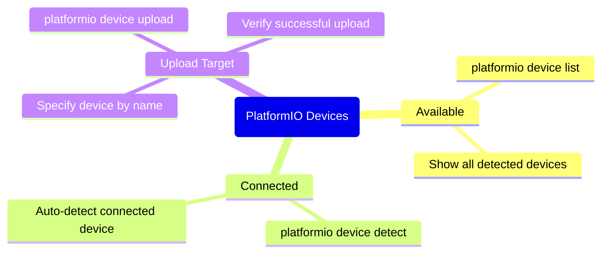
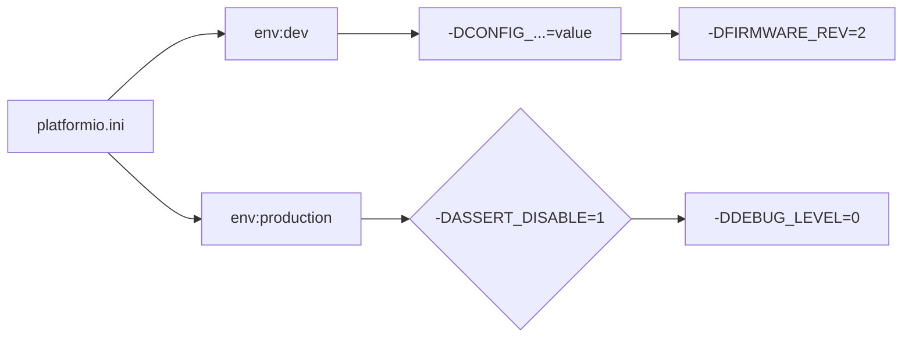
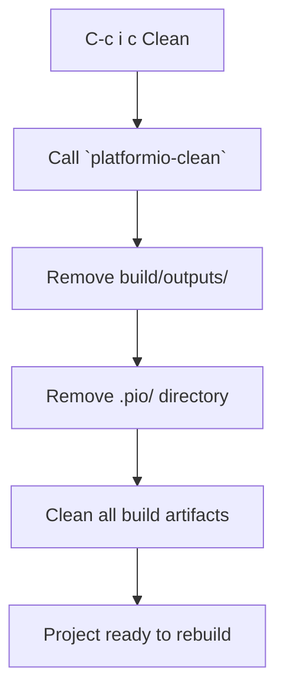

# PlatformIO Mode Overview

:::info {name="Integration Point"}
File: `mcp_server/emacs/emacs.el` (lines 5366-5444)
:::

## PlatformIO Setup



## Available Commands

| Keybinding | Command | Description |
|------------|---------|-------------|
| `C-c i b` | platformio-build | Build the project |
| `C-c i u` | platformio-upload | Upload firmware |
| `C-c i s` | platformio-monitor | Open serial monitor |
| `C-c i c` | platformio-clean | Clean build artifacts |

## Build Process

```mermaid
sequenceDiagram
    participant User as User
    participant Emacs as Emacs
    participant PlatformIO as PlatformIO
    participant Build as Build System
    
    User->>Emacs: C-c i b
    activate Emacs
    Emacs->>Emacs: Call `platformio-build`
    deactivate Emacs
    activate BuildSystem
    BuildSystem->>PlatformIO: Generate Makefile
    PlatformIO->>Build: Compile project
    Build->>PlatformIO: Build Complete
    deactivate BuildSystem
    PlatformIO->>Emacs: Display Build Output
    deactivate Emacs
```

## Upload & Flash



## Serial Monitor



## Project Structure



## Error Handling



## Device Management



## Build Flags



## Clean Artifacts



## Best Practices

:::info {name="PlatformIO Recommendations"}
1. Always start with `C-c i b` before `C-c i u`
2. Check device connection before uploading with `C-c i s`
3. Use `env:` sections in `platformio.ini` for different devices
4. Clean with `C-c i c` before debugging
5. Keep build directories organized
:::
