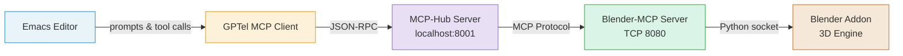
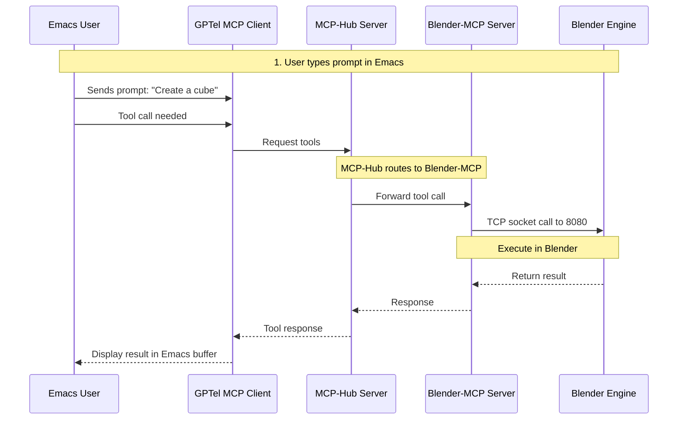
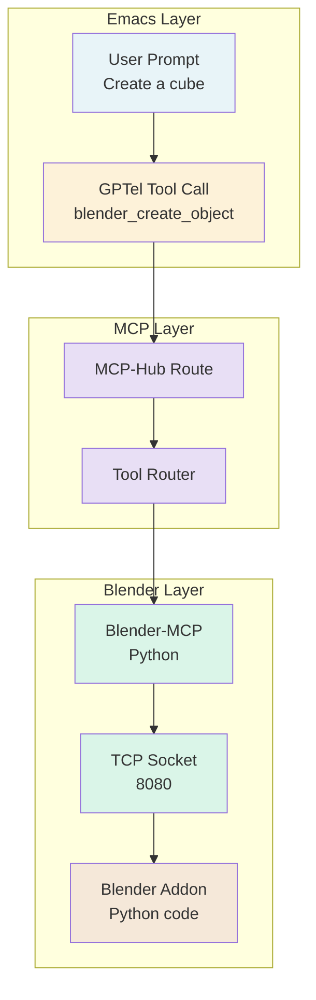
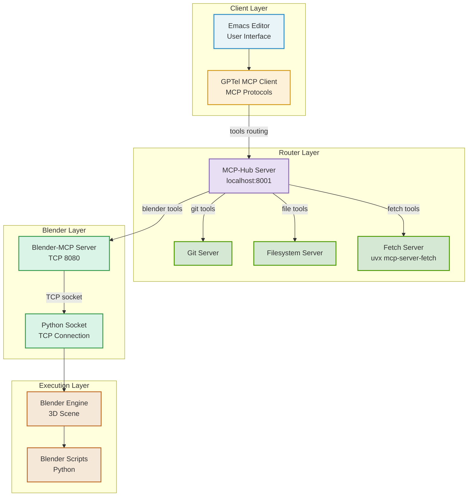
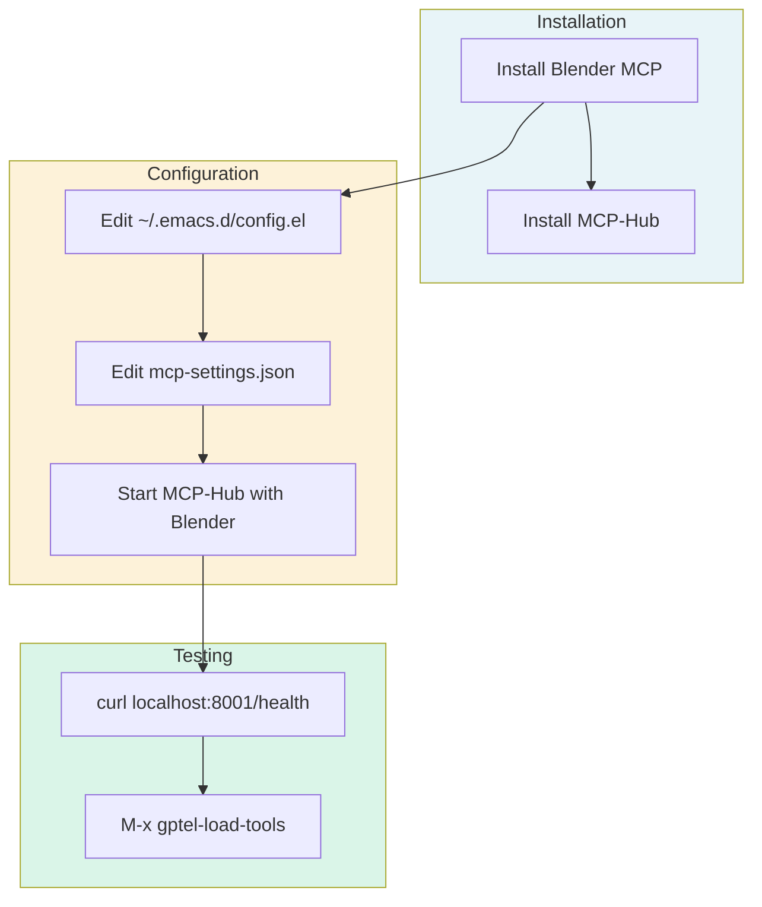
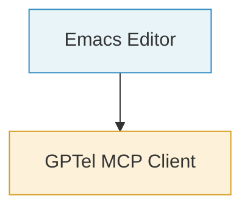
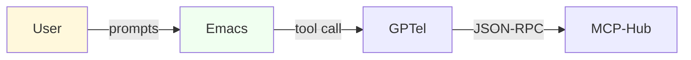
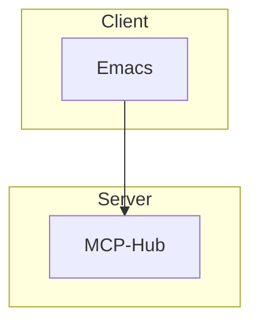

# Blender-MCP to Blender: Connection Diagrams

Mermaid diagrams for easy editing and markdown rendering.

---

## Connection Topology (Flow Chart)



---

## Data Flow Sequence



---

## Tool Call Flow



---

## Full Topology with All Components



---

## Setup Commands



---

## Rendering


---

## Customization Tips

### Change colors:



### Add labels:



### Use subgraphs for layers:



---

## Quick Commands

```bash
# Render mermaid to HTML
mmd-markdown diagrams.md > diagrams.html

# Or use mmdc
npx mmdc -i diagrams.md -o diagrams.html
```

---

## Summary

Mermaid diagrams are **easy to edit**, **version control friendly**, and **render in most markdown editors**. Just copy the code blocks above into your markdown files!

---

*Created for Blender-MCP Emacs integration*
