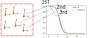
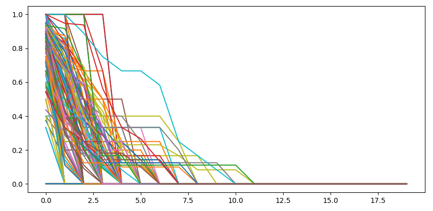
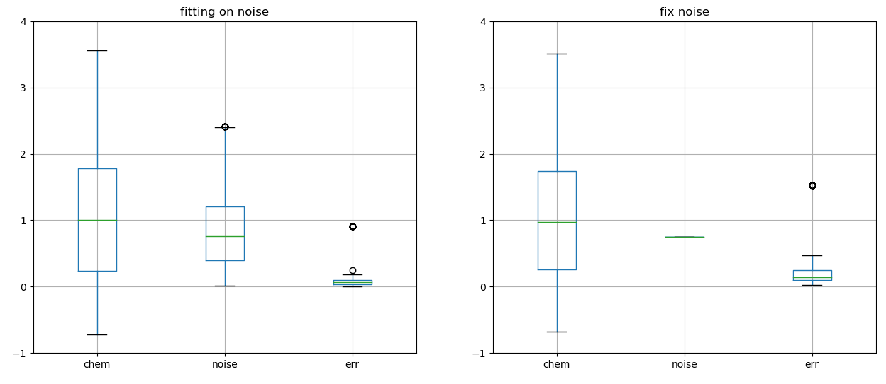
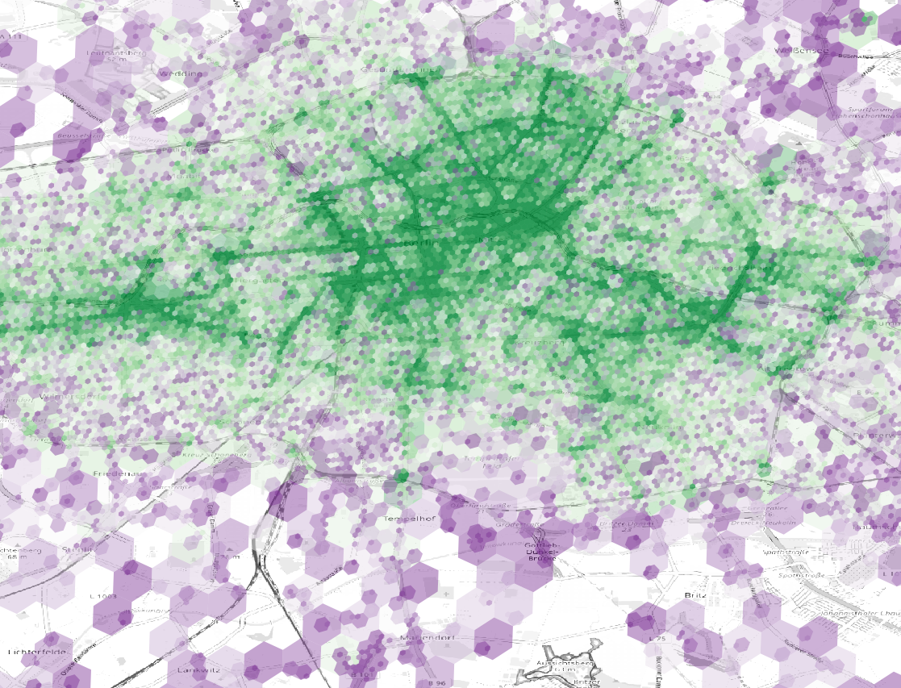
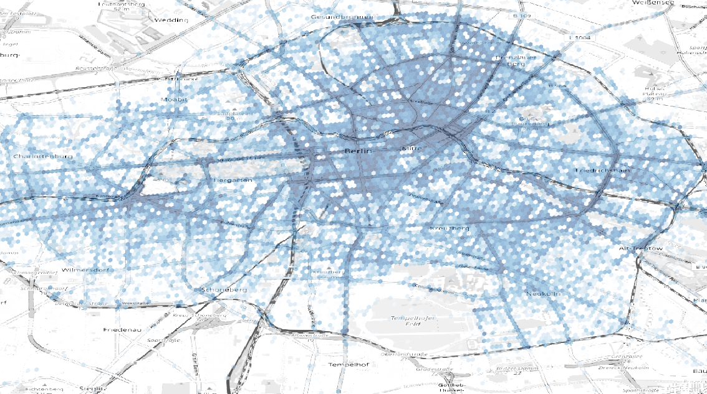
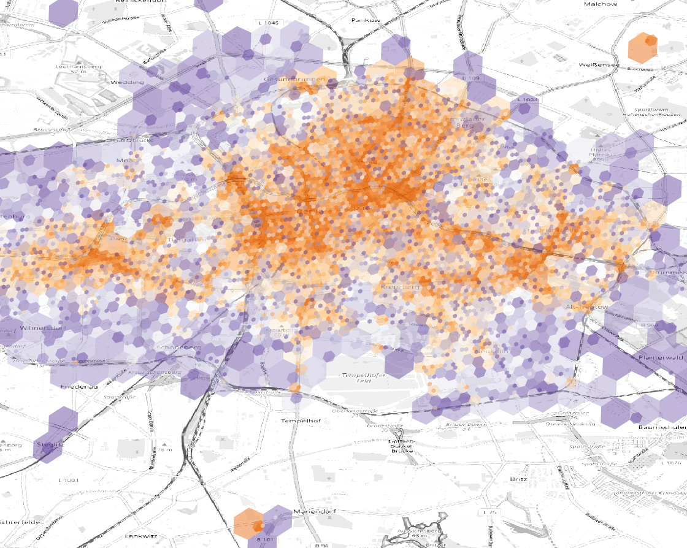
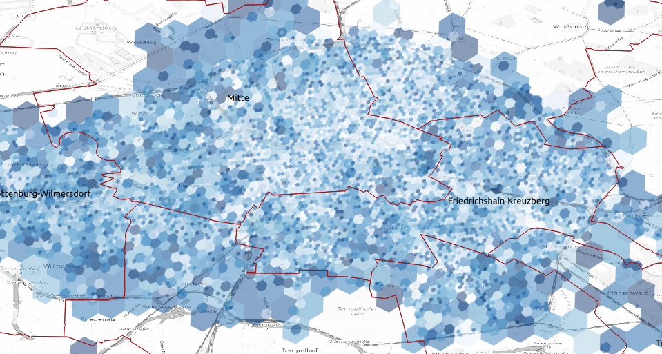

# activation

Every zone has particular demand which translates into the probability of picking the n-th scooter in a give time frame. We look at a proper distribution to estimate a zone characteristic parameter for each zone.

## activation probability

Depending on the demand of a zone we can define a probability for each ordinal number of scooters. Probability will of course drops for any new scooter added to the same zone. 



_activation probability for every n-th scooter in the area for a give timeframe_

We sum the number of used scooters inside an area for a given time frame. Since our scope is to optimize the deployments we define the 

```python
def sumProb(used,left,max_occ=20):
    """ordinal probability from a row of positive events: [4,3,5,6,...]"""
    prob = np.zeros(max_occ)
    for i,j in zip(used,left):
        ## summing used, left over, unknown
        p = [1. for x in range(i)] + [0. for x in range(j)] + [np.nan for x in range(max_occ-j-i)]
        p = s_s.interpMissing(p)
        prob = prob + np.array(p[:max_occ])
    prob = prob/len(used)
    return prob
```



_empirical distribution of activation probability per n-th scooter_

We therefore use a Fermi-Dirac distribution which describes the occupation of particles for a given energy state which in our case translates into the zone demand.
	
Fermi distribution:

$$ n_i = \frac{1}{e^{ (\epsilon_i - \mu)/k_BT} + 1} $$

Where $\mu$ is called the chemical potential (how favorable is to add a new particle to the system) and $k_BT$ is the thermal noise which we connect with the normalized temperature of that day and hour

```python
p0 = [0.75,thermal_noise]
x0 = [1.3,thermal_noise]
t = np.array(list(range(len(y))))
def ser_residual(x,t,y,p):
    """residuals of distribution"""
    return (y-dis_Fermi(x,t,p))
res = least_squares(ser_residual,x0,args=(t,y,p0))
x0 = res.x
y1 = dis_Fermi(x0,t,p0)
```


_example of fitting some empirical distributions_

We allow a maximum number of 20 scooters to have a similar distribution across all zones. We iterate the fit across all locations.


_we fit all the empirical distributions with a Fermi-Dirac law and compute the chemical potential_

A better fitting is obtained optimizing both the chemical potential and the thermal noise but we see that if we keep the thermal noise constant (at least for similar weather) the error is not much larger and the chemical potential is well defined



_distribution of chemical potential, noise and error with or without a fix noise parameter_

We can visualize on the map the areas with most revenue



_areas with most revenues_

Actually most of the revenue comes from the fact that we mostly deployed in that region



_areas where most of scooters were deployed_

We than calculate the average revenue per scooter and see that outskirts have a high potential


_areas with most revenues per scooter_

We than calculate the chemical potential and the potential revenue per area depending on the shift and the weekday

|geohash|weekday| shift|chem |  n  | urev|    pot|
|-              |- |- |-     |-    |-    |-      |
|8a63a06995affff| 4| 1|  7.09|   66| 9.39|  61.97|
|8a63a06988dffff| 6| 1|  6.94|  130|11.84|  76.33|
|8a63a069958ffff| 3| 2|  6.89|   69| 6.19|  39.64|
|8a63a0686367fff| 5| 2|  6.89|   52| 7.54|  48.22|
|8a63a068a8effff| 6| 1|  6.88|   70|11.37|  72.65|

Displaying the chemical potential tells us how many scooters should be deployed in an area



_chemical potential for single area_

We can than theoretically know the potential revenue per location, weekday and shift


_potential of that area for a given weekday and shift number_

We iteratively group by different zooms of geohash to have at least an estimate in areas where we don't have an accurate measurment of the activation probabilty and we can see that there is the indication that on same areas we would have good revenues

We calculate the error of the model per zone and obtain a median error of 18% with no significant correlation with the number of scooters analyzed



_distribution of error per zone, the smaller error is where we have a larger history_

```python
	conn_string = "dbname='{}' port='{}' host='{}' user='{}' password='{}'".format(cred['DATABASE'],cred['PORT'],cred['HOST'],cred['USER'],cred['PASSWORD'])
	con = psycopg2.connect(conn_string)
    sql = "select event.city, event.properties, event.time, event.device_id, event.user_id  from fivetran_mixpanel.event"
    sql += " where name = 'appStart' and time > '%s 00:00:00' and time < '%s 23:59:59' and lower(city) = 'berlin' " % (day,day)
    cur = con.cursor()
    cur.execute(sql)
    con.commit()
    resq = cur.fetchall()
    time.sleep(10)
```


_app openings_


_app openings vs rides_


_green: predominant start, pink: predominant end_


