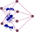
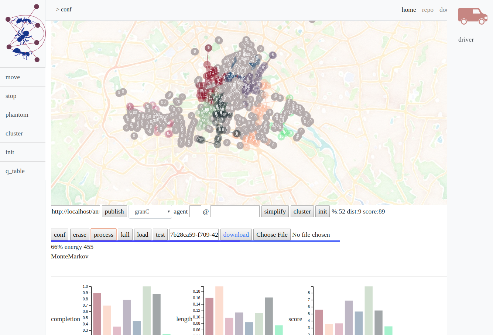
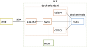
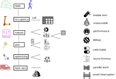
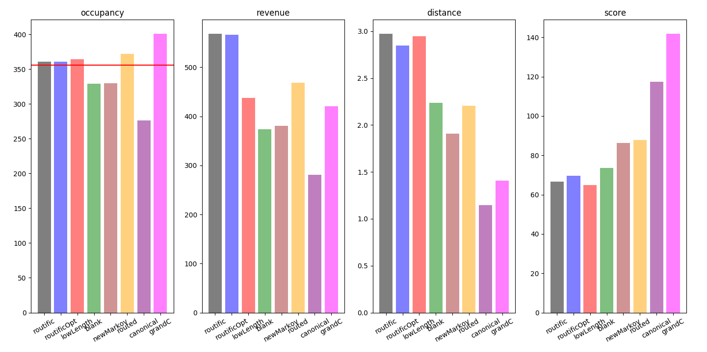
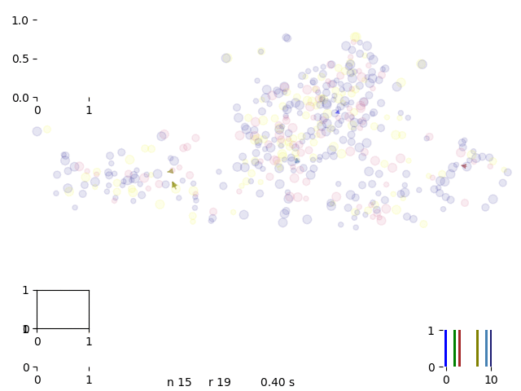
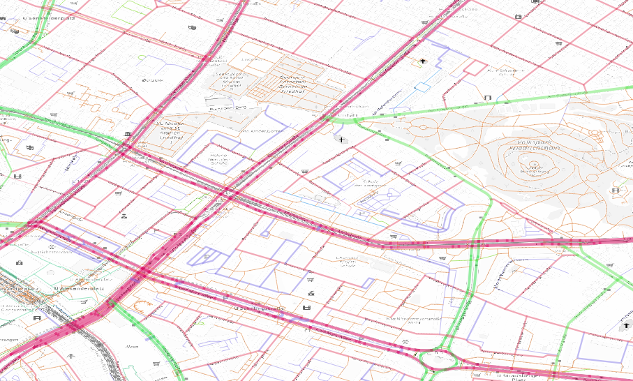

# antani

Ant - agent/network intelligence 

_ants optimizing paths on a network_

Antani is an agent/network based optimization engine for field operations

Content: 

## frontend

We provide a [frontend solution](http://10.0.49.178/antani_viz/) under the production vpn

And a video explaining the [functioning of the frontend](http://10.0.49.178/antani_demo.mp4)

## infra

[infrastructural design](antani_infra.html) 

* backend - endpoints
* frontend
* aws/productization

_infra design_

## integration

[workflow integration](antani_integration.html) 

* workflow

_infra design_

## kpi

[kpi comparison](antani_kpi.html)

* definition of kpis
* different kpi per run

_kpi comparison_

## engine

[engine functionalities](mallink_engine.html) 

* list of moves
* performances

_engine description_

## graph

[graph building utilities](geomadi_graph.html)

* retrieving a network
* building and fixing a graph

_graph formation_

## concept

[basic concepts](antani_concept.html)

* agent
* network optimization

_antani concept schema_

