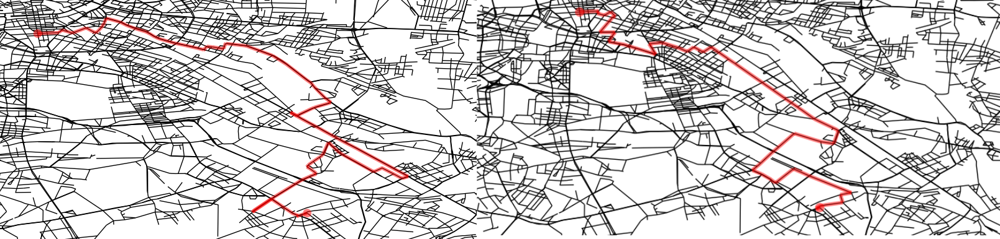

# Antani

Ant - agent/network intelligence 

_ants optimizing paths on a network_

## Efficiency

Why operation efficiency?

* Fill the gap between revenue and cost
* Think as a network, not single operator
* Select the most valuable tasks

## Problem

The closest path facing the warehouse fullfilling the most valuables tasks

_optimization engine requirements_

* Focus on profitability
* Plan shifts
* Consider task time and revenue

## Commercial softwares?

Delivery based, routific:
* Long deviations
* Skipped tasks
* Unclear priorities

_problems with routific_

No resuming, everytime a new simulation

## Google or-tools?

open source software suite for optimization

_or-tools solutions_

Many crossing Incomplete vans, long trajectories:

* incomplete solution (-20%)
* job to be killed
* 0.5-75mins

## In house solution

_in house optimization engine_

Step by step task assignement

## Path optimization
Path like polymers

_PhD defense – computational biophysics 2012_

## Optimization engine

Ludewa/Tanzania - 2013

_Electrical line design to connect households to the new power plant_

## Building a graph

From detailed street network to an efficient graph

_Subset, connect, simplify, subgraph, check directions..._

## weighting

Weight every segment

_Maxspeed, streetclass, length, junctions_

## Graph setup

Checking routes

_checking routes_

Good correlation between spot2spot
routes in graphs and air distance

Osrm – open street routing machine

## Routes

Subset the city in geohashes (~70m)

_routing information_

Calculate all pair distances and build a lookup database

_pair relationship database_

## Tasks

Sum up tasks in the same geohash

_graph edges kept_

Keep only neighbor connections between tasks

# Sense move reward

Ant/colony

_an ant per loop, iterate over the network_

_energy definition_

Energy:
* +separation
* +task value
* - area
* - task time
* - tot distance

## Path/network

An ant connecting each task

_antani concept_

## Path opt

_optimize sequences_

## Monte Carlo

Single random move

_energy evolution_

Asyntotic energy and move acceptance rate evolution

## Markov Chains

Transition probabilities, limit links

_markov chains_

We limit the possible moves leaving the most probable

## Enhance moves

single, Markov, distance, extrude

_move selection_

Spot selection according different probabilities

## Simulation boost

* Faster convergency
* Higher acceptance

Single move, routific optimization, Markov chain, extrusion, grand canonical...

## Calculation time

_Early simulations were too slow_

## Find a score:

scoring

_kpi comparison_

+completion + revenue – distance - time

## Reinforcement learning

Improve acceptance

_reinforce moves_

Single agent reinforcement is too slow and chaotic

## Posterior probability

Improve with real data

_posterior probabilities_

## Demand

_demand forecast_

## Microservice design

Backbone +microservices

_engine design_

## Asynchronicity

Docker, flask, redis,celery

_antani infrastructure_

Client – broker/worker design

## Frontend

OpenLayers, d3, ajaxDocumentation

_antani frontend_

## Documentation

_module mallink_

## Code

_library ecosystem_

...started in 2006

## Outlook

* Ready for spring
* Drivers feedback
* Process real data
* Compare with rideos
* ...

## Summary

* Start, stop, resume
* First draft within few seconds
* Clear operating areas
* Weighting potential revenues
* Focus on profitability

## Acknowledgement

Circ – fleet engine team
Carlo Mazzaferro – productization of antani

# Theory

## Gibbs sampling

We describe a probability distribution via its moments $\vec{\mu}$

$$ p(\vec{x};\vec{\mu}) $$

We have a system $\vec{x}$ where each $x$ is in a certain state $s$. We define a energy function which depends on the states of system and a set of parameters $\theta$. In our case the system is a series of field tasks on a map and the state is the agent who is fulfilling the task. 

The energy of the system is the sum of the revenue per task minus the cost: task time and path length. The parameter set $\theta$ defines the revenue and cost factor + external factors (temperature $T$, traffic time $h$,...). Ideally we will express the parameter set in terms of external factors $\theta(T,h)$ or change the metric (distance) of the system $d(T,h)$

$$ E_a(\vec{x}|\theta) = n_s\cdot r_s - c_d \cdot d_a - n_s\cdot t_s $$

where $n_s$ is the number of spots, $r_s$ the total revenue per spot, $t_s$ is the total operation time, $d_a$ the distance of that agent.

The probability distribution for a certain state and parameter follows the Boltzmann distribution

$$ p(\vec{x}|\theta) \propto exp(-E(\vec{x})/kT)

Target probability distribution

$$ p(\vec{x}) = \frac{w(\vec{x})}{Z} = \frac{1}{Z} \prod_c \phi_c(x)$$

estimator

$$ \frac{1}{T} \sum_{t=1}^{T} \phi(\vec{x}) \qquad E_{p(x)}|\phi(x)| = \sum_x p(x)\phi(x) $$ 

From the state $\vec{x}$ we create a state $\vec{x}'$ where we create a sample $x_j \rightarrow x_j'$, basically: $\vec{x}' = {x_1,x_2,...,x_j',...,x_n}$

$$ p(x) = \frac{exp(E(x)/T)}{Z} $$

$$ A(x'|x) = min(1,p(x')/p(x)) = min(1,exp(\frac{ E(x') - E(x)}{T})) $$

## Bayesian statistics

We want to calculate the posterior probability [doc](https://people.duke.edu/~ccc14/sta-663/MCMC.html) which is the probability of a parameter set $\theta$ from a given state $X$

$$ p(\theta|x) = \frac{l(x|\theta)p(\theta)}{p(x)} $$ 

where $l(x|\theta)$ likelihood, $p(\theta)$ prior, $p(x'|x)$ the probability to move from state $x$ to state $x'$ and $p(X)$ normalization factor

$$ p(X) = \int d\theta* p(X|\theta*) p(\theta*)$$

The likelihood is about finding the momenta of the distribution for a given data set (usually via regression), the probability distribution is the theoretical distribution for the system (independent on the data acquired). In a correct sampling the two match.

proposal distribution $p(x)$ - target distribution $g(x) ~ p(\theta|X)$ 

Step increment $\theta' = \theta + \Delta\theta$ 

$$\rho = \frac{g(\theta'|X)}{g(\theta|X)} \qquad \rho = \frac{p(X|\theta')p(\theta')}{p(X|\theta)p(\theta)}$$

sampling from probability from a state x [doc](http://www.stat.ucla.edu/~sczhu/Courses/UCLA/Stat_202C/lecture_note/Ch1_MC_Intro.pdf)

$$ x \tilde \pi(x) $$

High dimensional computing (over all states)

$$c = E[f(x)] = \int \pi(x) f(x) ds $$

optimization

$$ x* = argmax \pi(x) $$

Learning and Bayesian hierarchical modeling for a given parameter set $\Theta$

$$ \Theta * = argmax l(\Theta) ; l(\Theta) = \sum_{i=1}^{n} log p(x_i;\Theta) $$

