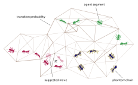
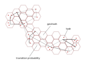

# antani

Ant - agent/network intelligence 

_ants optimizing paths on a network_
## antani description

The method consists in creating a network connecting tasks and move ants across network edges to find the most convenient solution.

_antani concept_

Agent based optimization, sense, move, act, gain reward

_antani concept_

We sum up all the tasks into the corresponding geohash and calculate the transition probability between two hexagons.

_summing up tasks per geohash and connecting the spots weighting the edges_

# Theory

## Gibbs sampling

We describe a probability distribution via its moments $\vec{\mu}$

$$ p(\vec{x};\vec{\mu}) $$

We have a system $\vec{x}$ where each $x$ is in a certain state $s$. We define a energy function which depends on the states of system and a set of parameters $\theta$. In our case the system is a series of field tasks on a map and the state is the agent who is fulfilling the task. 

The energy of the system is the sum of the revenue per task minus the cost: task time and path length. The parameter set $\theta$ defines the revenue and cost factor + external factors (temperature $T$, traffic time $h$,...). Ideally we will express the parameter set in terms of external factors $\theta(T,h)$ or change the metric (distance) of the system $d(T,h)$

$$ E_a(\vec{x}|\theta) = n_s\cdot r_s - c_d \cdot d_a - n_s\cdot t_s $$

where $n_s$ is the number of spots, $r_s$ the total revenue per spot, $t_s$ is the total operation time, $d_a$ the distance of that agent.

The probability distribution for a certain state and parameter follows the Boltzmann distribution

$$ p(\vec{x}|\theta) \propto exp(-E(\vec{x})/kT)

Target probability distribution

$$ p(\vec{x}) = \frac{w(\vec{x})}{Z} = \frac{1}{Z} \prod_c \phi_c(x)$$

estimator

$$ \frac{1}{T} \sum_{t=1}^{T} \phi(\vec{x}) \qquad E_{p(x)}|\phi(x)| = \sum_x p(x)\phi(x) $$ 

From the state $\vec{x}$ we create a state $\vec{x}'$ where we create a sample $x_j \rightarrow x_j'$, basically: $\vec{x}' = {x_1,x_2,...,x_j',...,x_n}$

$$ p(x) = \frac{exp(E(x)/T)}{Z} $$

$$ A(x'|x) = min(1,p(x')/p(x)) = min(1,exp(\frac{ E(x') - E(x)}{T})) $$

## Bayesian statistics

We want to calculate the posterior probability [doc](https://people.duke.edu/~ccc14/sta-663/MCMC.html) which is the probability of a parameter set $\theta$ from a given state $X$

$$ p(\theta|x) = \frac{l(x|\theta)p(\theta)}{p(x)} $$ 

where $l(x|\theta)$ likelihood, $p(\theta)$ prior, $p(x'|x)$ the probability to move from state $x$ to state $x'$ and $p(X)$ normalization factor

$$ p(X) = \int d\theta* p(X|\theta*) p(\theta*)$$

The likelihood is about finding the momenta of the distribution for a given data set (usually via regression), the probability distribution is the theoretical distribution for the system (independent on the data acquired). In a correct sampling the two match.

proposal distribution $p(x)$ - target distribution $g(x) ~ p(\theta|X)$ 

Step increment $\theta' = \theta + \Delta\theta$ 

$$\rho = \frac{g(\theta'|X)}{g(\theta|X)} \qquad \rho = \frac{p(X|\theta')p(\theta')}{p(X|\theta)p(\theta)}$$

sampling from probability from a state x [doc](http://www.stat.ucla.edu/~sczhu/Courses/UCLA/Stat_202C/lecture_note/Ch1_MC_Intro.pdf)

$$ x \tilde \pi(x) $$

High dimensional computing (over all states)

$$c = E[f(x)] = \int \pi(x) f(x) ds $$

optimization

$$ x* = argmax \pi(x) $$

Learning and Bayesian hierarchical modeling for a given parameter set $\Theta$

$$ \Theta * = argmax l(\Theta) ; l(\Theta) = \sum_{i=1}^{n} log p(x_i;\Theta) $$

