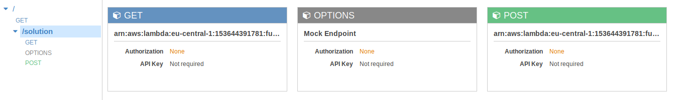

# antani

Ant - agent/network intelligence 


_ants optimizing paths on a network_


_antani concept schema_

## infra 

To deploy the engine we set up the hypervisor create and link different containers and check the routing and the services

```bash
sudo yum -y install httpd php libapache2-mod-wsgi python-dev
...
sudo systemctl restart httpd.service
...
docker run -it --link redis1:redis --name $imgName -p $PORT:$PORT -v $(pwd):/$APP_DIR $imgName bash
...
curl $SERVER/antani
curl $SERVER/ant
```


_deployment of antani_

## server spec

```
baseUrl : $SERVER/antani
```

### endpoint

Here is the list of end points and methods

* `/` - post/get: checking the server
* `/conf` - post: change configuration
* `/longtask` - post: start the long process
* `/status` - get: current status of the process/worker
* `/solve` post: start worker and returns `job_id` (routific format)
* `/jobs` - get: returns status/solution (routific format)
* `/publish` - get: solution is published (after manual inspection)
* `/simplify` - post: simplify the route
* `/process` - get: start serial routine
* `/solution` - get: return published solution

To try out:
```sh
curl http://$URL/antani/simplify -d @src/ui/antani_viz/data/sol_routific.json --header "Content-Type: application/json"
curl http://$URL/antani/solution --header "Content-Type: application/json"
curl http://$URL/antani/solve -d @raw/opt/job_winter.json --header "Content-Type: application/json"
```

## frontend

To visualize and edit the solution we have created a [frontend](https://dauvi.org/antani_viz/) 

```javascript
    $.ajax({
        type: "POST",
        url: url,
        data: JSON.stringify(data),
	contentType:"application/json",
	success: function(json) {
	    console.log(json);
	    if(Object.keys(geom).length !== 0){
		sol = json;
		geom = formatData(sol);
		spotL = geom.spotL;
		pathL = geom.pathL;
		refreshLayer(spotL);
	    }
	},
	error: function(xhr, status, error) {console.log(status + '; ' + error);}
    });

```

<iframe id="frame_map" width="100%" height="600" src="https://dauvi.org/antani_viz/"></iframe>

## redirect

To avoid the browser to stop requests we have to redirect the calls on the server or client side

`Cross-Origin Request Blocked: The Same Origin Policy disallows reading the remote resource`

The jsonp options requires a lot of reingeneering and we opt for the apache solution. After a lot of trial and errors the only option working for ubuntu and centos is a proxy:


```
ProxyRequests Off
ProxyPass /antani http://localhost:5000
ProxyPassReverse /antani http://localhost:5000
``` 

## backend

We create a flask app 

```python
app = Flask(__name__)
```

Where we can send the modified json

```python
@app.route('/simplify',methods=['POST'])
def route_simplify():
   print("parsing/converting solution")
   sol = request.get_json()
   spotL, pathL = dict2frame(sol)
   pO = p_o.pathOpt(spotL,pathL=pathL,conf=conf)
   print("simplify - calc distances")
   spotL1 = pO.simplifyRoute(spotL)
   pathL1 = pO.calcDistance()
   solD['solution'] = frame2dict(spotL1,pathL1)
   return '', 204
```
and request the optimized solution

```python
@app.route('/solution')
def get_solution():
   return jsonify(solD['solution'])
```

Which can be called via a [get request](http://10.0.49.178/antani/solution/)

## async

We create a celery


_forum tips for killing_

 
## data structure

To complete the loop between optEn, backend and frontend we suggest the following data structure


_data structure_

## aws/productization

The solution is written on a s3 bucket

```python
	json.dump_s3 = lambda obj, f: s3.Object(key=f).put(bytes(json.dumps(obj).encode('UTF-8')))
	json.dump_s3(solJ,jobN)
```

The lambda reads the solution from s3 and returns it

```python
	json.load_s3 = lambda f: json.load(s3.Object(key=f).get()["Body"])
	post = json.load_s3(jobN)
    return {
        'statusCode': 200,
        'body': json.dumps(post)
    }
```

We create a lambda and connect it with the api gateway


_lambda and api gateway_

and we created the resources and methods for enabling the call



_api gateway_

We stardadize the script

```bash
APP_NAME="antani_solution"
BUCKET="-------------"
ARN_ROLE="------------"
RESOURCE="solution"
REGION="eu-central-1"
ACCOUNT="------------"
LAMBDA_LINK="arn:aws:lambda:${REGION}:${ACCOUNT}:function:${APP_NAME}/$RESOURCE"
LAMBDA_URI="arn:aws:apigateway:$REGION:lambda:path/2015-03-31/functions/arn:$LAMBDA_URI"
ARN_SOURCE="arn:aws:execute-api:$REGION:$ACCOUNT:$API/prod/POST/$RESOURCE"
#---------------------------------create-lambda---------------------------------
zip package.zip antani_lambda.py
aws lambda create-function --function-name $APP_NAME --zip-file fileb://package.zip --role $ARN_ROLE --environment Variables="{bucket_name="$BUCKET"}" --handler index.handler --runtime python3.6
#--------------------------------test-lambda-----------------------------------
echo '{"jobN":"job_s592_v9_sol.json"}' > post.json
aws lambda  invoke --function-name $APP_NAME --payload fileb://post.json outputfile.json
#----------------------create-api------------------------------------
aws apigateway create-rest-api --name $APP_NAME > $APP_NAME.create.log
```

We can than perform a post request and test it

```bash
curl -v -X POST \
  'https://-------------.execute-api.eu-central-1.amazonaws.com/antani/solution/' \
  -H 'content-type: application/json' \
  -H 'x-amz-docs-region: eu-central-1' \
  -d '{"jobN":"job_s592_v9_sol.json"}' > sol.json
```

moving to [chalice](https://chalice.readthedocs.io/en/latest/).

