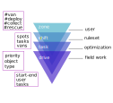
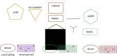
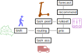

# antani

Ant - agent/network intelligence 


_ants optimizing paths on a network_

## workflow

The optimization engine has user controlled and automated modules


_ops application_

We retrieve information directly from the fleet console microservices 


_management console_

We collect the current status with a single api call

```python
resq = requests.get(url=cred['node_url']+"/users/actions/",headers=headers)
resq = requests.get(url=cred['node_url']+"/geodata/zones/",headers=headers)
resq = requests.get(url=cred['node_url']+"/geodata/zones/"+id_zone+"/areas",headers=headers)
resq = requests.get(url=cred['node_url']+"/geodata/areas/deployment/zone",headers=headers,params={"zoneIdentifier":g['zoneIdentifier']})
```

The fleet engine sits in the middle and steers all operations, tracking and monitoring log the current status


_development of objectives_

In the fleet engine 4 objects will be defined with an hierarchical structure 



_metric operations_

The purpose of the optimization engine is to compute profitability for each drive and iterate all over the possible solutions 



_field operation assignement_

For each *drive* is calculated a cost and a rating

For Each *task* is calculated a revenue and a risk

<!-- To enable parallel work we need to move from a graph design -->

<!--  -->
<!-- _engine design, current scheme_ -->

<!-- To a linear design where the engine just orchestrate the calls and there is always a cached table to substitute a broken service -->

<!--  -->
<!-- _engine design, suggested scheme_ -->


## design

To enable parallel work we need to move from a graph design


_engine design, current scheme_

To a linear design where the engine just orchestrate the calls and there is always a cached table to substitute a broken service


_engine design, suggested scheme_

We draw a cut between field operation and task optimization


_infra design_

