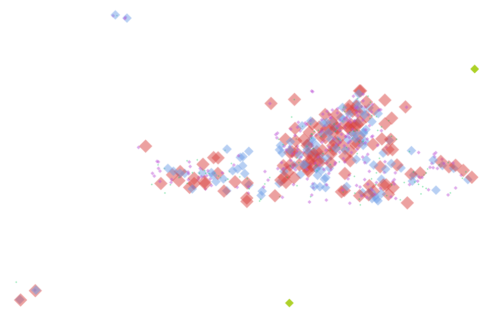
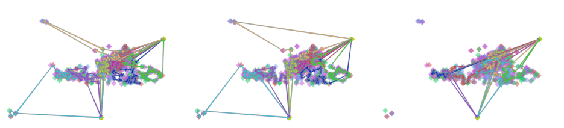
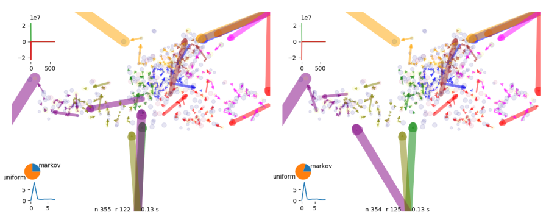
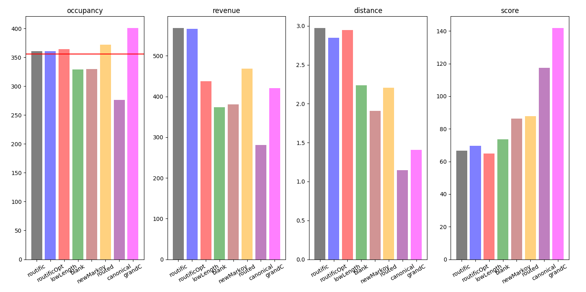
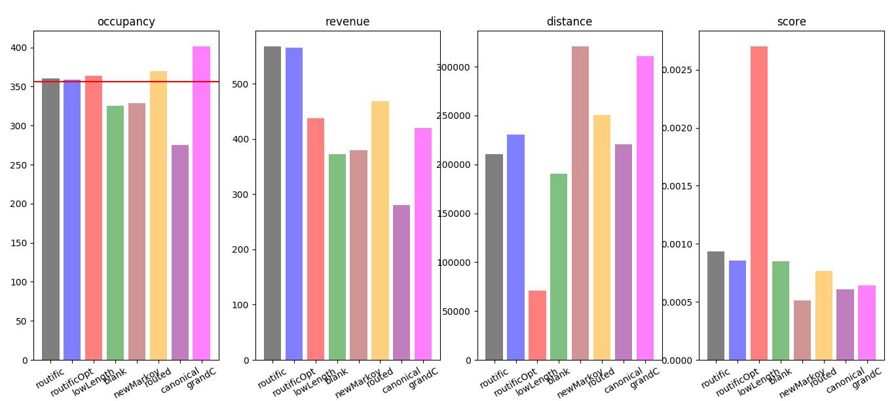

# optimization engine comparison

An optimization engine find the best combination for assigning tasks to a fleet.
To compare performances we create a set up of around 600 spots, 6 task types (with different priorities) and a fleet of 8 drivers

_set up for the comparison_

We prepare the job file and we send it to the routific api service and [visualize the solution](http://routific-viewer.herokuapp.com/jobs/k24ozyff68)

_routific solution explorer_

# optimization engine

We can run the optimization engine from a blank system or after a routific solution.

_comparison between routing engine_

Starting from a routific solution we see that the optimization engine at first improves big springs

_optimization improves big springs_

We use the following kpi:

* `completion`: percentage of van capacity filled
* `duration`: time spent
* `potential`: value of the van
* `distance`: distance of the route

The score is calculated via:

$$ score = \frac{occupancy * potential}{duration * distance} $$

_comparison of kpi between engines_

<!-- If we consider routed distances the figure change -->

<!--  -->

<!-- _comparison of kpi between engines using routed distances_ -->

# run time

Routific was sending a complete solution within 3 minutes, the optimization engine was sending a better solution in 30 minutes, to speed up the process we introduced new moves

_execution time_

