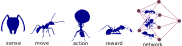
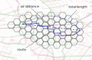
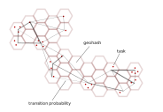
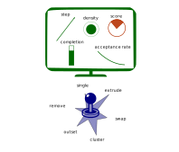
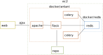
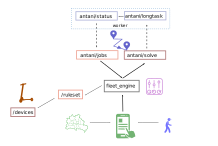

# antani

Ant - agent/network intelligence 

_ants optimizing paths on a network_

Antani is an agent/network based optimization engine for field operations. Antani efficiently associate a series of tasks to the most eligible operator.

## motivation

Market size, and a generic problem statement

*Fleet dispatch* is a complex problem which most of the companies can't solve themselves. Small companies uses manual labour which is unprecise, costy and causes delays in planning.

*Mid size companies* devolops a backend connection to external services or buy really expensive native software bad integrated in a pipeline. 

The most used software in the market is routific, the general feedback is that routes are *long, sequences don't make much sense and drivers intersect* their paths.

Starting with routific as benchmark we developed an in house solution for *task assignement* which considers task priorities and shift constraints.

We developed a microservice based *Saas* that is capable of returning a coarse solution *within few seconds* and keep on optimizing successive task assignements. 
The user can *interact with the engine* pausing, resuming, and interact with the simulation. For each solution there is a series of kpi that the user can consider before wating for the time out of the simulation.

The software is a mix of simulation and reinforcement learning.

The software has prooven better *performance and reliability* compared to commercial softwares and has been brought to a scale where it can handle multiple parallel calls.

Different mid and big size companies have expressed their interest in *testing such a product*, what is needed to be done is to re build the architecture, and make the solution water proof before allowing potential customers to test the software and come with feedbacks.

My experience in simulation spans over 12 years in simulations and architecture building, time series, and demand forecast.

<!--
## potential customer
contact: flixbus, amazon, bliq, rideos, MOIA, WeShare
interested: tier, ree
possible pilot: fliit, dhl, deutsche bahn
potential: benfleetservices.com, mycleaner.com, Dr. Oetker / Durstexpress, IOKI,
-->

## chain delivery

When you help a friend to move out you start walking 4 floors carrying heavy boxes, than you realize it's more efficient to assign to each one a floor, you cover one leg plus one checking the van security. You have a better duty cycle and less load. 
Last mile delivery should work the same, most of deliveries have dedicated drivers and they drive with expensive vans through small streets, parking somewhere, waiting to meet the customer... 
In my past company we did a couple of test rides, one hour to get to the warehouse, drive with an empty van, half an hour to get back to the city and start collecting scooters, around 4 an hour. The company failed because of high operational costs.
Currently there is no better option, no clear hand over between operators, no infrastructure for goods, fairly empty vans blocked in the traffic. 
The larger inefficiency is not to use the workforce already on place, we got used that travelling 2-3hours a day it's just normal, that's city life. 
Using a crowd allows to completely rebalance workforce, to let the driver deliver from warehouses to a local hub, and crowd from hub to users. Huge vans don't have to cross the whole city and different kind of carts can be used for small stretches. 
Vans should be placed where driver demand is higher, micro hubs should let local workforce to participate. 
I recently worked for the partnership with crowd for their user base, research institure for the micro hubs research and an eventual collaboration with master students. 
Reference markets are grocery stores, restaurant supply, micro mobility which need to cut delivery costs and successful market cases already happening outside of europe.

## overview

Optimization is about finding one optimal configuration for a given system, in this case we want to look for the best asssesment to dispatch $n$ drivers among $m$ tasks

_optimization 8 vans_

## methodology

[basic concepts](antani_concept.html)

The method consists in creating a network connecting tasks and move ants across network edges to find the most convenient solution.

_antani concept_

Each ant can, sense, move, act and based on the reward the best current solution is taken. 

_definition of an ant_

## graph

[graph building utilities](geomadi_graph.html)

* retrieving a network
* building and fixing a graph

_graph formation_

Once created the graph we simplify the computation pre calculating all the routes from geohash to geohash. 

_routing information_

The cached information fills a database storing the most relevant origin destination connection.

_routing database_

## Markov chains

To suggest a move from one spot to the next we use Markov chains based on graph connections, for each spot we find the most relevant links and transition probabilities to the closest spots.

_Markov chains_

## posterior probability

While collecting data we can calculate more reliable estimation of transition probabilities considering Bayesian inference on real data

_posterior probabilities_

## setting up

We sum up all the tasks into the corresponding geohash and calculate the transition probability between two hexagons.

_summing up tasks per geohash and connecting the spots weighting the edges_

## engine

[engine functionalities](mallink_engine.html) 

* list of moves
* performances

_engine description_

## reinforcement learning

We use reinforcement learning to find the best move for a given simulation time and task completion

_reinforcement learning for move probability_

## kpi

[kpi comparison](antani_kpi.html)

* definition of kpis
* different kpi per run

_kpi comparison_

## frontend

We provide a [frontend solution](http://localhost/antani_viz/) under the production vpn

And a video explaining the [functioning of the frontend](http://localhost/antani_demo.mp4)

## infra

[infrastructural design](antani_infra.html) 

* backend - endpoints
* frontend
* aws/productization

The solution consists in a series of microservices, many microservices have backup solutions or cached information to garantee operativity.

_design of the engine_

The system is dockerized and linked with docker compose into an instance

_docker and microservices_

We expose a series of endpoints on different clusters, the backbone application orchestrate the calls.

_infrastructure design_

