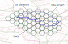
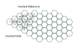
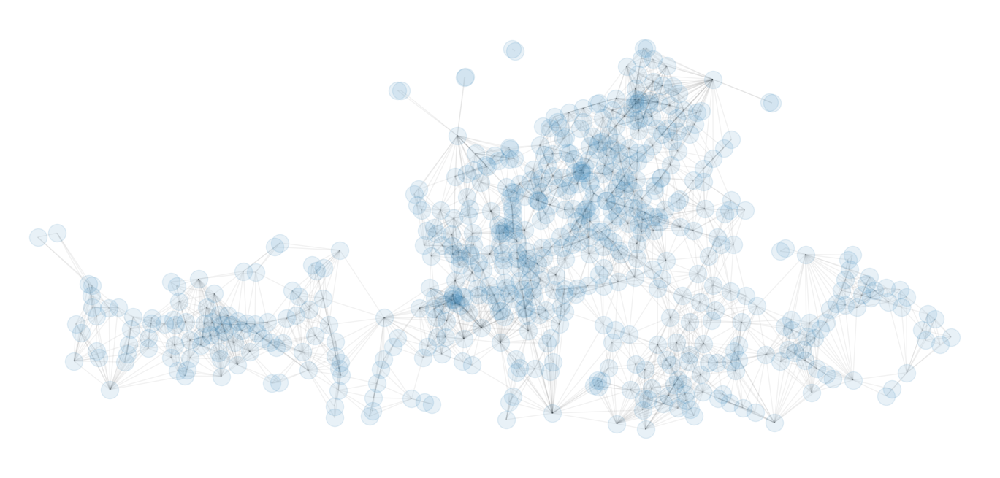
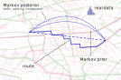
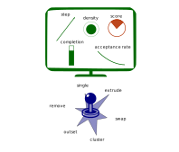
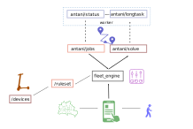

# antani

Ant - agent/network intelligence 

_ants optimizing paths on a network_

Antani is an agent/network based optimization engine for field operations. Antani efficiently associate a series of tasks to the most eligible operator.

## overview

Optimization is about finding one optimal configuration for a given system, in this case we want to look for the best asssesment to dispatch $n$ drivers among $m$ tasks

_optimization 8 vans_

## methodology

[basic concepts](antani_concept.html)

The method consists in creating a network connecting tasks and move ants across network edges to find the most convenient solution.

_antani concept_

Each ant can, sense, move, act and based on the reward the best current solution is taken. 

_definition of an ant_

## graph

[graph building utilities](geomadi_graph.html)

* retrieving a network
* building and fixing a graph

_graph formation_

Once created the graph we simplify the computation pre calculating all the routes from geohash to geohash. 

_routing information_

The cached information fills a database storing the most relevant origin destination connection.

_routing database_

## Markov chains

To suggest a move from one spot to the next we use Markov chains based on graph connections, for each spot we find the most relevant links and transition probabilities to the closest spots.

_Markov chains_

## posterior probability

While collecting data we can calculate more reliable estimation of transition probabilities considering Bayesian inference on real data

_posterior probabilities_

## setting up

We sum up all the tasks into the corresponding geohash and calculate the transition probability between two hexagons.

_summing up tasks per geohash and connecting the spots weighting the edges_

## engine

[engine functionalities](mallink_engine.html) 

* list of moves
* performances

_engine description_

## reinforcement learning

We use reinforcement learning to find the best move for a given simulation time and task completion

_reinforcement learning for move probability_

## kpi

[kpi comparison](antani_kpi.html)

* definition of kpis
* different kpi per run

_kpi comparison_

## frontend

We provide a [frontend solution](http://localhost/antani_viz/) under the production vpn

And a video explaining the [functioning of the frontend](http://localhost/antani_demo.mp4)

## infra

[infrastructural design](antani_infra.html) 

* backend - endpoints
* frontend
* aws/productization

The solution consists in a series of microservices, many microservices have backup solutions or cached information to garantee operativity.

_design of the engine_

The system is dockerized and linked with docker compose into an instance

_docker and microservices_

We expose a series of endpoints on different clusters, the backbone application orchestrate the calls.

_infrastructure design_

