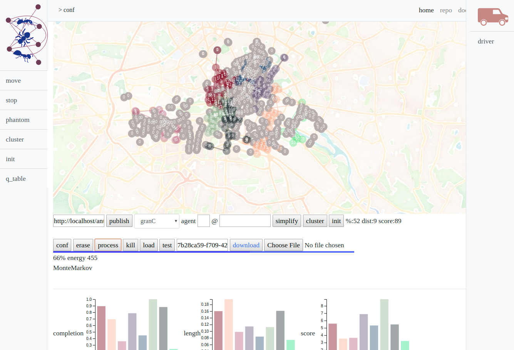
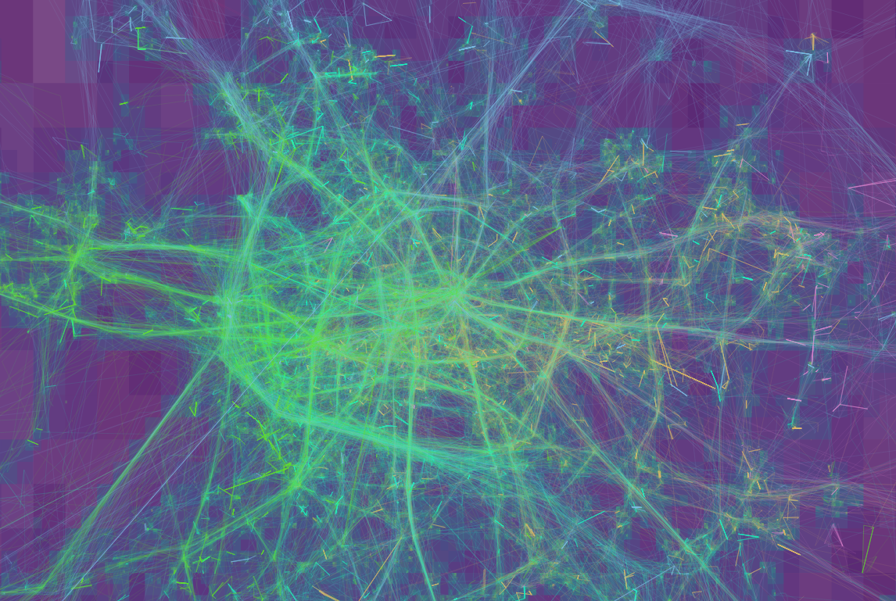

<!-- blog_main -->

<h2>Spiega: blog - documentation</h2>
Data science-engineering, modeling, theory
Detailed project descriptions for [tech](a/spiega.html) and [business](a/spiega_business.html) users 

<!-- project tools -->

<figure></figure>

# project tools: boost your productivity

* 26-2?] [agent workflow](a/agent_workflow.org) local agents for your productivity
* 26-2?] [org files](a/org_files.html) productivity with org files
* 13-2?] [agent context](a/agent_context.html) instruct agents how to behave and be productive
* 26-2?] [agent interview](a/agent_interview.html) an interview run by agents 
* 26-2?] [present documentation](a/documentation_present.html) create professional documentation out of your notes
* 26-2?] [knowledge graph](a/knowledge_graph.html) create a knowledge graph from your notes
* 26-2?] [multimedia utils](a/multimedia_utils.html) ease the creation of multimedia content for presentations

<h4 class="flot_left1"></h4>

<!-- end project tools -->

<!-- governance -->

<figure></figure>

# governance

* 26-2?] [LLM governance](a/llm_governance.html) how to manage agentic systems
* 26-2?] [storage governance](a/storage_governance.html) avoid resource waste in storing and processing data
* 13-2?] [management experience](a/management_experience.html) management experience
* 26-2?] [data sovereignity](a/data_sovereignty.html) on-prem infra
* 26-2?] [knowledge graph](a/knowledge_graph.html) auto generated locally
* 26-2?] [product design](a/product_design.html) features for building a product

<h4 class="flot_left1"></h4>

<!-- end governance -->

<!-- geomadi -->

<figure></figure>

# [geomadi](../geomadi): geospatial analysis

* 17-19] [graph creation](a/geomadi_graph.html) for routing applications
* 17-19] [location intelligence](a/location.html) to enrich predictions
* 17-19] [motorway stoppers](a/motorway.html) analysis on motorway traffic and capture rate
* 17-19] [routing comparison](a/route.html) comparing routing solutions
* 17-19] [triangulation of sensor data](a/triangulation.html) locate mobile users
* 20-21] [mini hub](a/mini_hub.html) to improve logistics in city centers

<h4 class="flot_left1"></h4>

<!-- end geomadi -->
<!-- mallink -->

<figure></figure>

# [mallink](../antani): microservice based optimization engine

* 19-20] [antani concept overview](a/antani_concept.html) 
* 19-20] [antani infrastructure design](a/antani_infra.html)
* 19-20] [antani microservice integration](a/antani_integration.html) 
* 19-20] [antani kpi comparison](a/antani_kpi.html)
* 19-20] [antani overview page](a/antani_overview.html)
* 19-20] [mallink optimization engine](a/mallink_engine.html)
* 19-20] [antani compared with routific](a/routific.html)

<h4 class="flot_left1"></h4>

<!-- end mallink -->
<!-- albio -->

<figure></figure>

# [albio](https://github.com/sabeiro/albio) [lernia](https://github.com/sabeiro/lernia): ML for signals

* 15-20] [lernia feature selection](a/lernia_feature.html)
* 15-20] [lernia library overview](a/lernia.html)
* 15-20] [albio forecast with exogen variables](a/prediction.html)
* 15-20] [time series forecast in production](a/series_prod.html)
* 15-20] [lernia blind test on series forecast](a/blindtest.html)

<h4 class="flot_left1"></h4>

<!-- end mallink -->
<!-- ndoe -->

<figure></figure>

# ndoe: motion patterns

* 17-20] [equations of motion](a/motion.html)
* 17-20] [ride behaviour](a/ride.html)
* 17-20] [mobility concepts](a/commercial.html)
* 17-19] [capture rate for restaurants](a/restaurant.html)
* 17-20] [activation potential](a/activation.html)
* 17-20] [spatial utils](a/geo.html)
* 20-21] [quality on telemetry](a/telemetry_data_quality.html)
* 20-21] [data types for telemetry](a/telemetry_data_sets.html)
* 20-21] [feature in telemetry](a/feature_relevance.html)
* 20-21] [forecast anomalies](a/telemetry_forecast.html)
* 20-21] [prediction on telemetry](a/prediction_telemetry.html)
* 20-21] [spatial](a/telemetry_spatial.html)

<h4 class="flot_left1"></h4>

<!-- end ndoe -->
<!-- lernia -->

<figure></figure>

# lernia: features and training

* 17-19] [convNet on time series](a/traffic_motorway.html)
* 17-19] [sensor filtering](a/train_mapping.html)
* 17-19] [skewness in predictions](a/train_reference.html)
* 15-2?] [neural networks](a/neural_networks.html) overview
* 15-2?] [machine_learning](a/neural_networks.html) models
* 15-25] [AI in industry](a/ml_basics.html) 2025 update

<h4 class="flot_left1"></h4>

<!-- end mallink -->
<!-- sawmill -->

<figure></figure>

# [sawmill](../intertino): data arch and ops

* 13-2?] [data platform basics](a/data_platform.html) example designs and principles
* 13-2?] [data storage](a/data_storage.html) applications and principles
* 14-2?] [data compliance](a/data_compliance.html) access, sensitive data, retention
* 15-2?] [data modeling](a/data_modeling.html) concepts and applications
* 15-2?] [security](a/security.html) practices and examples
* 12-2?] [webserver and networking](a/webserver.html) for the web
* 20-2?] [messaging system](a/messaging.html) for stream and IoT
* 17-2?] [middleware](a/middleware.html) to protect and speed up external requests
* 15-2?] [cloud providers](a/cloud_provider.html) impressions and experiences
* 15-2?] [CI/CD](a/deployment.html) praxis and options
* 06-2?] [test and checks](a/testing.html) types and necessity
* 17-2?] [scheduling jobs](a/scheduler.html) monitor and plan batch processes
* 15-2?] [log processing](a/logs_proc.html) from web, Iot, applications
* 06-2?] [UI and data visualization](a/data_viz.html) for the business

<h4 class="flot_left1"></h4>

<!-- end sawmill -->
<!-- dev -->

<figure></figure>

# development: front/back end - native

* 06-2?] [programming_praxis](a/praxis.html) common practices
* 06-13] [c++](a/cplusplus.html) simulations, native visual applications, openGL
* 13-2?] [python](a/python.html) data exploration, visualization, ETL
* 05-17] [R](a/R.html) data exploration, visualization, ETL
* 22-2?] [go](a/go.html) middelware to interact with relational databases
* 06-2?] [SQL](a/sql.html) manage databases, create tables, join, format
* 13-2?] [app](a/app.html) native, angular, react, nodejs, cordova
* 06-2?] [websites](a/websites.html) html5, css, bootstrap
* 06-2?] [javascript](a/javascript.html) bot, d3.js, maps
* 17-20] [spark](a/spark.html) batch processing of logs

<h4 class="flot_left1"></h4>

<!-- end dev -->
<!-- gen -->

<figure></figure>

# [generative](../viaggi/p/ai_gen.html) ai

* 19-2?] [painting with ML](a/generative.html)
* 17-2?] [text generation](a/text_gen.html)
* 04-2?] [music composition](a/music_composition.html)
* 23-2?] [agent naming environment](a/agent_naming.html)
* 11-12] [redundancy in natural images](../Fiziko/NaturalImages.pdf)

<h4 class="flot_left1"></h4>

<!-- end gen -->
<!-- intertino -->

<figure></figure>

# [intertino](../intertino): marketing, sales, retention

* 13-17] [offer segmentation](a/offer_segmentation.html)
* 20-23] [agent compensation](a/agent_compensation.html)
* 20-23] [lagged metrics](a/lagged_metrics.html)
* 20-23] [customer lifetime value](a/customer_lifetime.html)
* 14-23] [contact channels](a/contact_channel.html) main and control metrics

<h4 class="flot_left1"></h4>

<!-- end intertino -->
<!-- assesment -->

<figure></figure>

# assessments and applications

* 19] [scooter movement](../talk/assessment/scooter/)
* 20] [auto sensors](../talk/assessment/auto/)
* 19] [shared bike usage](../talk/assessment/bike/)
* 17] [ufo sightnings](../talk/assessment/ufo/)
* 2?] [weather prediction](../talk/assessment/weather/)

<h4 class="flot_left1"></h4>

<!-- end assessment -->
<!-- theo -->

<figure></figure>

# science and theory

* 09-13] [PhD defense: membrane inclusion objects](../Fiziko/Defense.pdf)
* 09-13] [PhD thesis: membrane inclusion objects](../Fiziko/phd_thesis.pdf)
* 08-09] [master defense: nanoparticle stability](../Fiziko/master_defense.pdf)
* 08-09] [master thesis: nanoparticle stability](../Fiziko/master_thesis.pdf)
* 05-06] [bachelor defense: ion diffusion in lattice](../Fiziko/bachelor_defense.pdf)
* 05-06] [bachelor thesis: ion diffusion in lattice](../Fiziko/bacholor_thesis.pdf)
* 11-11] [Fokker-Plank and master equations](../Fiziko/FokkerPlank.pdf)
* 07-07] [Teorema della fluttuazione: traiettorie a entropia negativa](../Fiziko/Fluttuazione.pdf)
* 02-09] [Fizikaj Eroj: klassika kaj kvuantuma mekaniko](../Fiziko/Fiziko.pdf)
* 13-13] [Lezioni di informatica](../Fiziko/LezioniInf/PresBase.pdf)
* 12-12] [Paper: Influenza Fusion](http://www.plosone.org/article/info\%3Adoi\%2F10.1371\%2Fjournal.pone.0038302)
* 12-12] [Paper: String method](ttp://journals.aps.org/prl/abstract/10.1103/PhysRevLett.108.228103) 
* 12-12] [Paper: Pore formation](http://www.sciencedirect.com/science/article/pii/S0009308414001017)

<h4 class="flot_left1"></h4>

<!-- end theo -->
<!-- algo -->

<figure></figure>

# algorithm 

* 11-12] [configurational bias](a/monte_carlo.html)
* 06-12] [Monte Carlo and molecular dynamics](doc_allink/)

<h4 class="flot_left1"></h4>

<!-- end algo -->
<!-- viudi -->

<figure></figure>

# [viudì](../viudi): music theory

* 13] [entropy in music](a/music_entropy.html)
* 23] [music chart valuation](a/music_evaluation.html)
* 06] [music composition](a/music_composition.html)

<h4 class="flot_left1"></h4>

<!-- end viudi -->

<!-- embedded -->

<figure></figure>

# [viudì](../viudi): embedded

* 18-2?] [coiler](a/coiler.html) coiler for pickups and sustainers
* 21-2?] [synth](a/synth.html) collection of synths for cheap microdevices
* 21-2?] [dsp](a/dsp.html) dsp and effects
* 15-17] [McAmp](a/mc_amp.html) mechanical amplifier
* 15-17] [no-key-board](a/no_key_board.html) keyboard with no keys (touch surface)
* 22-2?] [midi-hub](a/midi_hub.html) midi router
* 22-2?] [midi player](a/midi_player.html) M5stack midi player
* 97-2?] [audio mixer](a/audio_mixer.html) with op amps
* 19-2?] [piezo buffer](a/piezo_buffer.html) for impedance match and noise cleaning
* 13-15] [creative coding](a/creative_coding) openCV, openFrameworks, processing

<h4 class="flot_left1"></h4>

<!-- end embedded -->

