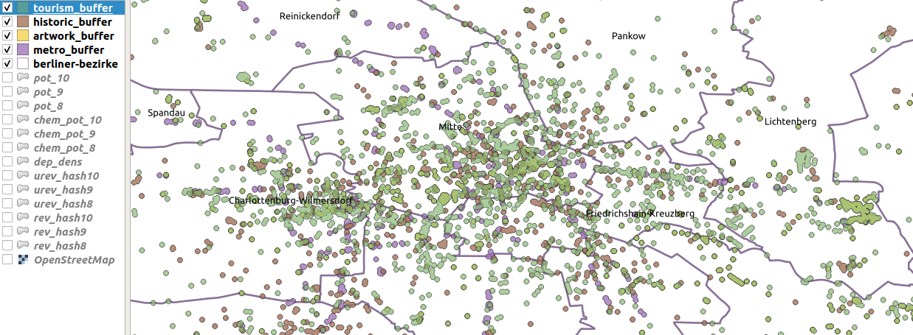
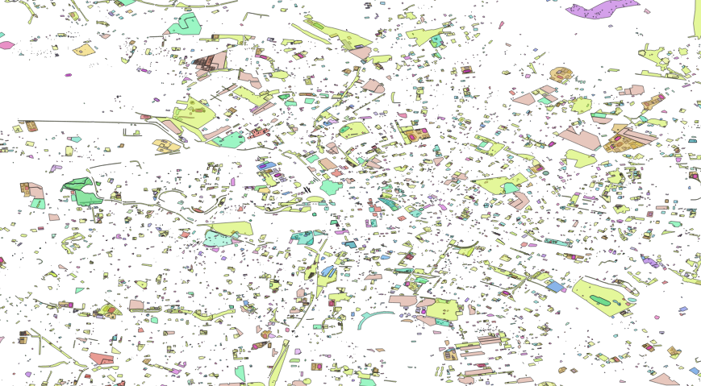
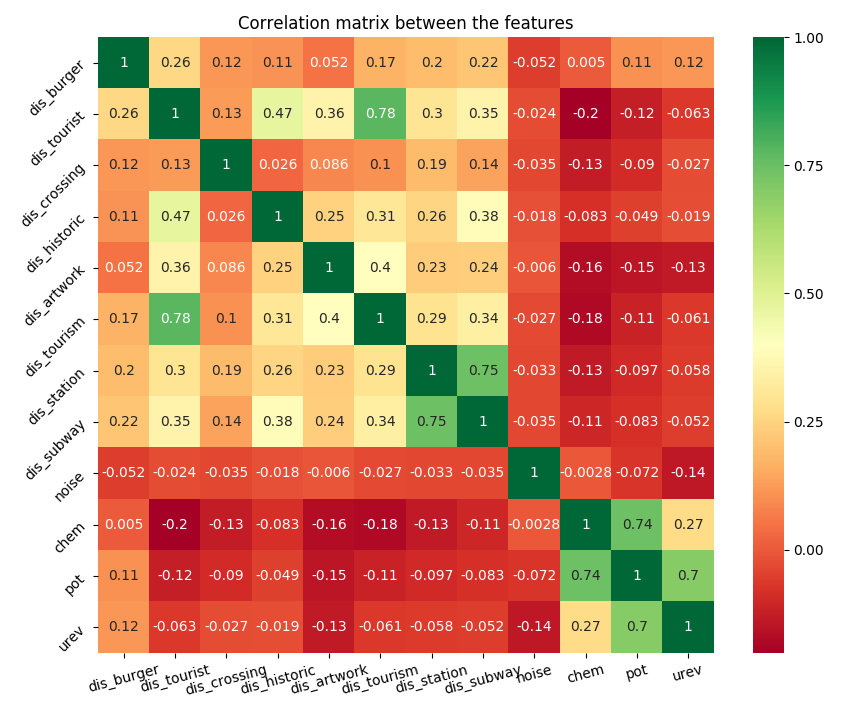
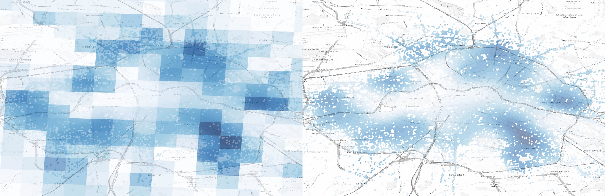
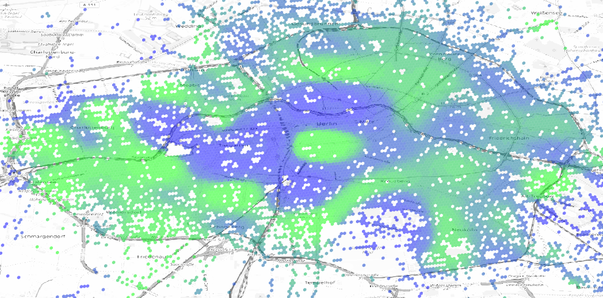
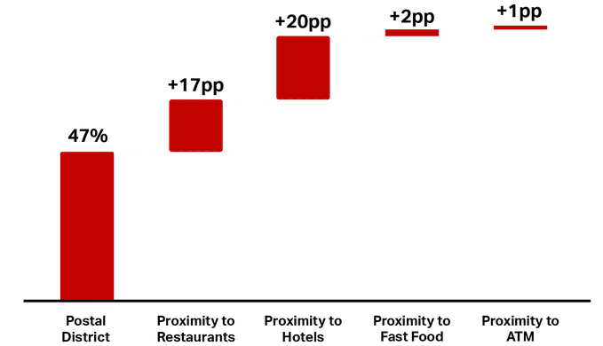

# city features

We run a series of queries on overpass turbo to get the most important features per city

_running a query on overpass_

We create a buffer around the new points and we dissolve the layer into a single multipolygon

_we have different layers showing the most important city features_

We calculate the distance from the closest polygon and label them by customer segment

_we have different layers showing the public spaces_

We calculate correlation between features

_correlation between features and distances_

_feature and spot overlapping_

### Population density
We enrich poi information with official statistical data like:

* population density 
* men/women asymmetry
* foreigner percentage
* flat density
* land use
* age asymmetry

We don't know a priori which parameter is relevant for learning and we might have surprisingly perfomances from features that do not seem to have connection with the metric.

_distribution of official census data_

To obtain the value of population density we interpolate over the neighboring tiles with official census data using a stiff multiquadratic function.

Distribution of expense power across the city

_expense power_

_determination of the density value coming from the neighboring tiles of the official statistics_

We than obtain an approximation on smaller geometries

_population density interpolation_

And obtain an estimation on percentage of foregners, flat use, land use...

_foreign distribution_

### Degeneracy
[Degeneracy](https://en.wikipedia.org/wiki/Degeneracy_(graph_theory)) is a measure of sparsity or replication of states, in this case we use the term to define the recurrency of pois in a spatial region.

The operative definition is to calculate the distribution of other pois at a certain distance. To reduce the complexity of the metric we perform a parabolic interpolation and define the degeneracy as the intercept of the parabola fitting the radial density distribution.

_spatial degeneracy, only the intercept is taken into consideration_

## Isochrone

For each location we download the local network and calculate the isochrones

_isochrone, selected nodes and convex hulls_

## prediction

In the literature there are different examples of spatial forecast prediction [property values](https://www.techinasia.com/machine-learning-estimate-singapore-property-value).

_property prediction_
