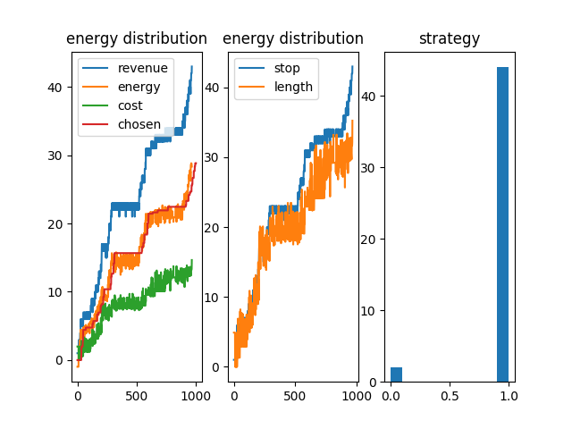
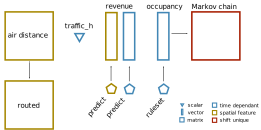
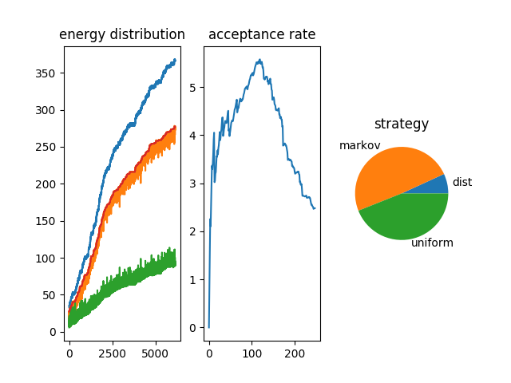
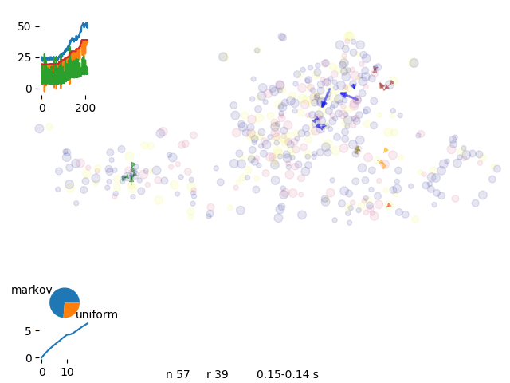
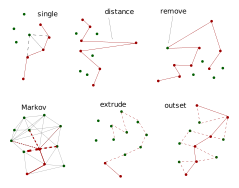

# Optimization

Optimization is finding one optimal configuration for a given system 

_optimization 8 vans_

# optimization task

We have to find the most efficient distribution tasks among drivers to minimize costs and maximize revenue

_optimization problem_

## optmimization engine

We need to reduce the drive time and focus on most interesting spots

<!-- <video controls><source src="../f/f_ops/linea.mp4"></video> -->
<!-- _optimization procedure_ -->

### routing efficiency

We first add all the spots a van could see and we calculate the most optimal route connecting the spots

_spot connection_

### spot prioritization

Prediction should define the layers where we are most confident about the revenues for a given time and weather condition

We define the revenue as:

_potential of that area for a given weekday and shift number_

$$ \mu_{deploy}n_{deploy}E_{deploy} + \mu_{collect}n_{collect}E_{collect} $$ 

Where $\mu$ is the potential to add or remove a scooter at a certain spot, $E$ is the revenue per scooter, $n$ is the number of scooters

and the costs as:

$$ l_{ride}c_{lenght} + n_{stops}c_{stops} $$

Where $l$ is the lenght, $n$ the number of stops and $c$ empirical parameters.

The energy calculation considers the single paths and the interaction among them:

[mallink_energy](../f/f_ops/concept_mallink_energy.svg  "mallink_energy")

## class structure

We display the interdepency

[module_mallink](../f/f_ops/module_mallink.svg  "module_mallink")

### solve problem

We can toggle the activation of the spot and recalculate the energy and apply the Metropolis algorithm to see whether the move is convenient

_optimization graph_

The total energy of the system decreses

_optimization energy_

We consider a larger system 

_larger system_

But after many iteration steps the solution is slowly approaching

_optimization energy, slowly learning_

# Markov chain

To improve the acceptance rate of moves we introduce Markov Chains

_Markov schema_

We multiply the Markov chain matrix with itself to condense iteration probabilities and set up a threshold to consider only the most important links

We calcualte at first a really dense Markov chain (first power) and we increase the power (until five) to have a sparse Markov chain 

_Markov chain densities_

We than use a sparse Markov chain with around 7 links per node

_sparse markov chain_

From the Markov chain we create a cumulative probability which is getting simpler while increasing the number of iterations

_cumulative probability on filtering_

## iterating to the solution

We run over 500 spots and 8 drivers

_optimization 8 vans_

and iterate over different solutions

_optimization 8 vans_

We can control the energy evolution and check the aymptotic behaviour of the curves.

_energy history with 8 vans_

# single task move

The engine was at first focusing on single task move which was making convergency pretty slow. We started than introducing new moves and initial set up

_single spot move, solutions are a bit crowded_

each driver start from a different k-mean cluster

_distribution of the closest spot to a cluster_

We have than a better separation of routes

_single markov chain_

_energy evolution for single move engine_

## extrude, phantom, canonical

We define a series of moves to re-sort ants across the network

_series of moves_

For speeding up operations we introduce a series of moves to improve run time and convergency.

*Extruding* is suggesting a chain following the Markov Chain probability

_extrude move_

With extrusion we dicrease calculation time to 1/10 getting to the same run time as routific.

We realize that sometimes some routes get trapped in a local minimum and we can't get complete the occupancy of the van. Therefore we introduce *phantom* drivers so we have the option to discard uncomplete runs

_phantom move_

Depending on the stage of the solution certain solutions are more appropriate than others

_energy distribution for canonical simulations_

To further improve convergence of solution we move to *gran canonical* simulation where we continously introduce and remove routes until we get to the best complete solution

_canonical move_

