# motion solution

_density of gps events across germany_

# data type

We get for each user a line with x and y coordinates, device type, accuracy in meters and time zone.
For each coordinate pair we create an octree index for the given accuracy

## positions

| ts | id | type | x | y | accuracy | tz | octree | n |
| - | - | - | - | - | - | - | - | - |
|1556146040|00002af79399fef8e...|0|52.2833|7.93245|17|7200|314223124321441|1| 314223124321441 | 1 |

## densities

From the positions we calculate the densities grouping by octrees and we remove one octree digit every time the number of events is smaller than a threshold.

In between we calculate the average position and time for each box.

|octree|n|x|y|ts|
|-|-|-|-|-|
|422331313214|35|7.5405|47.712|1554083921|

We can than convert the octrees in polygons and display the density values with a color map rendering first the large boxes.

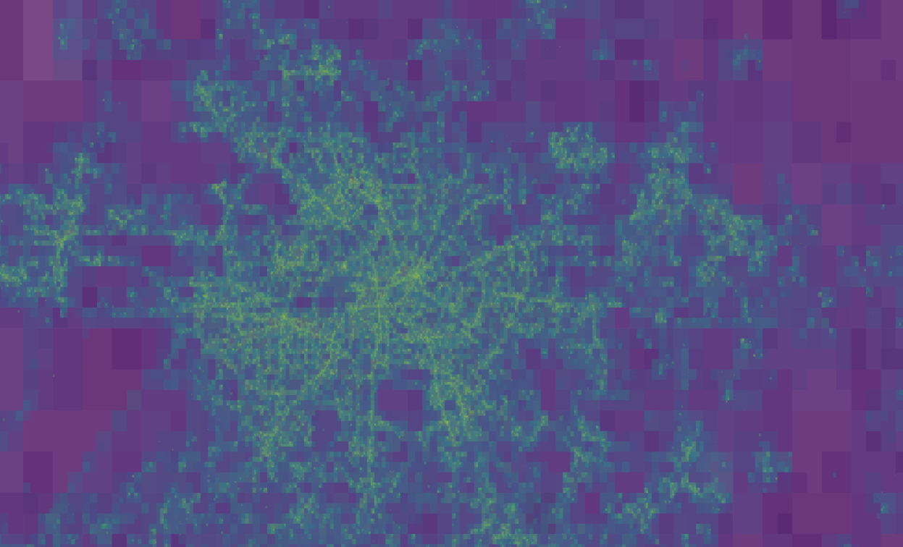
_densities in the city_

<!--  -->
<!-- _density overall the country_ -->

We can clearly distinguish users driving on main roads

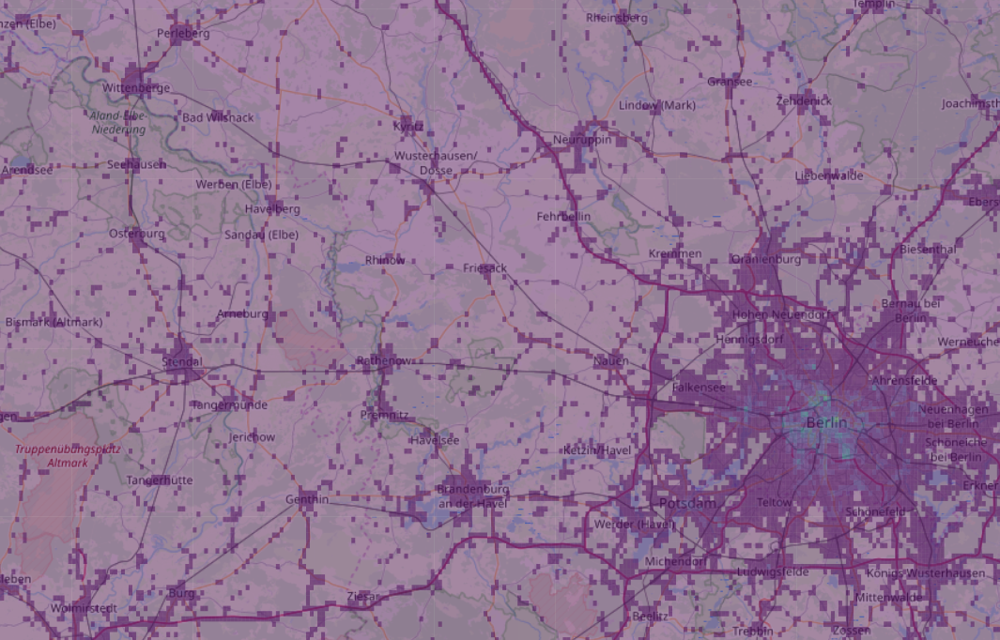
_density on the streets_

# trajectories

We pivot all entries by the user id and we create a new dataframe where on each line we have *id*, *time-space matrix*, *n* trajectory points, *bounding box* in octrees, *time interval*

|id|tx|n|bbox|dt|
|-|-|-|-|-|
933a58bfed63df92570...| `[[1556210261, 13.497, 52.395], [155626...`|976|423|15562|

_trajectory country_

All trajectories are defined by a bounding box which makes spatial filtering efficient

_densities and trajectories_

## frequencies

We create a dataframe each day to know how many users we see in the country

|id|ts|
|-|-|
|00002af79399fef8eb17522aedba3cedc45bb3cd193a34...|85|

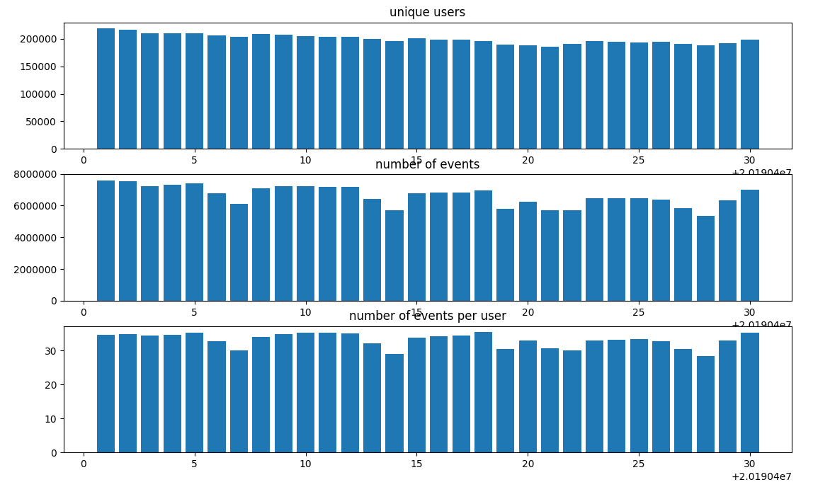
_user frequency_

If we look at the distribution of events per users we notice extreme numbers and the median drops to 19

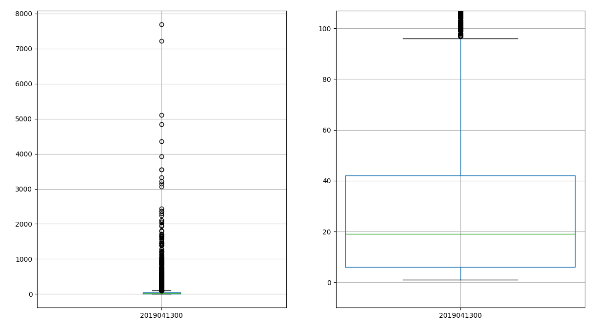
_user distribution_

# Speed profile

We iterate over all trajectories and calculate the point to point space-time difference. We derive than the speed, the angle and the chirality of the segment.

|octree|n|speed|angle|chirality|
|-|-|-|-|-|
|423144344341423|1.0|0.000008|0.957055|1.0|

Where we calculate the speed as a normal equation of motion

_speed calculation_

To calculate the segment speed we need first to smooth the input variables inducing correlation between the points. 
Without smoothing data are too noisy to be processed

_speed, no smoothing_

If we use a running average space-time and their derivatives are better defined

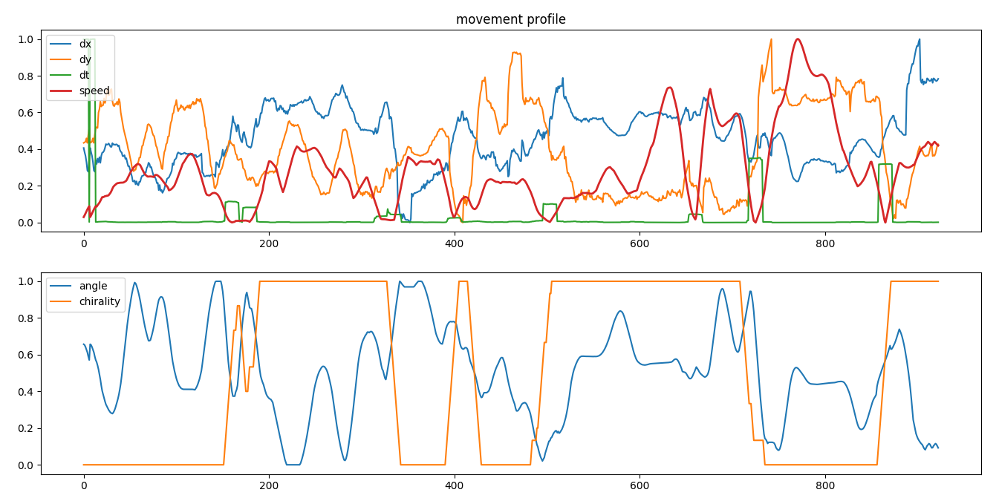
_speed, running average_

If we use a Kaiser smoothing we have smooth profiles across all variables.

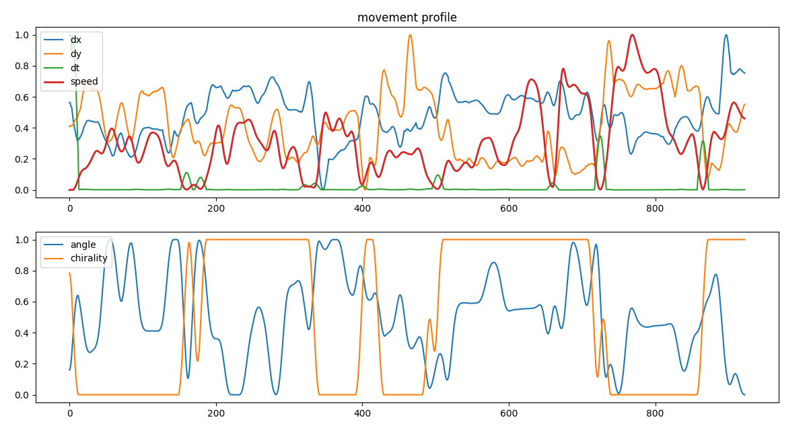
_speed, kaiser smoothing_

In this way we can calculate the speed density across the city and clearly see the network infrastructure

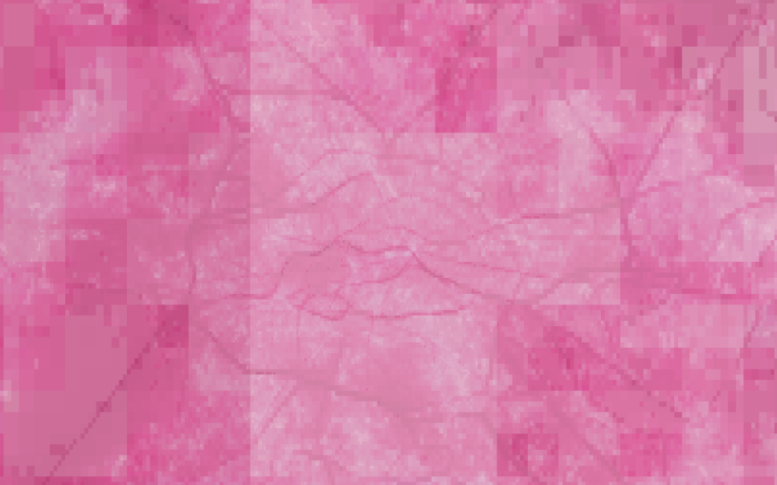
_speed density_

We can also observe the distribution of chirality across the city

_chirality density_

and the distribution of angles, interesting there are some spots strongly polarized

_angle density_

## motion

If we set a speed threshold depending on the particular use case (long/short trips) we can divide motion from dwelling.
We cluster the speed profiles when a velocity cross a threshold value. Below the threshold we have a dwelling, above a movement. 

mean values

|m_dt|m_x|m_y|m_speed|m_angle|m_chirality|m_m|
|-|-|-|-|-|-|-|-|-|-|-|-|-|
|4165|13.448|52.397|1.31E-06|1.33|0.5|1.80E-07|1248.57|

standard deviations

|s_dt|s_x|s_y|s_speed|s_angle|s_chirality|s_m|
|-|-|-|-|-|-|-|
|0.00026|2.58E-05|2.62E-06|0.553|0.234|0|

first and last signal

x1|y1|t1|x2|y2|t2|sr|
|-|-|-|-|-|-|-|
|13.44|52.3|2285.5|13.44|52.397|5196.57|0.000143|

User defined definition of activities and trips

_speed profile and the threshold defining activities_

We can display the dwelling and the trips across the city

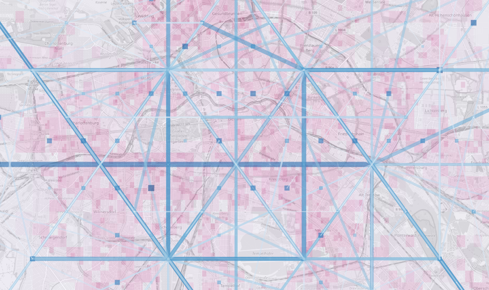
_dwelling and moving across the city_

Changing the threshold we can distinguish different types of movemens and we have completely different figures

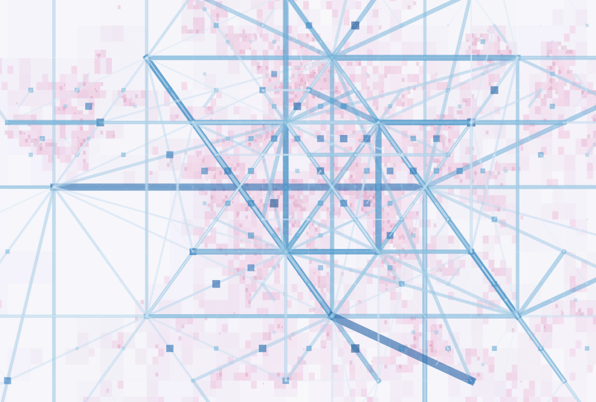
_moving and dwelling_

We sum up relations grouping first on destinations and than on origins and iterate coarsing the geometry until we reach similar counts per leg.

We have many relations for each node

_inner city relations_

## dwelling

Dwelling can be disconnected from the octree index

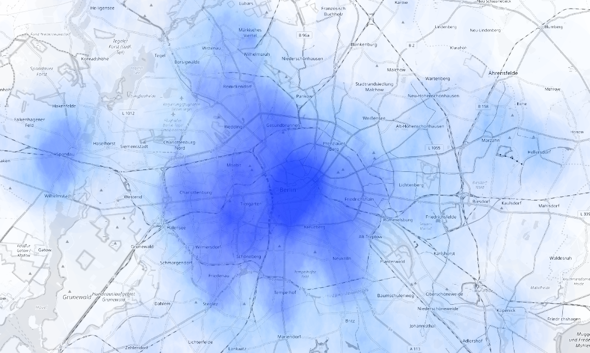
_dwelling heatmap_

# Retail

We want to compare mobile antenna connections with gps signal density, 

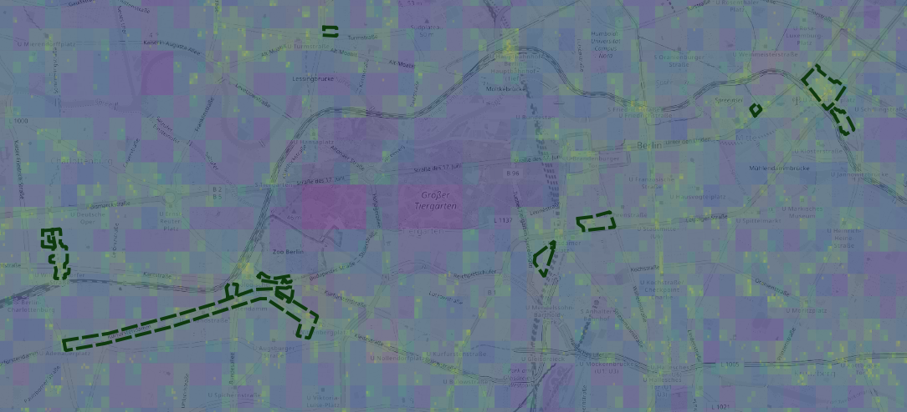
_retail areas and densities_

Compared to mobile data we have a completely different ranking of locations

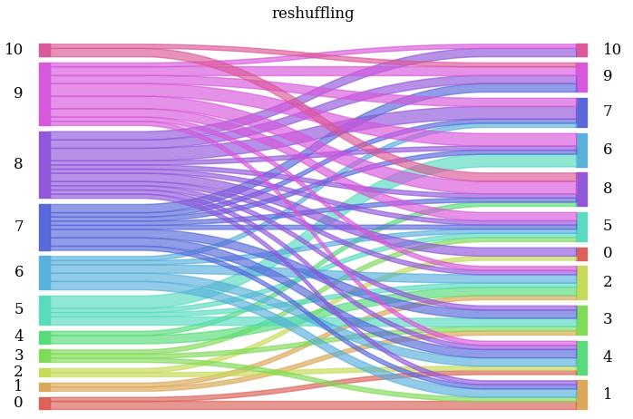
_re shuffling of ranking of retail areas_

