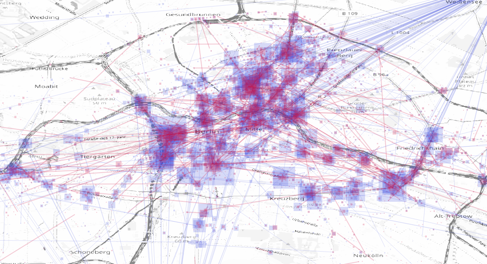
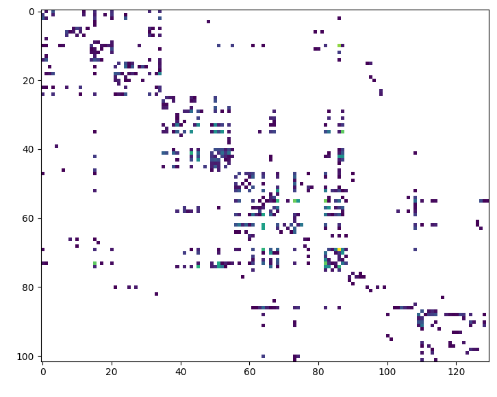

# daily aggregation 

We group the redundant information organizing the time variant information into a matrix called `tx` and summarize the dynamic quantities in their appropriate column 

|id_scooter|usertype|bound|dt|id_zone|locked|mileage| n | state| tx |
|-         |-       |-    |- | -     |-     |-      |-  |    - |  - |
861319030001038|  CUSTOMER|  [12.518, 55.6737, 12.5518, 55.6819]|3247| copenhagen | [True, False, False, True, False, False] | 1291|6 | [INTENT_RESERVED, RESERVED, UNAVAILABLE_FOR_RE... |[[1568028254, 12.5518, 55.6819, 99], [... |

We can than cluster user behaviour


_user behaviour on status_

# ride

We can aggregate information for each ride

|tx|bounding box|lenght|energy_consumption|n|cost|zoneid|firmware|
|-|-|-|-|-|-|-|-|
|[[1568028254, 12.5518, 55.6819, 99], [... |[12.518, 55.6737, 12.5518, 55.6819]|25|2.5|berlin|01_02_02_00_0306|

Where the dynamic matrix is

tx = [x,y,timestamp,energy,milage,speed,speed_limit]

We can than calculate the rides over two months


_rides on map_


_rides monitoring_

We can sum up rides per geohash


_rides on geohash_

And calculate the origin/destination matrix


_origin destination matrix_

We can than calculate a simplified graph of the customer movements


_customer movements on graph_

# hardware

The hardware api is the table that contains all the communication with the hardware. 

The table is updated every connection

# scooter

For each scooter we can sum up idle time, revenues...

|idle_time|total_revenue|bounding box|[id rides]|firmware|zoneid| milage|num_turs|num_deployments| 
|-|-|-|-|-|-|-|-|-|-|
|10:20:24|3.4|[12.518, 55.6737, 12.5518, 55.6819]|[4q3wfrg,qt4fr34q3]|01_02_02_00_0306|berlin|23|2|1|

tx = [deployment location,downstream revenue,downstream turns]

# customer

For each customer during the day we can counts how many rides, operation area...

|n_rides|bounding box|revenue|zoneid|
|-|-|-|-|
|1|[12.518, 55.6737, 12.5518, 55.6819]|2.4|berlin|

# job

```python
    import pyarrow.parquet as pq
    import s3fs
    s3 = s3fs.S3FileSystem()
    hapi = pq.ParquetDataset('s3://'+buck,filesystem=s3).read_pandas().to_pandas()
    del hapi['deviceenergylevel'], hapi['id'], hapi['version'], hapi['gnssupdatedat'], hapi['deviceenergylevel'], hapi['iccid'], hapi['signalstrength'], hapi['lambda_time'], hapi['kinesis_input_time'], hapi['iotprovider'], hapi['imei'], hapi['iotid']
    hapi.to_csv(baseDir + "raw/ride/hapi.csv.gz",index=False,compression="gzip")
```

# spark

libraries

```python
sc = pyspark.SparkContext.getOrCreate()
from pyspark.sql import SQLContext
from pyspark.sql.types import *
from pyspark.sql.functions import udf
import matplotlib.pyplot as plt
from pyspark.sql.functions import to_utc_timestamp, from_utc_timestamp
from pyspark.sql.functions import date_format
from pyspark.sql import functions as func
sqlContext = SQLContext(sc)
```

conf

```python
os.environ["SPARK_HOME"] = "/usr/hdp/current/spark-client"
conf = SparkConf()
conf.setMaster('yarn-client')
conf.setAppName('a')
conf.set("spark.executor.memory", "8g")
conf.set("spark.executor.cores", "2")
conf.set("spark.executor.instances", "100")
```

data structure

parquet vectorized

```python

```

user defined functions
```python
def get_val(steps):
    xV = [float(x['y']) for x in steps if not x['y'] == "None"]
    return float(np.average(xV))

ud../f/f_get_val = udf(get_val,FloatType())
df = df.withColumn("y",ud../f/f_get_val("steps"))
```

joins on the pivoted tables will be faster, even periodic reports


# rides
	
We look at the distribution of revenues:

![rev_revboxplot][../f/f_ride/rev_boxplot.png "revenue boxplot"]
_revenue boxplot_


