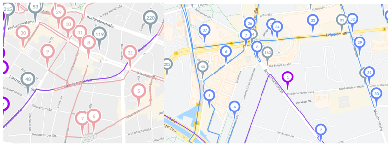
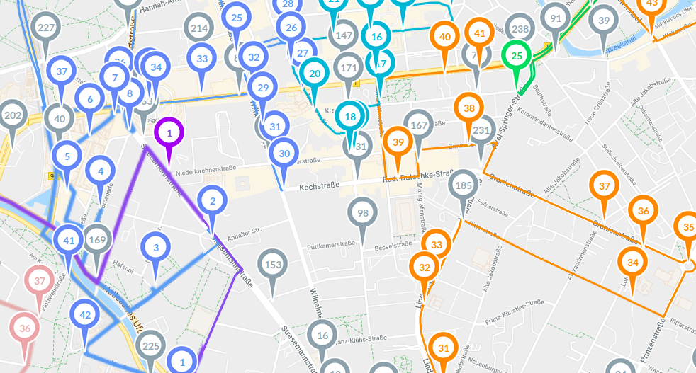
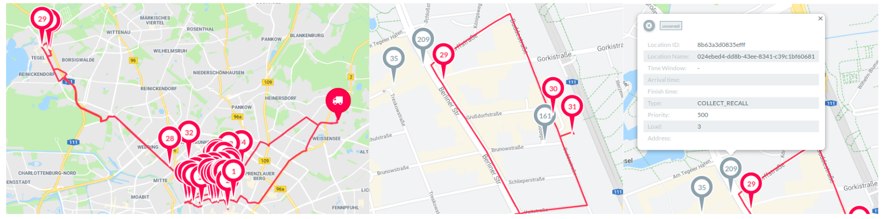
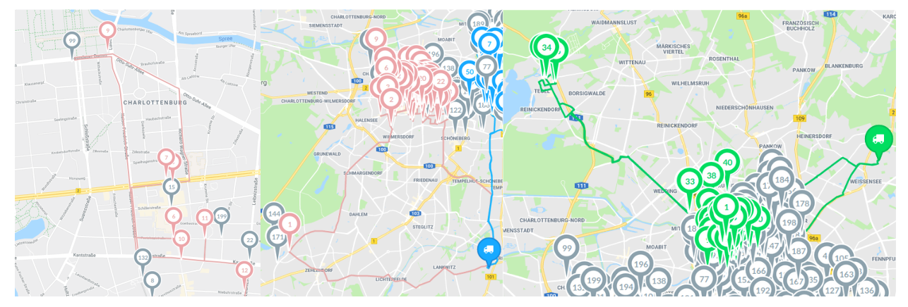
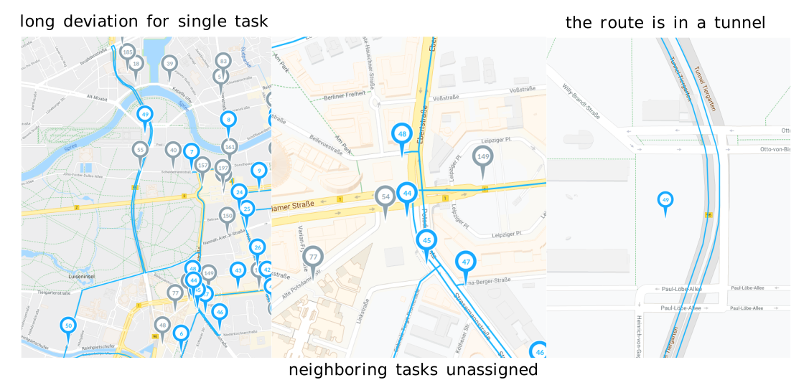
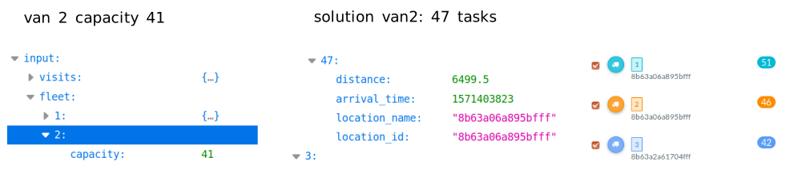

# routific

We use routific to distribute tasks to drivers

_routific dashboard_

Limitations of routific:

* not improving on revenue
* not optimizing on total drive time
* priority change routes but don't change graphs

# optimization engine comparison

An optimization engine find the best combination for assigning tasks to a fleet.
To compare performances we create a set up of around 600 spots, 6 task types (with different priorities) and a fleet of 8 drivers

_set up for the comparison_

We prepare the job file and we send it to the routific api service and [visualize the solution](http://routific-viewer.herokuapp.com/jobs/k24ozyff68)

_routific solution explorer_

We perform a visual inspection of routific work, we see that routes mix a lot

_routes have internal intersection and operation areas cross_

Sequences don't make much sense

_routifix sequence_

In the city center where is harder to park many drivers cross the same streets

_routifix mixing drivers_

There are some long deviations and once on the spot routific is ignoring neighboring tasks and skipping important priorities

_long routes_

We observe long deviations for a single task

_visual inspection of routific_

Even if we have [priority 1 over all tasks](http://routific-viewer.herokuapp.com/jobs/k2g4jwwj197) routes don't make much sense

_visual inspection of routific_

Long deviations for driving on a tunnel where the scooter is on the ground

_routed into a tunnel_

Routific returns more stops than the number of tasks

_routific and maximum capacity_

Routific returns only the total drive time and we have to reroute the segments to calculate the actula driven distance

