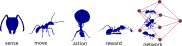
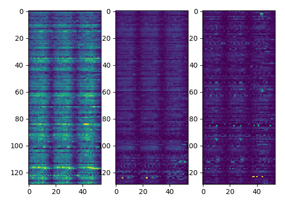

:PROPERTIES:
:GPTEL_MODEL: gwen3.5:9b
:GPTEL_BACKEND: Jetson
:GPTEL_SYSTEM: This is technical documentation who need to be presented. Be concised and focused on the main important points.
:GPTEL_TOOLS:
:GPTEL_BOUNDS: ((response (452 1281) (1283 2825) (3032 4369)))
:ID: spiega_all
:END:
#+TITLE: spiega tech
#+SUBTITLE: shared documentation across projects
#+DATE: 14-05-2026
#+KEYWORDS: Data science, language models, LLMs
#+description:
#+INCLUDE: ~/lav/src/spiega/template/reveal_config.org
#+INCLUDE: ~/lav/src/spiega/template/org_startup.org
#+OPTIONS: body-only:t
#+TODO: TODO IN-PROGRESS WAITING DONE
#+TAGS: buisness(b) dev(t) science(s) management(m) data_science(d) admin(a) consultancy(c) art(r)
#+STARTUP: showall

* spiega tech
:PROPERTIES:
:ROAM_ALIASES: spiega tech
:ID:  spiega-intro
:END:

Spiega is a collection of articles/post written during 17y of career spanning over 3k3 source code files and 2k images.
The main areas are around data science and the impact of using machine learning in operations and business.
Some content is presented as [[../slide/spiega,html][slides]] or as automated generated summary in the [[./overview.md][overview]] page.
For a more business oriented description of those activities refer to [[./spiega_business.org][spiega business]].

#+caption: module library
#+NAME:   fig:module_lib
#+ATTR_HTML: :max-height 300px :height 300px :align center
[[../../f/f_stage/module_library.png]]

During this time I tried to make the organize the diverse topics into some main areas which are:

*** [[management]] and client projects                               :management:
<2013-09-12>

Here is a collection of experiences regarding project scoping, execution and reporting

- [[governance][governance]] :: manage and design data platforms
- [[team management]] :: how to manage and kick off a team
- [[project tools]] :: what makes the execution of a project efficient
- [[professional growth]] :: how to see a career overall

#+caption: module library
#+NAME:   fig:module_lib
#+ATTR_HTML: :max-height 300px :height 300px :align center
[[../../f/f_stage/workflow_conversion.png]]
# [[../../f/f_intertino/AncillarySketch.png]

*** [[consultancy and service provider]]                            :consultancy:
<2013-06-03>

- [[dauvi][dauvi]]        :: ERP tools and firm consultancy, mainly focused on setting up and implementing ERP tools and connecting different company components
- [[intertino][intertino]]    :: web services. Offer segmentation strategies, agent compensation models, lagged metrics, customer lifetime value calculation, contact channels main and control metrics, scooter movement analysis, auto sensors assessment, shared bike usage evaluation, and weather prediction models.

#+caption: module library
#+NAME:   fig:module_lib
#+ATTR_HTML: :max-height 300px :height 300px :align center
[[../../f/f_intertino/Comment.png]]

*** [[optimization]] experience                                    :data_science:
<2017-10-04>

Collection of projects for optimization challenges 

- [[geomadi][geomadi]]      :: articles on geo features, routing applications, location intelligence, motorway stoppers analysis, routing comparisons, and sensor triangulation.
- [[antani][antani]]       :: optimization engine (reinforcement learning, simulations). 
- [[mallink][mallink]]      :: simulation engine in python. 
- [[allink][allink]]       :: C/C++ simulation code for biophysical membranes

#+caption: module library
#+NAME:   fig:module_lib
#+ATTR_HTML: :height 300px :max-height 300px :align center
[[../../f/f_act/doc_lib.svg]]

*** [[data science]] competences                                   :data_science:
<2014-11-03>

Collection of libraries used as support to data projects 

- [[kotoba][kotoba]]       :: generative ML. ML painting, text generation, music composition, agent
  naming environment for redundancy in images.
- [[albio][albio]]        :: time series analysis. 
- [[lernia][lernia]]       :: machine learning library used across multiple projects. Regressions without neural networks
- [[deep lernia][deep lernia]]  :: machine learning library used across multiple projects. Neural network models
- [[ndoe][ndoe]]         :: Equations of motion, ride behavior, mobility concepts, POI capture rate, activation potential, data quality assessment, telemetry data types, prediction anomalies, and spatial analysis.

#+caption: data science competences
#+NAME:   fig:module_lib
#+ATTR_HTML: :height 300px :max-height 300px :align center
[[../../f/f_act/motion_pattern.svg]]

*** [[programming and devops]]                                              :dev:
<2013-05-04>

Collection of work to develops products and manage data platforms

- [[sawmill][sawmill]]      :: big data processing. Data platform basics, data storage applications, compliance with access rules for sensitive data, modeling concepts, security practices, webserver and networking principles, messaging systems, middleware to protect requests, cloud provider impressions, CI/CD processes, testing methods, scheduling jobs, log processing, UI and data visualization techniques, and programming documentation.
- [[intertino][intertino]]    :: web services. Offer segmentation strategies, agent compensation models, lagged metrics, customer lifetime value calculation, contact channels main and control metrics, scooter movement analysis, auto sensors assessment, shared bike usage evaluation, and weather prediction models.
- [[malastro][malastro]]     :: useful scripts to manage a laptop, a server, embedded devices, media... Mainly using bash, ffmpeg...

#+caption: data pipe example 
#+NAME:   fig:data_pipe_example
#+ATTR_HTML: :height 300px :max-height 300px :align center
[[../../f/f_stage/data_pipe1.png]]

*** [[art and science]]                                                 :science:
<2002-10-03>

/Non commercial/ projects around art, music and science

- [[kotoba][kotoba]]       :: generative ML. ML painting, text generation, music composition, agent
  naming environment for redundancy in images.
- [[science][science]]      :: scientific contributions. PhD defense/paper on membrane inclusion objects, master defense/thesis on nanoparticle stability, bachelor defense/thesis on ion diffusion in lattice, Fokker-Planck equations, Fluttuazione theorem, physics papers, computer science lectures, PLOS One paper on influenza fusion, PR Letters paper on string method, and Sciencedirect paper on pore formation.
- [[algorithmics][algorithmics]] :: computer science features mainly used in scientific computation
- [[viudi][viudi]]        :: music tech including theoretical discovery of composition, electronics.

#+caption: module library
#+NAME:   fig:module_lib
#+ATTR_HTML: :height 300px :max-height 300px :align center
[[../../f/f_theo/PresProfBilayer.png]]

*** [[hardware]]                                                            :dev:
<1997-03-04>

- [[sciame][sciame]]       :: IoT applications. Coil for pickups/sustainers, synth collection, DSP, effects, mechanical amplifier, no-keyboard keyboard (touch surface), MIDI router player, audio mixer with op amps, piezo buffer for impedance matching and noise reduction, and creative coding techniques including openCV, openFrameworks, and processing.

#+caption: sciame library
#+NAME:   fig:sciame_lib
#+ATTR_HTML: :height 300px :max-height 300px :align center
[[../../f/f_viudi/coiler.png]]

* management
:PROPERTIES:
:ROAM_ALIASES: management
:ID:  spiega-mngt
:END:

This section collects the relevant experiences in project and team management.
The whole list of the 40 projects is in [[../../CV/index.html][portfolio]].

#+caption: management experience
#+NAME:   fig:management_lib
#+ATTR_HTML: :height 300px :max-height 300px :align center
[[../../f/f_comm/regression_tree.png]]

*** project tools                                                :management:
<2026-02-04>

Being efficient in running projects is essential and (especially in an agentic world) we need to prepare a good background for those agents to operate

- [[./agent_workflow.org][agent workflow]] :: local agents for your productivity
- [[./org_files.org][org files]] :: productivity with org files
- [[./agent_context.org][agent context]] :: instruct agents how to behave and be productive
- [[./agent_interview.org][agentic interview]] :: an interview run by agents 
- [[./documentation_present.org][documentation present]] :: create professional documentation out of your notes
- [[./spiega_deploy.org][spiega deploy]] :: how to replicate this project
- [[./agent_call.org][agent call]] :: how we use agents with MCP tools  
- [[./knowledge_graph.org][knowledge graph]] :: create a knowledge graph from your notes
- [[./multimedia_utils.org][multimedia utils]] :: ease the creation of multimedia content for presentations

#+caption: module library
#+NAME:   fig:module_lib
#+ATTR_HTML: :height 300px :max-height 300px :align center
[[../../f/f_intertino/InfraSketch.png]]

*** professional growth

Career is a long run, is made out of many investments in time and money. It needs planning and occasions, promotion and networking

- 13-26] [[./bio.org][bio]] :: overview on the main achievements
- 26-2?] [[./personal_finance.org][personal finance]] :: manage your savings and investments
- 26-2?] [[./documentation_present.org][documentation present]] :: learn how to create presentations 
- 26-2?] [[./manim_animations.org][video animations]] :: to build a portfolio
- 26-2?] [[./hobby_profession.org][hobby profession]] :: when your hobbies turn into real jobs
- 26-2?] [[./second_hand.org][second hand]] :: when your career change make sense of your old tools
- 26-2?] [[./youtube_channel.org][youtube channel]] :: communicate with videos
  
#+caption: manage your income
#+NAME:   fig:finance_year
#+ATTR_HTML: :height 300px :align center :height 300pt
[[../../f/f_cios/finance_year.png]]

*** governance                                                   :management:
<2014-10-04>

Data platform management

- 26-2?] [[./llm_governance.org][LLM governance]] :: how to manage agentic systems
- 26-2?] [[./storage_governance.org][storage governance]] :: avoid resource waste in storing and processing data
- 13-2?] [[./management_experience.org][management]] :: management experience
- 26-2?] [[./data_sovereignty.org][data_sovereignty]] :: on-prem infra
- 26-2?] [[./knowledge_graph.org][knowledge_graph]] :: auto generated locally
- 26-2?] [[./product_design.org][product design]] :: features to build a product

#+caption: module library
#+NAME:   fig:module_lib
#+ATTR_HTML: :height 300px :max-height 300px :align center
[[../../f/f_twin/gantt.svg]]

*** team management                                              :management:

Team management

- 13-2?] [[./team_composition.org][team composition]] :: how to set up a team, SoW
- 13-2?] [[./team_productivity.org][team productivity]] :: what makes a team productive
- 13-2?] [[./product_design.org][product design]] :: the important questions for building a product
- 13-2?] [[./presales.org][presales]] :: make sure you can deliver
- 13-2?] [[./client_relationship.org][client relationship]] :: promise, deliver, tell
- 13-2?] [[./corporate_organization.org][corporate organization]] :: managers, politics, career progression
- 13-2?] [[./well_being.org][well being]] :: body health for productivity 

#+caption: module library
#+NAME:   fig:module_lib
#+ATTR_HTML: :height 300px :max-height 300px :align center
[[../../f/f_intertino/CustomerJourney.png]]

* optimization
:PROPERTIES:
:ROAM_ALIASES: spiega optimization
:ID:  spiega-opt
:END:

Libraries mainly focused on optimization engine (operation, mobility...)

#+caption: module library
#+NAME:   fig:module_lib
#+ATTR_HTML: :height 300px :max-height 300px :align center
[[../../f/f_intertino/node_call.svg]]

*** geomadi                                                    :data_science:

<2017-10-16>

Geomadi was used to perform complex operations on a large network. The mongo database contained all the information regarding maps and POIs in Germany and we were analyzing spatial data regarding specific subset of a complex network. The library uses spatial queries and geometrical transformations.

- 17-19] [[./geomadi_graph.md][graph creation]] :: for routing applications
- 17-19] [[./location.md][location intelligence]] :: to enrich predictions
- 17-19] [[./motorway.md][motorway stoppers]] :: analysis on motorway traffic and capture rate
- 17-19] [[./route.md][routing comparison]] :: comparing routing solutions
- 20-21] [[./mini_hub.md][mini hub]] :: improve logistics by placing mini hubs for temporal storage in city centers
- 17-19] [[./triangulation.md][triangulation of sensor data]] :: locate mobile users
- 17-20] [[./geo.md][spatial utils]] :: for GIS

#+caption: geomadi library
#+NAME:   fig:geomadi_lib
#+ATTR_HTML: :height 300px :max-height 300px :align center
[[../../f/f_triang/cell_deformation.png]]

*** antani                                                     :data_science:

<2019-10-16>

[[../antani/][Antani]] is an optimization engine for logistics building efficient routes inspired by ants. The routes grow as polymers and variate to maximize opportunity/cost. This is a mixture of MonteCarlo as built in my PhD thesis and reinforcement learning. Each move has different polymer expansion options and the reinLearn decides what action to take to improve overall optimization time.

- 19-20] [[./antani_concept.md][antani concept overview]]
- 19-20] [[./antani_infra.md][antani infrastructure design]]
- 19-20] [[./antani_integration.md][antani microservice integration]] 
- 19-20] [[./antani_kpi.md][antani kpi comparison]]
- 19-20] [[./antani_overview.md][antani overview page]]
- 19-20] [[./routific.md][antani compared with routific]]

#+caption: antani library
#+NAME:   fig:antani_lib
#+ATTR_HTML: :height 300px :max-height 300px :align center
[[../../f/f_ops/antani_frontend.png]]

*** mallink                                                    :data_science:

<2019-10-16>

[[../antani/][Mallink]] is the python adaptation of [[allink]] which was writte 2008-2012 in C++ and used as engine for [[antani]]

- 19-20] [[./mallink_engine.md][mallink optimization engine]]

#+caption: mallink library
#+NAME:   fig:mallink_lib
#+ATTR_HTML: :height 300px :max-height 300px :align center

*** ndoe                                                       :data_science:
:PROPERTIES:
:ROAM_ALIASES: ndoe motion
:ID:  spiega-ndoe
:END:

<2017-10-16>

Ndoe analyzes motion behaviors and builds mobility reports

- 17-20] [[./motion.md][equations of motion]]
- 17-20] [[./ride.md][ride behaviour]]
- 17-20] [[./commercial.md][mobility concepts]]
- 17-19] [[./restaurant.md][capture rate for restaurants]]
- 17-20] [[./activation.md][activation potential]]
- 20-21] [[./telemetry_data_quality.md][quality on telemetry]]
- 20-21] [[./telemetry_data_sets.md][data types for telemetry]]
- 20-21] [[./feature_relevance.md][feature in telemetry]]
- 20-21] [[./telemetry_forecast.md][forecast anomalies]]
- 20-21] [[./telemetry_prediction.md][prediction on telemetry]]
- 20-21] [[./telemetry_spatial.md][spatial]]

#+caption: ndoe motion patterns
#+NAME:   fig:ndoe_lib
#+ATTR_HTML: :height 300px :max-height 300px :align center
[[../../f/f_mov/dens_traj3.png]]

* data science
:PROPERTIES:
:ROAM_ALIASES: machine learning
:ID:  spiega-ml
:END:

Machine learning and statistics used in different projects

#+caption: module library
#+NAME:   fig:module_lib
#+ATTR_HTML: :height 300px :max-height 300px :align center
[[../../f/f_lernia/feat_regularisation.png]]

*** lernia                                                     :data_science:

<2014-11-16>

Lernia is a library used across project to use ML. It divides into lernia and deep_lernia where the second one is built on keras

- 15-20] [[./lernia_feature.md][lernia feature selection]]
- 15-20] [[./lernia.md][lernia library overview]]
- 15-20] [[./blindtest.md][lernia blind test on series forecast]]
- 17-19] [[./traffic_motorway.md][convNet on time series]]
- 17-19] [[./train_mapping.md][sensor filtering]]
- 17-19] [[./train_reference.md][skewness in predictions]]
- 15-2?] [[./neural_networks.md][neural networks]] :: overview
- 15-2?] [[./neural_networks.md][machine_learning]] :: models
- 15-25] [[./ml_basics.md][AI in industry]] :: 2025 update

#+caption: lernia library
#+NAME:   fig:lernia_lib
#+ATTR_HTML: :height 300px :max-height 300px :align center
[[../../f/f_mot/weather_feature.png]]

*** albio                                                      :data_science:

<2014-11-16>

Albio is a library to work with time series. During my career I used a lot of series decomposition and forecasts.

- 15-20] [[./prediction.md][albio forecast]] ::  with exogen variables
- 15-20] [[./series_prod.md][time series]] :: forecast in production

#+caption: albio library
#+NAME:   fig:albio_lib
#+ATTR_HTML: :height 300px :max-height 300px :align center
[[../../f/f_mot/stat_prop.png]]

*** deep lernia                                                :data_science:

<2016-11-16>

Neuronal networks

- 17-19] [[./traffic_motorway.md][convNet on time series]]

#+caption: deep lernia library
#+NAME:   fig:deep_lernia_lib
#+ATTR_HTML: :height 300px :max-height 300px :align center

* programming and devops
:PROPERTIES:
:ROAM_ALIASES: programming
:ID:  spiega-prog
:END:

Knowledge used across the projects.
How we take big logs and process them to get the most important information out of the big volume.

#+caption: sawmill library
#+NAME:   fig:sawmill_lib
#+ATTR_HTML: :height 300px :max-height 400px :align center
[[../../f/f_sawmill/sawmill_log.jpg]]

*** sawmill                                                             :dev:
<2013-11-16>

Big data, data engineering, data pipelines, machine learning ops

- 13-2?] [[./data_platform.md][data platform basics]] :: example designs and principles
- 13-2?] [[./data_storage.md][data storage]] :: applications and principles
- 14-2?] [[./data_compliance.md][data compliance]] :: access, sensitive data, anonymization, retention
- 15-2?] [[./data_modeling.md][data modeling]] :: concepts and applications
- 15-2?] [[./security.md][security]] :: practices and examples
- 12-2?] [[./webserver.md][webserver and networking]] :: for websites and traffic to containers
- 20-2?] [[./messaging.md][messaging system]] :: for stream and IoT
- 17-2?] [[./middleware.md][middleware]] :: to protect and speed up external requests
- 15-2?] [[./cloud_provider.md][cloud providers]] :: impressions and experiences
- 15-2?] [[./deployment.md][CI/CD]] :: praxis and options
- 06-2?] [[./testing.md][test and checks]] :: types and necessity
- 17-2?] [[./scheduler.md][scheduling jobs]] :: monitor and plan batch processes
- 15-2?] [[./logs_proc.md][log processing]] :: from web, Iot, applications
- 06-2?] [[./data_viz.md][UI and data visualization]] :: for the business and client's insights
- 12-2?] [[./admin_tool.org][admin tools]] :: collection of script to admin a system

  
*** malastro                                                            :dev:

<2006-11-16>

Development, sysadmin, prototyping 

- 06-2?] [[./programming_praxis.md][programming praxis]] :: documentation, conventions, processes
- 02-2?] [[./emacs.md][emacs]] :: mighty editor
- 06-13] [[./cplusplus.md][c++]] :: simulations, native visual applications, openGL
- 13-2?] [[./python.md][python]] :: data exploration, visualization, ETL
- 05-17] [[./R.md][R]] :: data exploration, visualization, ETL
- 22-2?] [[./go.md][go]] :: middelware to interact with relational databases
- 06-2?] [[./sql.md][SQL]] :: manage databases, create tables, join, format
- 13-2?] [[./app.md][app]] :: native, angular, react, nodejs, cordova
- 06-2?] [[./websites.md][websites]] :: html5, css, bootstrap, php
- 06-2?] [[./javascript.md][javascript]] :: openlayer, d3.js, maps
- 06-2?] [[./node.md][node]] :: bot, automation, server
- 17-20] [[./spark.md][spark]] :: batch processing of logs

  
#+caption: malastro library
#+NAME:   fig:malastro_lib
#+ATTR_HTML: :height 300px :max-height 300px :align center
[[../../f/f_sawmill/dev_log.jpg]]

*** assessments                                                :data_science:
<2019-07-03>

Coding interviews

- 19] [[../../talk/assessment/scooter/][scooter movement]] :: a portal for visualizing geo data
- 20] [[../../talk/assessment/auto/][auto sensors]] :: analyze connected cars data
- 19] [[../../talk/assessment/bike/][shared bike usage]] :: user usage of ride hail 
- 17] [[../../talk/assessment/ufo/][ufo sightnings]] :: geospatial information
- 2?] [[../../talk/assessment/weather/][weather prediction]] :: basics around data science

#+caption: assessment library
#+NAME:   fig:assessment_lib
#+ATTR_HTML: :height 300px :max-height 300px :align center
[[../../talk/assessment/scooter/fig/area_num.png]]

* consultancy and service provider

How to advice companies and clients to develop a digital/data strategy.

#+caption: management experience
#+NAME:   fig:management_lib
#+ATTR_HTML: :height 300px :max-height 300px :align center
[[../../f/f_intertino/front_back.svg]]

*** intertino                                                   :consultancy:

<2013-11-16>

Web marketing and digital services, customer retention and communication strategies

- 13-17] [[./offer_segmentation.md][offer segmentation]]
- 20-23] [[./agent_compensation.md][agent compensation]]
- 20-23] [[./lagged_metrics.md][lagged metrics]]
- 20-23] [[./customer_lifetime.md][customer lifetime value]]
- 14-23] [[./contact_channel.md][contact channels]] :: principal and control metrics

#+caption: intertino library
#+NAME:   fig:intertino_lib
#+ATTR_HTML: :height 300px :max-height 300px :align center
[[../../f/f_intertino/audPerformance.jpg]]

*** dauvi                                                       :consultancy:
<2013-11-16>

SME consultancy, ERP systems, digital strategies

- [[../../dauvi][dauvi]] :: presentation of the projects

#+caption: TanTo
#+NAME:   fig:tanto_lib
#+ATTR_HTML: :height 300px :max-height 300px :align center
[[../../f/f_dauvi/offgrid.svg]]

* art and science
:PROPERTIES:
:ROAM_ALIASES: art and science 
:ID:  spiega-science
:END:

/Non commercial/ projects for art and science

#+caption: art and science
#+NAME:   fig:art_lib
#+ATTR_HTML: :height 300px :max-height 300px :align center
[[../../f/f_kotoba/vec3d_2.png]]

*** kotoba                                                              :art:
<1999-07-10>

Language and perception

- 19-2?] [[./generative.md][painting with ML]] :: [[../../viaggi/p/ai_gen.html][generative ai]] 
- 17-2?] [[./text_gen.md][text generation]] :: 
- 04-2?] [[./music_composition.md][music composition]] ::
- 23-2?] [[./agent_naming.md][agent naming environment]] ::
- 11-12] [[../Fiziko/NaturalImages.pdf][redundancy in natural images]] ::
- 99-2?] [[./phonosymbolic.org][phonosymbolic language]] :: can we create a phonosymbolic language?

#+caption: kotoba 
#+NAME:   fig:kotoba_lib
#+ATTR_HTML: :height 300px :max-height 300px :align center
[[../../f/f_gen/gen_cover.jpg]]

*** viudi                                                               :art:
<2013-03-04>

Music development 

- 13] [[./music_entropy.md][entropy in music]] :: how to recognize the author of a song
- 23] [[./music_evaluation.md][music chart valuation]] :: how people judge the quality of songs
- 06] [[./music_composition.md][music composition]] :: generative melody generator
- 10] [[./video_production.md][video production]] :: create songs with musical gears
- 10] [[./video_production.html][video presentation]] :: description of the channel
- 10] [[./video_detail.html][video detail]] :: video detail

#+caption: viudi 
#+NAME:   fig:viudi_lib
#+ATTR_HTML: :height 300px :max-height 300px :align center
[[../../f/f_viudi/DistCanzoni.png]]

*** allink                                                              :dev:
<2008-09-15>

Software created during the PhD thesis

- 08-12] [[../doc_allink][documentation]] :: for the project allink in C++

#+caption: allink library
#+NAME:   fig:allink_lib
#+ATTR_HTML: :height 300px :max-height 300px :align center
[[../../f/f_theo/PathIsoPoreStalk.png]]

*** science                                                         :science:
<2002-09-30>

Documents during the physics research period 

- 09-13] [[../../Fiziko/Defense.pdf][PhD defense]] :: membrane inclusion objects
- 09-13] [[../../Fiziko/phd_thesis.pdf][PhD thesis]] ::  membrane inclusion objects
- 08-09] [[../../Fiziko/master_defense.pdf][master defense]] :: nanoparticle stability
- 08-09] [[../../Fiziko/master_thesis.pdf][master thesis]] :: nanoparticle stability
- 05-06] [[../../Fiziko/bachelor_defense.pdf][bachelor defense]] :: ion diffusion in lattice
- 05-06] [[../../Fiziko/bacholor_thesis.pdf][bachelor thesis]] :: ion diffusion in lattice
- 11-11] [[../../Fiziko/FokkerPlank.pdf][Fokker-Plank]] :: and master equations
- 07-07] [[../../Fiziko/Fluttuazione.pdf][Teorema della fluttuazione]] :: traiettorie a entropia negativa
- 02-09] [[../../Fiziko/Fiziko.pdf][Fizikaj Eroj]] :: klassika kaj kvuantuma mekaniko
- 13-13] [[../../Fiziko/LezioniInf/PresBase.pdf][Lezioni di informatica]] :: per piccole imprese
- 12-12] Paper :: [[http://www.plosone.org/article/info\%3Adoi\%2F10.1371\%2Fjournal.pone.0038302][Influenza Fusion]], [[https://journals.aps.org/prl/abstract/10.1103/PhysRevLett.108.228103][String method]], [[http://www.sciencedirect.com/science/article/pii/S0009308414001017][Pore formation]]

#+caption: fizikaj eroj library
#+NAME:   fig:fiziko_lib
#+ATTR_HTML: :height 300px :max-height 300px :align center
[[../../f/f_theo/fizikaj_eroj.png]]

*** algorithmics                                                        :dev:
<2006-03-02>

Development of algorithms for better performances

- 11-12] [[./monte_carlo.md][configurational bias]]
- 06-12] [[./doc_allink/][Monte Carlo and molecular dynamics]]

#+caption: algo library
#+NAME:   fig:algo_lib
#+ATTR_HTML: :height 300px :max-height 300px :align center
[[../../f/f_theo/NpConfBiasSketch.png]]

*** media production                                                    :art:
:PROPERTIES:
:ID:  spiega-media
:END:
<2013-02-04>

Collection of media projects

- 13-15] [[./creative_coding.md][creative coding]] :: openCV, openFrameworks, processing
- 26-2?] [[./blender_animation.org][blender animation]] :: language models and 3d modeling
- 26-2?] [[./blender_tricks.org][blender tricks]] :: best settings for blender
- 15-2?] [[./youtube_channel.org][youtube channel]] :: manage a channel#+RESULTS: video-summary
- 15-2?] [[./viudi_channel.org][viudi channel]] :: current channel
- 10-2?] [[./video_production.md][video production]] :: create songs with musical gears

#+caption: media library
#+NAME:   fig:media_lib
#+ATTR_HTML: :height 300px :max-height 300px :align center
[[../../f/f_media/color_cor01.png]]

* hardware sciame
:PROPERTIES:
:ROAM_ALIASES: spiega hardware
:ID:  spiega-hd
:END:

Sciame is a collection of projects for embedded and IoT devices

#+caption: electronics and IoT
#+NAME:   fig:electronics_lib
#+ATTR_HTML: :height 300px :max-height 300px :align center
[[../../f/f_viudi/piezo_circ.png]]

*** sciame                                                              :dev:
:PROPERTIES:
:ROAM_ALIASES: spiega sciame
:ID:  spiega_sciame
:END:

- 18-2?] [[./coiler.md][coiler]] :: coiler for pickups and sustainers
- 21-2?] [[./synth.md][synth]] :: collection of synths for cheap microdevices
- 21-2?] [[./dsp.md][dsp]] :: dsp and effects
- 15-17] [[./mc_amp.md][McAmp]] :: mechanical amplifier
- 15-17] [[./no_key_board.md][no-key-board]] :: keyboard with no keys (touch surface
- 22-2?] [[./midi_hub.md][midi-hub]] :: midi router
- 97-2?] [[./audio_mixer.md][audio mixer]] :: with op amps
- 19-2?] [[./piezo_buffer.md][piezo buffer]] :: for impedance match and noise cleaning
- 25-2?] [[./robotics.org][robotics]] :: tools for robotics development

#+caption: sciame library
#+NAME:   fig:sciame_lib
#+ATTR_HTML: :height 300px :max-height 300px :align center
[[../../f/f_viudi/VioPreBasetta2.JPG]]

*** script                                                              :dev:

#+name: generate-doc
#+begin_src bash :exports none :results none
cd $HOME/lav/src/spiega
bash ./script/convert.sh
#+end_src

#+name: list_files
#+begin_src bash :exports results :results ouput replace
ls ~/lav/src/spiega/markdown/agent*
#+end_src
